# AgentHarness — 实现规范

- [Part 0 — 概览（Orientation）](#part-0--概览orientation)
  - [0.1 这是什么](#01-这是什么)
  - [0.2 系统模型](#02-系统模型)
  - [0.3 三个存储](#03-三个存储)
  - [0.4 实例演练 —— 一个 Slack thread](#04-实例演练--一个-slack-thread)
  - [0.5 实例演练 —— 工具执行中崩溃](#05-实例演练--工具执行中崩溃)
  - [0.6 Non-goals（明确不做的事）](#06-non-goals明确不做的事)
  - [0.7 记号与源类型](#07-记号与源类型)
- [Part 1 — Storage（存储）](#part-1--storage存储)
  - [1.1 模型](#11-模型)
  - [1.2 身份（Identity）](#12-身份identity)
  - [1.3 Register 命名空间](#13-register-命名空间)
  - [1.4 事务](#14-事务)
  - [1.5 查询](#15-查询)
  - [1.6 Usage ledger（用量账本）](#16-usage-ledger用量账本)
  - [1.7 后端（Backends）](#17-后端backends)
  - [1.8 为什么采用「一次写入 + register」](#18-为什么采用一次写入--register)
- [Part 2 — 对话树](#part-2--对话树)
  - [2.1 Entry（条目）](#21-entry条目)
  - [2.2 放置（Placement）](#22-放置placement)
  - [2.3 Lane（泳道）](#23-lane泳道)
  - [2.4 Fact（事实）](#24-fact事实)
  - [2.5 分支查询与上下文](#25-分支查询与上下文)
  - [2.6 Branch index（分支索引）](#26-branch-index分支索引)
  - [2.7 Fork（派生）](#27-fork派生)
  - [2.8 Session 与 repository 的边界](#28-session-与-repository-的边界)
  - [2.9 Precise rewrite（精确重写）](#29-precise-rewrite精确重写)
- [Part 3 — Operation 状态机](#part-3--operation-状态机)
  - [3.1 Operation](#31-operation)
  - [3.2 Operation 状态 —— 程序计数器](#32-operation-状态--程序计数器)
  - [3.3 Lane 状态与当前状态的有效性](#33-lane-状态与当前状态的有效性)
  - [3.4 原子状态转移规则](#34-原子状态转移规则)
  - [3.5 状态图](#35-状态图)
  - [3.6 受理（Acceptance）](#36-受理acceptance)
  - [3.7 Assistant 生成](#37-assistant-生成)
  - [3.8 工具（Tools）](#38-工具tools)
  - [3.9 摘要生成 —— compaction 与 navigation summary](#39-摘要生成--compaction-与-navigation-summary)
  - [3.10 Navigation（导航）](#310-navigation导航)
  - [3.11 Inbox、队列与延迟写入](#311-inbox队列与延迟写入)
  - [3.12 Checkpoint 过程](#312-checkpoint-过程)
  - [3.13 终结事务](#313-终结事务)
- [Part 4 — 执行、恢复、中止与关闭](#part-4--执行恢复中止与关闭)
  - [4.1 解释器（The interpreter）](#41-解释器the-interpreter)
  - [4.2 副作用边界（The effects boundary）](#42-副作用边界the-effects-boundary)
  - [4.3 Lane 变更线](#43-lane-变更线)
  - [4.4 Restore（恢复）](#44-restore恢复)
  - [4.5 崩溃位置与恢复策略](#45-崩溃位置与恢复策略)
  - [4.6 Abort（中止）](#46-abort中止)
  - [4.7 Close —— 一次受控的崩溃](#47-close--一次受控的崩溃)
  - [4.8 Fault（故障）](#48-fault故障)
  - [4.9 外部收尾（External finalization）](#49-外部收尾external-finalization)
- [Part 5 — 公开接口](#part-5--公开接口)
  - [5.1 Lane 接口](#51-lane-接口)
  - [5.2 Harness](#52-harness)
  - [5.3 SessionTree](#53-sessiontree)
  - [5.4 快照与订阅](#54-快照与订阅)
  - [5.5 Event（事件）](#55-event事件)
  - [5.6 Hook（钩子）](#56-hook钩子)
  - [5.7 Agent-loop 构件](#57-agent-loop-构件)
  - [5.8 Telemetry（遥测）](#58-telemetry遥测)
- [Part 6 — 未来展望：分区式保留（Postgres）](#part-6--未来展望分区式保留postgres)
- [Part 7 — Schema 演进](#part-7--schema-演进)
  - [7.1 问题](#71-问题)
  - [7.2 为什么本设计缩小了这个问题](#72-为什么本设计缩小了这个问题)
  - [7.3 机制：storage 版本 + 打开时迁移](#73-机制storage-版本--打开时迁移)
  - [7.4 迁移是全覆盖的（total）](#74-迁移是全覆盖的total)
  - [7.5 三个层次，以策略形式重述](#75-三个层次以策略形式重述)
- [Part 8 — 构建顺序](#part-8--构建顺序)
- [Part 9 — 不变量与测试](#part-9--不变量与测试)
  - [9.1 不变量](#91-不变量)
  - [9.2 竞态目录](#92-竞态目录)
  - [9.3 测试层级](#93-测试层级)
- [Appendix A — 术语表](#appendix-a--术语表)
- [Appendix B — Coding-agent v3 格式兼容](#appendix-b--coding-agent-v3-格式兼容)
- [Appendix C — 开放问题](#appendix-c--开放问题)
# Part 0 — 概览（Orientation）

## 0.1 这是什么

一个专为 agent 对话准备的持久化运行时（durable runtime）。它把对话状态和 operation 状态都存下来，被打断的工作可以直接接着往下跑，而不必把已经做完的副作用（settled effect）再做一遍。

## 0.2 系统模型

### Session（会话）

一个 session 把相关的工作聚合在一起，包含四个部分：

- **Entry tree（条目树）。** 一个 entry 可以是一条 message、一次 compaction（压缩）、一份 branch summary（分支摘要），或应用自定义的 custom entry。Entry 是不可变的。每条 branch 就是一条对话线索；整棵树是共享的，于是分支（branching）、compaction、派生（fork）和并行工作都能做，而历史一条不丢。

  ```text
  a ── b ── c ── d
        └── e ── f
  ```

- **Facts（事实）。** 可变的、带命名空间的键值状态。内置的 fact 包括 session 名称与 entry 标签；应用也可以存放自定义 fact。
- **Lanes（泳道）。** 指向树的具名游标（cursor）。每个 session 都有一条 `main`。一条 lane 拥有它的 leaf（叶子节点）、模型配置、队列，以及至多一个 operation。额外的 lane 可用于 Slack thread、subagent，以及其他基于共享历史的并行工作。
- **Usage ledger（用量账本）。** 该 session 的仅追加（append-only）token 与成本事件。

### Harness 与 operation

Session 层管理持久化数据，并暴露带类型的树视图。Harness 驱动 lane：它接受 prompt、执行模型与工具步骤、管理队列、对树做 compaction 或 navigation（导航），并恢复被中断的工作。它还管着几样 harness 级别的东西：可用工具与 prompt 资源的注册表、能拦截并改写执行的 hook、只负责汇报活动与持久变更的被动 event，以及运行时配置。

**operation** 是 lane 上一个被受理的工作单元：一次 run、一次 compaction，或一次 navigation。它的不可变元数据记录了身份、意图与起点；它的完整当前状态（total current state）记录了所处阶段、控制信息、队列与恢复数据。每一次持久化的状态转移都会整体替换当前状态。完成时会删除 operation 状态，并记录该 lane 的结果。

### Storage（存储）

在 session 与 harness 之下，`Storage` 暴露原子事务与查询，作用于三种持久形式：不可变的 entry、可变的 register，以及仅追加的 usage 行。Register 构成一个可变的、带命名空间的键值存储。Fact 存放于此；harness 内部的命名空间则持久化保存待处理内容（pending content），以及崩溃恢复所需的 lane 与 operation 状态。具体来说，`op.meta` 只写入一次，保存 operation 的元数据；而 `op.state` 会在每次状态转移之后被整体替换为其完整的当前状态。终结事务（terminal transaction）会删除这两者，并写入 `lane.lastResult`。你永远不会看到一个只做了一半的事务。

## 0.3 三个存储

Part 1–5 的一切都从这里推出来。

**1. 三个存储，一条不变量。** 所有持久化的东西都属于以下之一：

```text
entries        对话树 —— 一次写入（write-once）、仅追加
registers      当前可变状态 —— 带命名空间的类型化单元，可覆盖或删除
usage ledger   成本历史 —— 仅追加的行
```

*每一份 payload 都在某个 entry、某个 register，或 ledger 里；除此之外别无他处。* 一个 entry 就是完整的对话记录 —— 位置（placement）与 payload 在同一行。一个 register 直接保存它当前的类型化值；覆盖会丢弃旧值，删除则移除该 key。那些在树中还没有位置、但已经持久存在的内容（排队输入、deferred write）会先待在 `pending.entry` register 中，并在放置它的那次事务里变成 entry。各后端自有的投影（projection）—— branch index、全文检索、统计 —— 都能从这三个存储重建出来，它们本身不作数（没有权威性）。

**2. 原子事务。** 一次事务是一组 entry 插入、usage 插入与 register 写入（set 或 delete），以全有或全无（all-or-none）的方式提交，并带有严格递增的序号。事务内部不存在崩溃状态。这是唯一的写原语。

**3. 持久化的程序计数器（program counter）。** 每一步之后，harness 会覆盖一个 register —— `op.state/{operationId}` —— 写入该 operation *完整的* 当前状态。恢复过程不会重放日志，也不会根据「缺了什么」去推断位置；它读取那个 register，然后据此分派。该状态是 *total（完整自足）* 的 —— 它永远不依赖于前一个状态。少量被捕获的值（配置、stream 选项、重试策略）内联存放；体积大且稳定的 payload 则放在同级的 `op.*` register 中，或者以 id 引用。当 operation 结束时，终结事务会删除它的这些 register：一个已完成的 session 里，恰好只剩下对话本身、ledger，以及少数几个 lane 与 fact register。没有需要回收的死状态。

**4. 副作用三明治（effect sandwich）。** provider 请求与真实的工具调用被夹在两次提交之间：

```
commit:  "即将执行 X；它的输出将使用 id R 与 U"        ← intent（意图）
         执行 X                                       ← 不确定的部分
commit:  输出 + usage + 下一个状态                     ← settlement（落定）
```

Hook 则遵循它们自己的 replay 契约：一个 hook 结果会在「消费它的那次事务」中变得持久，而在该事务之前崩溃可能导致 hook 被重新执行。因此，任何外部副作用都仍有可能在没有持久落定的情况下发生。provider/tool 的 intent 把这种不确定性显式化，因为 replay 策略依赖于它；而 hook 这边只要求自己幂等，剩下的不确定性就认了 —— 这是本设计明确不打算解决的问题（non-goal）。

## 0.4 实例演练 —— 一个 Slack thread

用户在一个已经有 400 条历史 entry 的频道里发言。应用为这个 thread 创建一条 lane，锚定在该频道当前的 leaf 上。Entry id 是 UUIDv7（§1.2）；示例中做了缩写。

```
harness.createLane("slack:1719432.0021", at: "0195c8d1-4a2e-7b31-…")
lane.prompt("what changed in auth last week?")
```

按顺序发生的事：

1. **Acceptance（受理）。** Harness 做校验，执行 `before_run` hook，并提交一次事务：user message entry、该 operation 的 `op.meta` register，以及它的第一个 `op.state` —— *「我处在一个 checkpoint 上，并且我需要一个 assistant 响应。」*
2. **Intent（意图）。** 在一次内部的 ready-state 提交之后，它提交请求意图：*「我即将发起一次 provider 请求。响应将是 entry `0195c8d1-53a0-7c44-…`，usage 行将是 `0195c8d1-53a0-7d18-…`。」* 两个 id 都在此刻铸造；此时还什么都没有发出。
3. **请求。** 开始流式输出。这是整个过程里唯一不落盘的一段。
4. **Settlement（落定）。** 一次事务提交响应 entry、它的 usage 行，以及下一个状态：*「该响应带有 tool call；这是批次计划，结果 id 已经分配好。」*
5. Tool call 遵循同样的 intent → effect → settlement 形状，每次两个提交。
6. 当模型不再返回 tool call 而停止时，一次终结事务删除该 operation 的所有 register，把结果记录进 `lane.lastResult`，并让 lane 回到空闲。

作为一条 trace（id 已缩写；每个 `TX[...]` 都是一次原子提交）：

```text
TX[ insert entry n1 (user msg), upsert op.meta/O, upsert op.state/O = checkpoint,
    upsert lane.leaf = n1, upsert lane.state = { currentOperationId: O } ]
TX[ upsert op.state/O = assistant ready (config snapshot) ]
TX[ upsert op.state/O = effect_pending (reserves response n2, usage u1) ]
… provider 流式输出中 …                                ← 不确定窗口
TX[ insert entry n2, insert usage u1, upsert lane.leaf = n2,
    upsert op.state/O = tools (result id n3 reserved) ]
TX[ upsert op.tool_args/O:s1:0, upsert op.state/O = call 0 effect_pending ]
… 工具执行中 …
TX[ insert entry n3, upsert lane.leaf = n3, upsert op.state/O = checkpoint ]
… 第二轮：ready · intent · stream · settle (n4, u2) …
TX[ delete op.meta/O, op.state/O, op.tool_args/O:*,
    upsert lane.lastResult = { O, completed, n4 },
    upsert lane.state = { currentOperationId: null } ]
```

在上面任意两次事务之间杀掉进程再重启。Harness 读一下这条 lane 的 register，就能确切知道最后落盘的是上面哪一句话，然后接着往下走。如果它是在第 3 步挂掉的，它知道一次请求可能已经计费，且可能产生也可能没产生输出 —— 这是整个系统中唯一真正不确定的窗口，并且针对它有明确的策略。

与此同时，同一频道里的第二个 thread 正在运行它自己的 lane，基于同样这 400 条共享历史，两者之间无需任何协调。

## 0.5 实例演练 —— 工具执行中崩溃

```
lane.prompt("delete the stale migrations and run the test suite")
```

模型返回两个 tool call。Harness 提交批次计划，然后提交「call 0 即将执行，参数如下，并且它声明自己不可安全重放」。工具开始删除文件。进程被杀死。

```text
TX[ insert entry n2 (assistant, 2 calls), insert usage u1, upsert lane.leaf = n2,
    upsert op.state/O = tools (result ids n3, n4 reserved) ]
TX[ upsert op.tool_args/O:s1:0, upsert op.state/O = call 0 effect_pending,
                                                    replay: "never" ]
… 工具正在删除文件 …  ← 崩溃
```

重启后，harness 读取一个 register，发现 `calls[0].status = "effect_pending", replay = "never"`。它不会重新执行删除。它会在副作用开始前就预留好的那个结果 id 下，追加一条合成的错误结果（synthetic error result），把该 call 标记为完成，然后继续执行 call 1：

```text
TX[ insert entry n3 (synthetic "interrupted" result), upsert lane.leaf = n3,
    upsert op.state/O = call 0 completed ]
```

对话保持自洽 —— 每个 tool call 都有结果 —— 并且没有任何东西被执行两次。

如果该工具声明的是 `replay: "safe"`（一次读取、一次查询），harness 就会用持久化的参数重新执行它。

## 0.6 Non-goals（明确不做的事）

- **外部副作用的 exactly-once（恰好一次）。** 见上文。带有自身副作用的 hook 必须是幂等的，并以 operation id 作为幂等键。
- **provider 流恢复（stream resumption）。** 部分流是进程本地的，从不持久化。一个已落定的响应会在任何分类动作之前被 *完整地* 持久化。
- **多写者（multiple writers）。** 每个 session 一个进程。服务层据此路由，SQLite 后端则用一个 fenced lease（带围栏的租约，§1.7）来强制这一点。那些看上去需要多写者的场景，交给 lane 去解决。
- **复制（replication）。** 一个 session 只存在于一个地方。
- **持久的写历史。** Register 只保存当前值：被覆盖的 register 就消失了，也没有任何 API 或表暴露写历史。测试中对写入顺序的断言使用包裹 `commit()` 的插桩存储装饰器（Part 9）；生产环境的审计属于 telemetry 层（§5.8）。
- **把删除当作运行时特性。** Entry 与 usage 行永不删除：compaction 改变的是 provider context，而非存储；终结清理也只删除 register。注意 `retainedTail` 会把旧 message 复制进更新的 compaction entry，摘要也源自旧内容，所以 compaction 同样不是擦除。合规级别的「把这个抹掉」是管理性的 precise rewrite（精确重写，§2.9），这是唯一被认可的例外。

## 0.7 记号与源类型

- `TX[ a, b, c ]` —— 一次原子提交，按该顺序包含写入 `a`、`b`、`c`。写入词汇表为 `insert entry`、`insert usage`、`upsert namespace/key = value` 和 `delete namespace/key`。
- Id 均为 UUIDv7（§1.2）。示例中做了缩写：短标签 —— `e_*` entry id、`u_*` usage id、`op_*` operation id —— 在时间前缀无关紧要处代表完整 id；在前缀重要处，示例会展示它（`0195c8d1-4a2e-7b31-…`）。
- `S(next)` —— 用下一个完整 operation 状态覆盖 `op.state/{operationId}` register。`L(next)` —— 对 `lane.state/{lane}` 做同样的事。
- **must / must not（必须 / 不得）** 是规范性（normative）表述。其余都是解释说明。

源类型出处：

- `AgentMessage`、`AgentTool`、`AgentToolResult`、`QueueMode`、`ThinkingLevel`：`packages/agent/src/types.ts`。
- `AgentEventSink`：`packages/agent/src/agent-loop.ts`。
- `Skill`、`PromptTemplate`、`AgentHarnessResources`（下文的 `Resources`）、`AgentHarnessTool`、`AgentHarnessStreamOptions`、`AgentHarnessStreamOptionsPatch`：`packages/agent/src/harness/types.ts`。
- `Model`、`Models`、`Usage`、`RetryPolicy`、`StopReason`、`AssistantMessage`、`ImageContent`、provider message、stream 选项与 deferred handle：`packages/ai`。
- `CompactionSettings`、`CompactionPreparation`、`CompactResult`、`BranchPreparation`、`BranchSummaryResult`：`packages/agent/src/harness/compaction/`。除非本文档明确改动，现有的 preparation 与 split-turn 算法仍是实现的起点。
- `TelemetryContext` 与类型化 schema 辅助函数：`packages/telemetry`；agent 自有的 schema 仍留在 `packages/agent/src/harness/telemetry.ts`。
- 用于注册持久化自定义 message 的 `TSchema`：`typebox`。

公开的 `QueueMode` 仍为 `"all" | "one-at-a-time"`。公开的 `RetryPolicy` 仍保持 pi-ai 的形状 `{ enabled, maxRetries, baseDelayMs }`；operation 状态则存储其归一化后的等价形式 `{ maxAttempts, baseDelayMs }`。`maxRetries` 与 `baseDelayMs` 必须是有限的非负安全整数，且 `maxRetries + 1` 必须仍是安全整数；关闭重试归一化为一次尝试。指数退避延迟与 `notBefore` 的算术在 `Number.MAX_SAFE_INTEGER` 处饱和。公开的 `CompactionSettings` 仍为 `{ enabled, reserveTokens, keepRecentTokens }`；两个 token 计数都必须是有限的非负安全整数。构造函数与 setter 在对外发布之前拒绝非法设置。本设计为 `AgentHarnessStreamOptions` 及其 patch 类型新增 `deferred?: boolean | { window?: "15m" | "1h" | "24h" }`；结构性请求（structural request）总是将其强制为 false。

```ts
type SettledAssistantMessage = AssistantMessage & {
  stopReason: Exclude<StopReason, "pending">;
};

// provider 分派在请求时通过 Models 解析持久化的 { provider, modelId } 身份，
// 这一步同时会应用鉴权。注册表条目缺失或被替换会让请求在带内（in-band）失败，
// 就像遇到一个未知的工具一样。
```

---

# Part 1 — Storage（存储）

Storage 对 agent、lane 与对话一无所知。它存储 entry 与 usage 行、更新 register，并回答一小组固定的查询。Part 2–4 完全构建在它之上。

## 1.1 模型

```ts
type JsonValue = null | boolean | number | string | JsonValue[] | { [k: string]: JsonValue };

/** 一次写入（write-once）。完整的对话记录：位置与 payload 在同一行。
    恰好在一次事务中创建，永不修改或删除。继承该基类的四种具体 entry
    类型定义于 §2.1。 */
interface EntryBase {
  id: string;                // UUIDv7 (§1.2)
  parentId: string | null;
  seq: number;               // 提交时由 storage 分配
  timestamp: number;         // Unix 毫秒，提交时由 storage 分配
  type: EntryType;
  customType?: string;       // 当 type === "custom" 时
  // ...各 entry 类型各自的 payload 字段 (§2.1)
}

type EntryType = "message" | "compaction" | "branch_summary" | "custom";

/** 唯一的可变存储。一个带命名空间的 key，直接保存它当前的类型化值。
    覆盖会替换该值；删除会移除该 key。 */
interface Register<N extends RegisterNamespace = RegisterNamespace> {
  namespace: N;
  key: string;
  value: RegisterValues[N];
  seq: number;               // 最后一次设置该 register 的写入的 seq
}

/** 仅追加的成本账本行。永不修改，永不删除 (§1.6)。 */
interface UsageRow {
  id: string;                // UUIDv7 (§1.2)
  seq: number;               // 提交时由 storage 分配
  usage: Usage;
  entryId?: string;          // 该成本所属的 entry（若存在）
  adjustment: boolean;       // true = 调用方提供的对账数据，而非 provider 上报
  details?: JsonValue;
}
```

## 1.2 身份（Identity）

每一个 id —— entry、usage，以及每一个被预留的 id —— 都是来自该 session 的 id 生成器（§2.8）的 **UUIDv7**；遗留数据导入时会重新铸造以符合该规则（Appendix B）。前 48 位是铸造时间，因此每个引用都是自描述且可按时间排序的。接受的代价是：id 会泄露创建时间。（未来的分区 Postgres 后端可以基于这个前缀构建 —— 参见非规范性的 Part 6。）

铸造规则：

1. Id 在 **预留（reservation）时** 用 `now()` 铸造。直接 append 在同一次事务里完成放置；assistant/tool 的 id 落后于放置时间，最多相差一次请求的时长。
2. **tool-result id 继承其 assistant id 的时间戳**（`idGenerator.next(timestampMs?)`，随机尾部重新生成），因此一组 call 及其结果在 id 顺序下是时间聚合的，即使跨越午夜边界也是如此。
3. 合成落定（synthetic settlement）写在已经预留好的 id 下（§4.5）—— 无需特殊处理。

**不透明 payload（opaque payload）** —— custom entry 的 `data`、`details`、`fact.custom` 的值、message 文本、hook 的 `resumeData` —— 可能内嵌 entry id。Harness 从不追踪这些引用，它们可能失效；请复制内容，而不是引用它。

**铁律。** 在一个 session 内，entry 与 usage 行永不删除 —— precise rewrite（§2.9）是唯一例外。父节点缺失永远意味着数据损坏。

## 1.3 Register 命名空间

```ts
interface RegisterValues {
  "lane.leaf":       string | null;                // entry id；null = lane 位于根部
  "lane.config":     LaneConfiguration;            // §2.3
  "lane.state":      LaneState;                    // §3.3
  "lane.lastResult": LaneLastResult;               // §3.13
  "op.meta":         Operation;                    // §3.1
  "op.state":        OperationState;               // §3.2 —— 程序计数器
  "op.tool_args":    Record<string, JsonValue>;    // 生效的工具参数 (§3.8)
  "op.preparation":  DurableStructuralPreparation; // §3.9
  "pending.entry":   PendingEntry;                 // §2.2
  "fact.name":       string;
  "fact.label":      string;
  "fact.custom":     JsonValue;                    // JSON null 是合法值
}
type RegisterNamespace = keyof RegisterValues;

/** 尚未放置的内容：在放置事务写入完整 entry 并删除该 register 之前，
    它是当前的可变状态 (§2.2)。 */
interface PendingEntry {
  type: "message" | "custom";
  customType?: string;
  payload?: JsonValue;       // 将成为 entry payload 的内容；
                             // 缺省 = 一个不带 data 的 custom entry
}

interface DurableFileOperations {
  read: string[]; written: string[]; edited: string[];
}
type DurableStructuralPreparation =
  | { kind: "compaction"; messagesToSummarize: AgentMessage[];
      turnPrefixMessages: AgentMessage[]; retainedTail: AgentMessage[];
      isSplitTurn: boolean; tokensBefore: number; previousSummary?: string;
      fileOps: DurableFileOperations; settings: CompactionSettings }
  | { kind: "branch_summary"; messages: AgentMessage[];
      fileOps: DurableFileOperations; totalTokens: number };
```

| 命名空间 | Key | 值 | 含义 |
|---|---|---|---|
| `lane.leaf` | lane 名 | entry id 或 `null` | 该 lane 下次追加的位置 |
| `lane.config` | lane 名 | `LaneConfiguration` | lane 的完整配置 |
| `lane.state` | lane 名 | `LaneState` (§3.3) | `currentOperationId`、`pendingNextRun` |
| `lane.lastResult` | lane 名 | `LaneLastResult` (§3.13) | 该 lane 最近一次 operation 的终结结果 |
| `op.meta` | operation id | `Operation` (§3.1) | 受理数据；只写一次，永不覆盖 |
| `op.state` | operation id | `OperationState` (§3.2) | 完整 operation 状态 —— **程序计数器** |
| `op.tool_args` | `{opId}:{stepId}:{sourceIndex}` | 生效参数 | 在工具放行（clearance）时写入一次 (§3.8) |
| `op.preparation` | `{opId}:{taskId}` | `DurableStructuralPreparation` | 在 decision hook 之前写入一次 (§3.9) |
| `pending.entry` | 预留的 entry id | `PendingEntry` | 等待放置的排队内容 (§2.2) |
| `fact.name` | `""` | string | session 名称 |
| `fact.label` | entry id | string | entry 标签 |
| `fact.custom` | 应用自定义 key | `JsonValue` | 应用状态 |

以上就是完整集合。从 key 的形状可以看出两种生命周期：

```text
lane.*  fact.*     与 session 同寿；fact 只由显式的应用动作删除
op.*               与 operation 同寿；由终结事务删除 (§3.13)
pending.entry      存活到其内容被放置或被取消为止
```

- `op.meta` 与 `op.preparation` 的 key 恰好写入一次；`op.tool_args` 的每个 key 写入一次，并以产生它的 step 作为 key 的一部分，因此批次之间永不冲突。它们都不晚于终结事务被删除；operation 期间只有 `op.state` 会被覆盖。
- 归 operation 所有、且在结束时仍未被消费的 `pending.entry` register（剩余的 inbox 条目与 abort 时排空的条目）由终结事务删除 —— 已被消费的条目，其 register 在放置事务中就消亡了；而归 lane 所有的那些（`pendingNextRun`）比 operation 活得更久，在被消费或被取消时消亡（§3.11）。
- `lane.lastResult` 只由终结事务写入，并被同一 lane 上的下一次终结事务覆盖 —— 每条 lane 永远只有一个有界的 register。恢复过程从不读取它；它存在是为了让「受理了一个 operation、然后崩溃、再重新打开」的应用仍能得知该 operation 的结果（§3.13）。
- 删除一个 fact 会移除它的 register。在 `fact.custom` 中存储 JSON `null` 是另一种合法状态；系统中不存在墓碑（tombstone）。
- 取消不留痕迹：`cancelQueued` 依次判断 —— 仍处于 pending → `cancelled`，entry 已存在 → `already_consumed`，否则 → `not_found`（§3.11）。客户端重试一次丢失的取消请求时，应把 `not_found` 视为成功。

## 1.4 事务

```ts
/** 映射式可辨识联合：命名空间决定值类型。 */
type RegisterSetWrite = {
  [N in RegisterNamespace]: { kind: "register"; op: "set"; namespace: N;
                              key: string; value: RegisterValues[N] }
}[RegisterNamespace];

type Write =
  | { kind: "entry"; entry: Omit<Entry, "seq" | "timestamp"> }
  | { kind: "usage"; row: Omit<UsageRow, "seq"> }
  | RegisterSetWrite
  | { kind: "register"; op: "delete"; namespace: RegisterNamespace; key: string };

interface Transaction { writes: Write[] }

interface CommitResult { firstSeq: number; seqs: number[]; timestamp: number }
```

规则：

1. 事务以 **全有或全无** 方式提交。你不可能观察到「一部分写入生效、另一部分没生效」的状态。
2. 各写入按给定顺序获得 **严格递增** 的 `seq` 值；无论事务内还是事务间，允许出现空洞。`seq` 在整个 session 范围内、跨所有 lane 与所有写入种类保持单调。register 的 `set` 会用分配到的 `seq` 给该 register 打戳。
3. 事务内部，写入按顺序生效：一个 entry 可以指向同一事务中更早创建的父节点；一个 register 值可以引用同一事务中更早创建的 entry 或 usage id。放置事务会同时插入完整 entry 并删除它的 `pending.entry` register（§2.2）—— 绝不存在两者同时存在的时刻。
4. Entry 与 usage id 共享一个 session 范围的 id 命名空间。在任何已存在的 id 下写入任一种类都属于 **数据损坏**，而非更新。
5. 对相同 `(namespace, key)` 的 `set` 会替换当前值；`delete` 会移除该 key；之后的 `set` 会重新创建它。不保留任何历史。指向不存在 key 的 `delete` 是无操作（no-op），因此诸如清除一个未设置的标签这类公开删除操作仍然合法。
6. 同一 session 上的事务是 **串行化** 的。只有一个写者与一个队列。

在进入 storage 之前，session 会校验完整事务，包括 JSON 序列化与运行时 schema。一次已被接纳的提交若失败，会让 **harness 进入 fault（故障）状态**：所有副作用停止，所有调用被拒绝，进程必须重启。绝不容忍事务只生效一半。

## 1.5 查询

一个 `Storage` 实例服务一个 session。仓库（repository）的发现与生命周期不在这个接口内（§2.8）。

```ts
interface Storage {
  commit(tx: Transaction): Promise<CommitResult>;

  getEntries(ids: string[]): Promise<ReadonlyMap<string, Entry>>;

  getRegister<N extends RegisterNamespace>(namespace: N, key: string):
    Promise<Register<N> | undefined>;
  /** keyPrefix 是对 (namespace, key) 的带索引前缀列举；
      终结清理时对 op.* 的前缀扫描会用到它 (§3.13)。 */
  listRegisters<N extends RegisterNamespace>(namespace: N, keyPrefix?: string):
    Promise<Register<N>[]>;

  scanBranch(q: BranchScan): Promise<Entry[]>;            // §2.5
  scanBranchStructure(q: BranchScan): Promise<EntryStructure[]>;
  scanEntries(q: EntryScan): Promise<Entry[]>;            // session 范围的树清单
  scanUsage(q: UsageScan): Promise<UsageRow[]>;           // 按 seq 区间读取账本 (§1.6)
  getStats(): Promise<SessionStats>;                      // 持续维护的投影 (§1.6)

  close(): Promise<void>;
}

/** 不含 payload 字段的放置元数据。 */
type EntryStructure = Pick<Entry, "id" | "parentId" | "seq" | "timestamp" | "type" | "customType">;

interface EntryScan {
  type?: EntryType; customType?: string;
  fromSeq?: number; toSeq?: number;
  order?: "asc" | "desc"; limit?: number;
}

interface UsageScan {
  fromSeq?: number; toSeq?: number;
  order?: "asc" | "desc"; limit?: number;
}
```

这里刻意不提供跨命名空间的 register 扫描，也不提供持久的写入日志。restore、fact、fork 与执行都沿着精确的 id 与 key 进行；entry 清单用 `scanEntries`；账本读取用 `scanUsage`；总计用 stats 投影（§1.6）；测试中的顺序断言用插桩存储装饰器包裹 `commit()`（Part 9）；生产审计属于 telemetry（§5.8）。

恢复与执行阶段的读取必须是索引驱动且有界的。它们不得从「值不存在」推断状态，而且没有 register 历史可供折叠。允许精确解引用：一个当前状态可以指名一组有界的 entry 与 register，在一次批量读取中取回，且不做依赖顺序的归约。公开的清单与调试 API 可以刻意读得比热路径多；它们的 `limit`/分页行为在 `SessionTree` 层显式定义。

`close()` 是幂等的。它封锁新的接纳（admission），拒绝该实例上之后的读取/提交，排空封锁前已接纳的提交，然后释放资源与写者占用。持久数据通过仓库重新打开。

## 1.6 Usage ledger（用量账本）

每一次落定的 provider 尝试都会写入一行 `UsageRow` —— 成功的、失败的、重试的与合成的尝试一视同仁，包括那些其 operation 之后被中止的尝试。落定事务把响应 entry 与它的 usage 行一起写入（§3.7）；合成落定则在预留的 usage id 下写入零用量。行是仅追加的：终结清理会删除一个 operation 的 register，但绝不会删除它的账本行，因此计费能挺过编排状态可能遭遇的一切。

```jsonc
{ "id": "u_7", "seq": 815, "entryId": "e_51", "adjustment": false,
  "usage": { "input": 12000, "output": 431, "cost": { ... } } }
```

- `entryId` 指明该成本所属的 entry（若存在）。在产出 entry 之前就失败的结构性（摘要）尝试，以及独立的对账调整，没有该字段。
- `adjustment: true` 标记这是调用方提供的对账（`recordUsage`，§5.1），而非 provider 的上报。format-3 导入会写入一行聚合的 adjustment 行（Appendix B）。
- provider 尝试的 usage id 是在 intent 提交中预留的 UUIDv7（§1.2），因此落定写入的 id 恰好就是其 intent 承诺过的那个。adjustment 行、工具上报的 usage 行、hook 提供的 compaction/navigation usage 行（§3.9、§3.10）以及导入聚合行，都在提交时才铸造 id；没有任何东西为它们预留 id。
- `getStats()` 是基于账本与 message entry 计数持续维护的投影 —— `messageCount` 只统计 `message` 类型的 entry，不含 compaction、summary 或 custom entry。每次提交之后它都等于账本求和；一致性测试套件会断言这一点（Part 9）。单条记录在提交时通过 `usage` event 抵达应用（§5.5），而 `scanUsage`（§1.5）按 seq 区间读回它们 —— 持久化了「已应用的最大 event `seq`」的消费者，可以在停机之后用 `scanUsage({ fromSeq })` 追平。恢复过程从不读取账本。

## 1.7 后端（Backends）

同一套模型的三种落地形式现在都有了 —— Memory、JSONL、SQLite —— 三者都通过同一套一致性测试套件（Part 9）。每个后端都记录该 session 的 `storageVersion`（Part 7）：JSONL 用一个 header 字段，SQLite 用一个 catalog 列。Memory session 永远是最新版本。可能的第四种后端 —— 分区 Postgres —— 在非规范性的 Part 6 中有草图；这里的一切都不依赖它。

### Memory

```ts
entries:   Map<string, Entry>
registers: Map<string, Register>       // key: `${namespace}` + NUL + `${key}`
usage:     Map<string, UsageRow>
children:  Map<string, string[]>       // parentId → entry id 列表，用于遍历树
```

一个队列把提交串行化。一次提交先校验并把写入应用到临时事务状态，然后把这些 map 一起发布出去。register 删除就是 map 删除。读取即 map 查找；`scanBranch` 沿 `parentId` 遍历并在内存中过滤。没有日志：Memory 只保存活状态，别无其他。

### JSONL

文件不是状态本身；它是上述 Memory map 的 **重放配方（replay recipe）**。每次 `commit()` 对应一条物理行。Storage 先分配 sequence/timestamp 字段，然后把一次提交的单个写入编码成一个 JSON object 行，或把多个写入编码成一条 **数组行**。

```jsonl
{"v":4,"kind":"header","id":"s_1","storageVersion":1,"createdAt":1700000000000,"cwd":"..."}
[{"kind":"entry","seq":101,"timestamp":1700000000000,"id":"e_50","parentId":"e_41","type":"message","message":{"role":"user","content":[...]}},
 {"kind":"register","op":"set","seq":102,"namespace":"op.meta","key":"op_9","value":{...}},
 {"kind":"register","op":"set","seq":103,"namespace":"op.state","key":"op_9","value":{...}},
 {"kind":"register","op":"set","seq":104,"namespace":"lane.leaf","key":"main","value":"e_50"},
 {"kind":"register","op":"set","seq":105,"namespace":"lane.state","key":"main","value":{...}}]
{"kind":"usage","seq":110,"id":"u_7","entryId":"e_51","adjustment":false,"usage":{...}}
{"kind":"register","op":"delete","seq":131,"namespace":"op.state","key":"op_9"}
```

- 这是 format 4。源码树中当前那份不兼容的 format-4 代码尚未完成，会被就地替换；无需为它做迁移。coding-agent 的 format 3 仍受支持（Appendix B）。
- 打开时按顺序把各行重放进 Memory map：entry 与 usage 行不断累积；之后的 register `set` 覆盖该 key，`delete` 移除它。这是 *解码*，不是恢复逻辑。打开时会校验持久化的 sequence 单调性 —— 严格递增，允许空洞（§1.4）—— 以及时间戳，并且永不重新生成已提交的时间戳。之后所有查询都在内存中执行。
- **末尾被截断（torn）的一行会被整体丢弃**，数组行的每个元素也一并丢弃，并且在接纳新写入之前先做截断。正是这一点让「事务内部不存在崩溃前缀」在这里成立。
- 一条格式错误的 *中间* 行，或一次完整但非法的事务，属于数据损坏。唯一的例外是：schema 迁移之前遗留的、已被取代的旧形状 register 行，在重放时会被宽松地解码为带 key 的原始 JSON（Part 7）；compaction 会淘汰它们。
- 持久性级别为进程崩溃级：一次已 resolve 的 `commit()` 能挺过进程死亡。不承诺 fsync。
- 可选：为每个 entry 保留 `(offset, length)` 并惰性加载 payload，只把结构与 register 常驻内存。仅当性能分析确有需要时才这么做。

**快照压缩（Snapshot compaction）。** 在 SQLite 中，register 的 `set` 是原地 upsert —— 一次 30 轮的 run 只留下一行 `op.state`，最后归零。而在 JSONL 中每次 `set` 都是追加，因此同一次 run 会追加约 10 条完整的 `op.state` 行，而它们在终结的 `delete` 行落盘那一刻全部作废：文件随 *写历史* 增长，尽管逻辑状态并没有增长。解决办法是把文件重写为 `header + 当前 entry + 当前 register + usage 行`，通过临时文件 + 原子 rename 完成；保留下来的行保持原有的 `seq` 值，被丢弃的行留下的空洞是合法的（§1.4），因此压缩不需要任何重新编号的机制。以一次四条 entry 的 run 为例：

```text
压缩前：  约 10 条事务行，约 27 个写入 —— op.state 的历次修订、
          tool 参数、pending payload，自终结行之后全部作废
压缩后：  header + 4 条 entry 行 + 2 条 usage 行 + 4 条 lane register 行
```

何时压缩：打开时若死字节比例超过阈值；可选地在终结事务之后；schema 迁移之后总是压缩（Part 7）。两次压缩之间，正常运行是仅追加的，每次提交 O(1)。有一点值得明确指出：已删除的 pending payload 与被取代的状态修订会 **以字节形式滞留**，直到压缩为止 —— 逻辑删除是立即的，物理删除是延后的。如果部署环境要求敏感的已取消内容被及时物理移除，就应在终结边界上主动压缩。

### SQLite

**一个 session 一个数据库文件。** 文件就是 session，正如 JSONL 文件一样。损坏被限制在单个 session 内，删除就是 unlink 一个文件，而 SQLite 的「每文件一个写者」规则与本设计的「每 session 一个写者」规则天然重合。

```sql
entries(id TEXT PRIMARY KEY, parent_id TEXT, seq INTEGER, type TEXT,
        custom_type TEXT, timestamp INTEGER, payload TEXT) WITHOUT ROWID;
CREATE INDEX ix_entry_parent ON entries(parent_id);
CREATE INDEX ix_entry_seq ON entries(seq, type);

registers(namespace TEXT, key TEXT, seq INTEGER, value TEXT,
          PRIMARY KEY (namespace, key));

usage_ledger(id TEXT PRIMARY KEY, seq INTEGER, entry_id TEXT, adjustment INTEGER,
             usage TEXT, details TEXT) WITHOUT ROWID;
CREATE INDEX ix_usage_seq ON usage_ledger(seq);

-- 私有的 branch index (§2.6)。它不是 register；其他后端没有对应物。
branch_entries(branch_id TEXT, entry_id TEXT, entry_seq INTEGER, entry_type TEXT,
               PRIMARY KEY (branch_id, entry_id)) WITHOUT ROWID;
-- 有序扫描。entry_seq 必须紧跟 branch_id，否则 ORDER BY 需要临时 b-tree；
-- entry_id 与 entry_type 排在后面，使该索引能覆盖只读 id 的查询。
CREATE INDEX ix_be_seq  ON branch_entries(branch_id, entry_seq, entry_id, entry_type);
-- 按类型过滤的扫描。
CREATE INDEX ix_be_type ON branch_entries(branch_id, entry_type, entry_seq, entry_id);
CREATE INDEX ix_be_entry ON branch_entries(entry_id);
branch_meta(branch_id TEXT PRIMARY KEY, tip_entry_id TEXT, tip_seq INTEGER,
            base_branch_id TEXT, base_seq INTEGER);
CREATE UNIQUE INDEX ix_bm_tip ON branch_meta(tip_entry_id);

-- 各一行：文件即 session。
session(created_at, parent_session_id, storage_version, metadata,
        message_count, usage_payload, next_seq);
writer_lease(owner_id TEXT, fence INTEGER, expires_at_ms INTEGER);
```

一次 `commit()` 就是一个 SQL 事务：插入 entry、插入账本行、upsert 或删除 register、维护 branch index、递增 `session_stats`。绝不对 entry 或账本行执行 UPDATE 或 DELETE；可变性被限制在 register、branch index（`branch_meta` 的 tip 与 base）、stats、序列号、session catalog 行以及 lease 之内。

**每个事务都必须以 `BEGIN IMMEDIATE` 开始。** 一个 deferred 的 `BEGIN` 若先读后写，会取得一个读快照，之后必须升级为写锁；如果期间有另一个写者提交过，SQLite 会让这次升级失败 —— 而且 `busy_timeout` **救不了它**，因为再怎么等待都无法刷新一个陈旧的快照。唯一的恢复方式是回滚并完整重试。

这不是个别提交的形状，而是每一个提交的形状。分配序列号区间需要读取 session 行的 `next_seq` 然后写回它，因此系统执行的每个事务中都存在「读先于写」。branch 创建（§2.6）又是一个例子：它在插入前读取最新的 compaction。`BEGIN IMMEDIATE` 一开始就取得写锁，避免了无法恢复的陈旧快照升级问题，因此在这里不存在 deferred `BEGIN` 是正确选择的情形。

**`writer_lease` 强制单写者规则。** WAL 完全允许两个进程交替写同一个文件，而那正是本设计所禁止的交错 —— 所以「每 session 一个文件」并不能消除对 lease 的需要。带过期与 fence 的所有权机制：`open()` 取得占用，storage 在追加时以及空闲时续约，close 在队列排空后停止续约，并且只删除与自己匹配的 `(owner_id, fence)` 对 —— 这样陈旧的持有者就无法释放接替它的那个新占用。正是这一点让「一个进程拥有一个 session」成为被强制执行的性质，而不是一条指望服务层去遵守的约定。Memory 与 JSONL 没有对应机制，只能依赖进程所有权；一个被打开两次的 JSONL session 会损坏且无法被察觉。

原子性本身不需要特别处理。多写入事务因文件格式而天然全有或全无：WAL 帧只有在 commit 记录落盘后才可见，所以并发读者要么看不到该事务的任何写入，要么看到全部。

`scanBranch` 的每个物理段使用一次 JOIN；§2.6 负责组合各段的区间：

```sql
SELECT e.id, e.parent_id, e.seq, e.type, e.custom_type, e.timestamp, e.payload
FROM branch_entries b
CROSS JOIN entries e ON e.id = b.entry_id
WHERE b.branch_id = ? AND b.entry_seq > ? AND b.entry_seq <= ?
ORDER BY b.entry_seq;
```

`CROSS JOIN` 在这里是关键：它强制 `branch_entries` 作为外层循环。若放任查询规划器自行决定，它可能从 `entries` 出发、全表扫描，再用临时 b-tree 排序。请在测试中断言执行计划：

```
SEARCH b USING COVERING INDEX ix_be_seq (branch_id=? AND entry_seq>?)
SEARCH e USING PRIMARY KEY (id=?)
```

任何包含 `USE TEMP B-TREE FOR ORDER BY` 或对 `entries` 全表扫描的计划都属于性能回归。

`scanBranchStructure` 是同一查询去掉 payload 列。`getEntries` 是按 `e.id IN (...)` 的主键查找。

由于文件即 session，precise rewrite（§2.9）与 fork 都是文件操作：构建一个全新的数据库（`VACUUM INTO` 或在一个读快照上逐行复制），对于 rewrite 还要把它原子地替换到旧路径上 —— 与 JSONL 采用的形状相同。

## 1.8 为什么采用「一次写入 + register」

- **恢复只是一次读取。** 每条 lane 五次 register 点查，然后按精确 id 解引用（§4.4）。根本不存在可能出 bug 的 reducer。
- **崩溃状态是可枚举的。** 只发生在事务之间，绝不发生在事务内部。
- **清理是删除，而不是回收。** 一次 30 轮的 run 会覆盖同一个 `op.state` register 约 30 次然后删除它。剩下的恰好是对话、账本，以及少数几个 lane 与 fact register —— 没有死状态值，没有历史行，也没有什么需要垃圾回收。（JSONL 把 *物理* 回收推迟到快照压缩；逻辑状态是完全一致的。）
- **不存在「靠重写来修复」。** 恢复只追加 entry，并且只覆盖它自己拥有的 register，使用与正常执行相同的状态转移；中断它再重跑，得到的结果一样。
- **并发根本不成问题。** 读者永远看不到只写了一半的状态；没有什么需要加锁。
- **唯一一次刻意的双写。** 排队内容会被序列化两次：入队时写进它的 `pending.entry` register，放置时写进它的 entry。只有排队项付出这个代价 —— assistant 与 tool 的落定（也就是热路径）只写一次 entry。作为交换，每个队列项就是一个 id，取消即彻底删除内容，而且任何 payload 都不会处于无主状态。

---

# Part 2 — 对话树

## 2.1 Entry（条目）

一个 **entry** 就是完整的存储行（§1.1）：放置字段与 payload 在一起。`getEntries` 与各类扫描返回的，恰好就是当初提交的东西 —— 没有物化（materialization）步骤，也没有 join。

```ts
interface MessageEntry       extends EntryBase { type: "message"; message: AgentMessage;
                                                 terminate?: true }
interface CompactionEntry    extends EntryBase { type: "compaction"; summary: string;
                                                 retainedTail: AgentMessage[]; tokensBefore: number;
                                                 details?: JsonValue; usage?: Usage; fromHook: boolean }
/** fromId 是被摘要分支在导航前的 leaf：即产生它的 operation 的
    sourceLeafId (§3.10)。 */
interface BranchSummaryEntry extends EntryBase { type: "branch_summary"; fromId: string;
                                                 summary: string; details?: JsonValue;
                                                 usage?: Usage; fromHook: boolean }
interface CustomEntry        extends EntryBase { type: "custom"; customType: string; data?: JsonValue }

type Entry = MessageEntry | CompactionEntry | BranchSummaryEntry | CustomEntry;
```

规则：

- `type` 与 `customType` 是结构字段：分支查询依据它们过滤，branch index 会对它们做反范式化（§2.6）。`customType` 恰好只在 custom entry 上设置；payload 字段永不驱动结构。
- Assistant entry 必须始终包含一个 `SettledAssistantMessage`。写入前拒绝 `pending`。
- Tool-result entry 携带 `terminate?: true`。这是编排状态，而 `ToolResultMessage` 没有对应字段。
- 每个 compaction 与 branch summary 都携带 `fromHook`：hook 产出为 `true`，模型生成为 `false`。
- 每个 compaction 都存储完整的 `retainedTail`（为空时是 `[]`）。**上下文永不越过 compaction 往前读。** 正是这一点让 compaction 成为一个自包含的检查点，而不是指向历史的一个指针。
- 一个 custom entry 可以不带 `data`。一个 entry 要么能按其类型的运行时 schema 解码，要么就是损坏数据。
- Payload 是内联的，因此两个 entry 永远不共享存储内容；不存在去重层。

## 2.2 放置（Placement）

树的核心规则：

> **entry** 在被放置的那一刻创建，而且一创建就是完整的。在放置 *之前* 就已持久的内容属于当前可变状态，它待在 `pending.entry` register 里；放置事务写入 entry 并删除该 register。此后两者都不再被修改。

三种情形，都很机械：

**生而即放置（born placed）** —— assistant 响应、tool 结果、对空闲 lane 的直接追加。内容与放置同时到达；一次事务：

```
TX[ insert e_a4 = { parent: e_q1, type: "message", message: <assistant response> },
    upsert lane.leaf/main = "e_a4" ]
```

**内容先行，放置在后** —— 排队输入（`steer`、`followUp`、`nextRun`）与延迟的树写入。entry id 在入队时铸造，并兼作 register 的 key；队列状态就用这一个 id 引用内容。两次事务，可能相隔很久：

```
t0  TX[ upsert pending.entry/e_q1 = { type: "message", payload: <200KB message> },
        S(next){ ...inbox.steer += "e_q1" } ]

t1  TX[ insert e_q1 = { parent: e_a3, type: "message", message: <来自 register> },
        delete pending.entry/e_q1,
        upsert lane.leaf/main = "e_q1",
        S(next){ ...inbox.steer -= "e_q1" } ]
```

该 register 在放置 entry 的那次事务里消亡。在 `t1` 之前崩溃：该条目仍在队列中。之后崩溃：它已被放置，register 已消失。**不存在第三种状态** —— 在放置或取消之前，每个提交边界上 register 与 entry 恰好存在其一，绝不会两者都在，也绝不会两者都不在。取消是另一个出口：`cancelQueued` 删除该 register，内容就此消失，从未触及树（§3.11）。

**内容出现之前就预留 id** —— assistant 响应与 tool 结果。被预留的 id 只是 `op.state` 里一个普通的字符串；在落定插入完整 entry 之前，既没有 register 也没有任何行。预留不花任何代价。

这就是 **两种预留机制**：落定家族的 id（响应、tool 结果、usage 行）是 operation 状态里的字符串；排队内容的 id 则是 `pending.entry` register。「被预留的 id 只是一个字符串」这句话只对第一类成立。

可以依赖的推论：

- 一个 pending 条目对 **树查询不可见**（没有 entry），但在 **快照中可见**：拥有它的状态列出了它的 id，payload 从它的 register 解引用得到。
- 「这条内容放置了吗？」由拥有它的队列列表与该 register 是否存在来回答 —— 绝不能靠「entry 不存在」来判断。
- 双写是本模型唯一一处刻意的冗余（§1.8）。SQLite 与 Postgres 可以在放置事务内用 `INSERT … SELECT` 从 register 行完成放置；在 JSONL 中两份副本都以字节形式存在，直到快照压缩（§1.7）。只有排队项付出这个代价；落定从不需要。

## 2.3 Lane（泳道）

一条已配置的 lane 由三个 register 构成 —— 在它的第一个 operation 结束之后再加上 `lane.lastResult`（§3.13）。全新的、或由 v3 归一化而来的 `main`，在首次与 harness 关联之前可能暂时没有 `lane.config`：

```
lane.leaf/{name}    = entry id 或 null
lane.config/{name}  = LaneConfiguration      // 仅未配置的 main 可缺省
lane.state/{name}   = LaneState
```

```ts
interface LaneConfiguration {
  model: { provider: string; modelId: string };
  thinkingLevel: ThinkingLevel;
  activeToolNames: string[];
}
```

- 一条 lane 的 leaf 只有两种移动方式：该 lane 追加了一个 entry（leaf 变成该 entry），或者该 lane 做了导航（leaf 跳到某个已存在的 entry）。
- `LaneConfiguration` 是 **完整（total）** 的。setter 覆盖整个 register；它从来不是 patch，也永远不是树中的 entry。
- 创建 lane 不会从它的锚点复制任何树内容、任何历史或任何配置：

```
TX[ upsert lane.config/{name} = <初始配置>,
    upsert lane.leaf/{name}   = anchorEntryId,
    upsert lane.state/{name}  = { currentOperationId: null, pendingNextRun: [] } ]
```

- Lane 永不被删除或重命名。名字是永久的应用键。
- 每个 session 中都存在 `main`。
- 位于同一 leaf 的两条 lane，在各自的下一次追加时自然分叉。

## 2.4 Fact（事实）

Session 作用域、后写胜出（latest-wins），不属于树的一部分。

```
fact.name/""          = string
fact.label/{entryId}  = string
fact.custom/{key}     = JsonValue
```

把一个 fact 设为 `undefined` 会删除它的 register —— 是真正的删除，不是墓碑；删除一个未设置的 fact 是无操作（§1.4）。JSON `null` 是合法的自定义值，会被直接存储，并且能与删除区分开，因为 register 本身要么存在要么不存在。内置命名空间与自定义命名空间永不重叠。Fact 写入立即提交，且永不移动 leaf。

## 2.5 分支查询与上下文

```ts
interface BranchScan {
  start?: string;               // 在 Storage 层是必需的；Session 的树视图
                                // 会默认用该视图所属 lane 的 leaf
  stopAtType?: EntryType;       // 扫描在首个匹配之后结束，含该条
  stopAtId?: string;
  type?: EntryType;
  customType?: string;
  order?: "newestFirst" | "oldestFirst";   // 默认 newestFirst
  limit?: number;
  cursor?: EntryCursor;
}
type EntryCursor = { seq: number };
```

语义：取从 `start` 朝根方向的路径，排序（默认 `newestFirst`），在首个 `stopAt` 匹配处 **含该条地** 停止，按 `type`/`customType` 过滤，应用排他游标，最后应用 `limit`。对 `newestFirst`，游标保留 `seq < cursor.seq`；对 `oldestFirst`，保留 `seq > cursor.seq`。一个 `stopAt` entry 只有在同时通过过滤条件时才会被返回。

**上下文投影（Context projection）** —— provider 请求是这样构建的：

1. `scanBranch({ start: leaf, order: "newestFirst", stopAtType: "compaction" })`。
2. 反转为 oldest-first。如果扫描是被某个 compaction 终止的，那么上下文是：它的 `summary`，然后是它的 `retainedTail`，再然后是它之后的所有 entry。**更早的内容一律不读。**
3. 丢弃停止原因为 `error`、`aborted` 或 `deferred` 的 assistant 响应。真正因为输出长度上限而停的 `length` 保留下来。
4. 让 custom entry 通过 `entryProjectors`。未被投影的 custom entry 永远不会进入上下文。
5. 执行 `transform_context`，然后 `toProviderMessages`。

溢出（overflow）响应不需要专门的省略规则：它以停止原因 `error` 提交（§3.7），因此会像其他错误一样被规则 3 丢弃，也会被任何以同样方式过滤的下游 `transformMessages` 丢弃。

**仅追加的上下文不变量。** 在同一条 lane 的多次请求之间，provider 上下文只能在尾部增长。在上次请求的尾部之前插入内容会让 provider 的 KV cache 失效，并让成本成倍上升。这正是 *为什么* run 中途的写入要推迟到 checkpoint —— 在那里它们是在尾部追加。Compaction 是唯一一次刻意的缓存失效，它以此换取更小的上下文。

## 2.6 Branch index（分支索引）

Memory 与 JSONL 在内存中沿父指针遍历。SQLite 则维护一个私有的分段分支缓存，让一次分叉追加不必把长度无界的根前缀整个抄一遍。

`branch_entries` 存储某一段（segment）中物理存在的 entry。`branch_meta` 存储该段的 tip 与可选的 `{ baseBranchId, baseSeq }`。一个段在逻辑上包含它自己 `baseSeq` 之上的行，加上被引用的、直到 `baseSeq` 的 base 前缀。

追加：

1. 如果某个分支的 tip 等于 lane 的 leaf，就追加一行并移动该 tip。
2. 否则，解析出一个确实覆盖该 leaf 的分支，沿完整的段链找到位于 leaf 或其下方的最新 compaction，只复制该 compaction 之后直到 leaf 的行，并把更旧的前缀设为新段的 base。
3. 追加新 entry，并让它成为新的段 tip。

读取时先读最新的段。如果请求区间跨越 `baseSeq`，就沿 base 链继续，并把上界截断到该边界。在过滤/限制之前，把各段结果按请求顺序合并。

有两条正确性规则是强制的：

- base 分支自身必须在其逻辑范围内覆盖该 leaf；仅仅在某个祖先中包含该 leaf 是不够的。
- 搜索最新 compaction 时必须遍历 base 链；只检查最新的物理段可能会漏掉它。

该缓存必须保证：

- 沿段链行走得到精确的根路径，无空洞、无重复；
- 所有包含某个 entry 的链，在该 entry 之下都彼此一致；
- 运行时读取永不退化为全表扫描或父指针遍历；
- 陈旧分支仍是有效的缓存历史；
- 只有显式的修复操作才会从 entry 重建缓存。

测试会断言这些不变量以及要求的查询计划。任何挂钟时间上的阈值都不属于规范要求。

## 2.7 Fork（派生）

Fork 是仓库层面的操作，基于源 session 的一份自洽快照。它复制选定的 entry、最新的 fact、lane 的 leaf 与完整配置；它永不复制 `op.*`、`pending.entry` 或 `lane.lastResult` register，也不复制账本行 —— 目标 lane 以全新的空 `LaneState` 起步。

```ts
type ForkOptions =
  | { scope?: "branch"; entryId?: string; position?: "before" | "at" }
  | { scope: "tree" };
```

- Memory 与 JSONL 把快照作为源 storage 队列上的一个作业来获取。SQLite 使用一个读事务。
- branch 范围复制一条路径，且只创建目标端的 `main`。tree 范围复制整棵树以及每条 lane 的 leaf/配置。
- 目标 session 处于空闲状态，其 token/成本账本从零开始。被复制 entry 上的 entry 局部展示用量仍然保留。
- Fact 遵循所选范围：name/custom fact 总是复制；label 只有在其目标被复制时才复制，除非是 tree 范围复制了所有目标。
- 任何 message 都可以作为 fork 点。请求构建过程会修复被孤立的 tool call。
- 被复制的 entry 保持其原有 id。
- 目标 session 的元数据记录 `parentSessionId`。

如果源 session 只有一个全新的/未配置的 `main` —— 新建的 format 4，或只读归一化的 v3 —— 它可能没有配置。此时无论哪种 fork 范围，都会创建一个未配置的目标 `main`，由首次 harness 关联按常规为其写入初始配置。fork 复制的每条已配置的 format-4 lane 都保留其当前的完整配置。

## 2.8 Session 与 repository 的边界

`Storage` 被刻意设计为只服务单个 session。`Session` 提供带类型的校验、绑定 lane 的视图，以及带类型的 entry/register 解码。`SessionRepo` 负责发现与 storage 实例的生命周期：

```ts
interface SessionMetadata {
  id: string;
  createdAt: number;
  /** 当前存储 schema 版本 (Part 7)。 */
  storageVersion: number;      // 新建的 format-4 session 从 1 开始
  cwd?: string;                // 工作目录（当应用记录了它时）
  parentSessionId?: string;
  /** 仅当 v3 的父路径无法解析为可用的 header id 时使用。 */
  legacyParentSessionPath?: string;
}

interface SessionCodecOptions {
  /** 内置的 provider message role 默认已注册。 */
  customMessageSchemas?: Record<string, TSchema>;  // 以自定义 `role` 为 key
}

interface SessionRepo<M extends SessionMetadata = SessionMetadata,
                      C extends { id?: string; parentSessionId?: string } =
                        { id?: string; parentSessionId?: string },
                      L = void> {
  create(options: C): Promise<Session<M>>;
  open(metadata: M): Promise<Session<M>>;
  list(options?: L): Promise<M[]>;
  delete(metadata: M): Promise<void>;
  fork(source: M, options: ForkOptions & C): Promise<Session<M>>;
}

interface Session<M extends SessionMetadata = SessionMetadata> extends SessionTree {
  readonly metadata: M;
  /** 铸造 UUIDv7 id；传入时间戳则铸造一个 follower id (§1.2)。 */
  readonly idGenerator: { next(timestampMs?: number): string };
  view(lane: string): SessionTree;

  /** 包内部的 harness 存储接口；在委派给 Storage 之前先校验。 */
  commit(tx: Transaction): Promise<CommitResult>;
  getEntries(ids: string[]): Promise<ReadonlyMap<string, Entry>>;
  getRegister<N extends RegisterNamespace>(namespace: N, key: string):
    Promise<Register<N> | undefined>;
  listRegisters<N extends RegisterNamespace>(namespace: N, keyPrefix?: string):
    Promise<Register<N>[]>;

  close(): Promise<void>;
}
```

Repository 的构造函数接受 `SessionCodecOptions`。每个通过声明合并（declaration merging）加入的自定义 `AgentMessage` 都必须有字符串 `role` 并注册运行时 schema；未知的自定义 role 在持久化之前以及解码时都会被拒绝。仓库新建的 session 会创建一个 leaf 为 null、`LaneState` 为空的 `main`，但没有配置；首次与 harness 关联时会写入它的初始配置。

`open()` 会把存储的 `storageVersion` 与二进制自身的版本比较：相等则继续；偏旧则在 writer lease 保护下依次执行迁移链再返回（Part 7）；偏新则拒绝打开。旧的 coding-agent v3 JSONL session 通过同一个仓库打开，并在加载时归一化（Appendix B —— 那里的「v3」指的是遗留的 JSONL session 格式，而非本文档）。

Repository 实现把 `fork(source, ...)` 解析到源 session 的串行化快照边界：活跃的 Memory/JSONL storage 会把快照与提交一起排队；不活跃的 JSONL 文件被作为一份不可变前缀读取；SQLite 使用该 session 文件的一个读快照。为此，仓库可以按 session id 维护一张活跃 storage 的注册表。这属于仓库层的协调，不是单 session `Storage` 契约的一部分。

仓库如何组织它的 session 由它自己决定，唯一约束来自存储后端：JSONL 与 SQLite 存储都是一个 session 一个文件，所以它们的仓库是基于文件的；而 Postgres 存储可以把所有 session 放在一个数据库里。

### 搜索（Search）

搜索是 **建立在仓库之上的独立服务**，拥有自己的存储。依赖是单向的：该服务消费 `repo.list()` 与只读的 session 打开；仓库对搜索一无所知，也不暴露任何搜索方法，并且没有任何一致性测试覆盖这一部分。需要搜索的应用自行构造该服务并直接查询：

```ts
const search = createSqliteSearchService({ repo, dbPath });    // 参考实现
await search.sync();                                           // 追平游标
events.on("entry_added", (e) => search.notify(e.sessionId));   // 可选的新鲜度提示

const hits = await search.searchSessions({ text: "auth migration", limit: 10 });
```

```ts
interface SessionSearchService {
  /** 按最佳匹配排名的 session。必需实现。 */
  searchSessions(query: SearchQuery): Promise<SessionSearchHit[]>;
  /** 按匹配度排名的 entry。可选能力。 */
  searchEntries?(query: SearchQuery): Promise<EntrySearchHit[]>;

  sync(): Promise<void>;              // 枚举所有 session，追平全部游标
  notify(sessionId: string): void;    // 新鲜度提示；对单个 session 做防抖拉取
  remove(sessionId: string): Promise<void>;
  close(): Promise<void>;
}

interface SearchQuery { text: string; limit?: number }  // limit 的单位取决于所调用的方法

interface SessionSearchHit {
  sessionId: string;
  score?: number;
  top?: { entryId: string; snippet?: string; timestamp: number };  // 最佳匹配，用于展示
}

interface EntrySearchHit {
  sessionId: string; entryId: string; timestamp: number;
  snippet?: string; score?: number;
}
```

生命周期由应用掌控：启动时或按计划调用 `sync()`，需要新鲜度时把 `notify()` 接到它的事件流上，在 `repo.delete()` 旁边调用 `remove()`（或者交给下一次 `sync()`，它会与 `repo.list()` 对账）。命中结果携带 `sessionId`；调用方用自己手上的仓库去 join 元数据。

**索引是拉取式的；事件仅仅是提示。** 该服务为每个 session 保存一个持久游标 —— 它已索引到的最大 entry `seq`。`sync()` 通过仓库枚举 session（旧的、新的，以及靠复制出现的文件一视同仁），对每个 session 读取 `scanEntries({ fromSeq: cursor + 1 })`，按 `(sessionId, entryId)` 幂等地索引 message entry 文本，然后推进游标。批处理中途崩溃只会把少量行重新索引成同样的状态；面向多年积累的既有 session 部署的服务从空索引起步，用同一个循环追平。`notify()` 从不携带内容 —— 它只是一个触发单 session 防抖拉取的戳；丢失的戳会被下一次全量扫描补上。索引是可重建的投影，不具备任何权威性：索引失败绝不影响 harness 或提交。

两点机制上的说明。读取一个正被其他进程写入的 session 是合法的 —— writer lease 只管写者，而 WAL 提供跨进程的快照读 —— 但全量扫描可以把被 lease 持有的 session 跳过作为优化，因为热点 session 由 `notify()` 覆盖。precise rewrite（§2.9）会替换 session 的存储并可能重新编号 seq，所以游标以 `(sessionId, storeGeneration)` 为 key；rewrite 会递增元数据里的 generation 计数器，不匹配则触发该 session 的全量重建索引。

参考实现是一个独立的 SQLite 数据库 —— 一张覆盖 `(session_id, entry_id, text)` 的 FTS5 表加上游标表 —— 并且在 JSONL session 文件上也能原样工作。多个进程可以在常规纪律下共享它（WAL、`busy_timeout`、`BEGIN IMMEDIATE`、幂等行、单调游标更新）；写者之间串行化。

**开放问题 —— 元数据过滤。** coding-agent 的 resume 流程按 `cwd` 过滤 session；而其他仓库根本没有 cwd 的概念。仓库已经通过它们的 `L` 选项泛型（`list(options?: L)`）建模了实现特定的列举方式，但 `SearchQuery` 是刻意通用的 —— 那么仓库特定的过滤条件如何抵达索引？以下是候选方案，留给将来为此争论的人去定夺：

```ts
// (a) 类型化的过滤器透传 —— 服务对过滤器类型变成泛型
await search.searchSessions({ text: "auth", filter: { cwd: "/repo" } });

// (b) 先用仓库自己的列举做限定；把候选 id 集合传进来
const local = await repo.list({ cwd: "/repo" });
await search.searchSessions({ text: "auth", within: local.map((m) => m.id) });

// (c) 在应用层做后置过滤 —— 会破坏排名：limit 在过滤之前生效
const all = await search.searchSessions({ text: "auth", limit: 10 });
const hits = all.filter((h) => byId.get(h.sessionId)?.cwd === "/repo");

// (d) 在 sync 时索引选定的元数据字段；在索引内部原生过滤
createSqliteSearchService({ repo, dbPath, metadataFields: ["cwd"] });
await search.searchSessions({ text: "auth", where: { cwd: "/repo" } });
```

(a) 保持一次往返，但让服务对每个仓库的过滤词汇变成泛型；(b) 能与任何仓库原样组合，但可能把一个巨大的 id 集合塞进查询；(c) 如所示是不健全的 —— 在 `limit` 之后过滤会丢结果；(d) 是索引最擅长的做法，但把服务与 sync 时选定的元数据字段耦合在一起，并且字段变化时需要重新 `sync`。

## 2.9 Precise rewrite（精确重写）

Entry 与 usage 行永不删除（§1.2）。唯一被认可的例外是 **precise rewrite**：一个管理性的仓库操作，它在一份自洽快照之上，把保留集合 —— entry、usage 行、fact、lane register —— 复制进一个全新的 session 存储（做法与 fork 完全相同，§2.8），然后原子地替换掉旧存储。它的保留谓词（keep-predicate）可以表达任何运行时机制都不允许表达的东西：合规级别的擦除（包括被复制进各个 `retainedTail` 与摘要中的内容）、裁剪废弃分支，以及为遗留格式的 id 重新铸造（Appendix B）。它是 harness 之上的工具 —— harness 的任何接口都不暴露它，也没有任何核心规则依赖它。

# Part 3 — Operation 状态机

## 3.1 Operation

```ts
interface Operation {
  operationId: string;
  lane: string;
  sourceLeafId: string | null;
  startedAt: number;
  intent:
    | { kind: "run"; promptEntryIds: string[];
        systemPromptOverride?: string; resumeData?: Record<string, JsonValue> }
    | { kind: "compaction"; customInstructions?: string }
    | { kind: "navigation"; targetId: string | null; summarize: boolean;
        label?: string; customInstructions?: string };
}
```

受理数据存放在 `op.meta/{operationId}` register 中：受理时写入一次，永不覆盖，并由终结事务删除（§3.13）。`sourceLeafId` 是该 operation 开始 *之前* lane 的 leaf；operation 自己追加的 entry 排在它之后。`promptEntryIds` 指明调用方经过归一化的 prompt entry，它们在受理事务中「生而即放置」（§3.6）。

## 3.2 Operation 状态 —— 程序计数器

`op.state/{operationId}` 直接保存一个完整的 `OperationState`。每次状态转移都覆盖整个 register；终结事务删除它（§3.13）。这个联合类型里没有「已完成」成员 —— 一个结束了的 operation 根本没有状态，它的结果存放在 `lane.lastResult` 中。

```ts
type OperationState = RunState | CompactionState | NavigationState;

type Control =
  | { status: "running" }
  | { status: "cancel_requested"; requestedAt: number;
      /** 被排空的队列 id。它们的 pending.entry register 在排空后依然存在，
          只由终结事务删除 (§3.11、§3.13)。 */
      drainedSteer: string[]; drainedFollowUp: string[] };

interface RunState {
  kind: "run";
  control: Control;
  /** 在受理时原子捕获；setter 只影响之后的 operation。 */
  settings: {
    compaction: CompactionSettings;
    steeringMode: QueueMode;
    followUpMode: QueueMode;
    toolExecution: "sequential" | "parallel";
  };
  phase: RunPhase;
  inbox: Inbox;
  /** 本 operation 中最新的持久 assistant 生成/fetch 响应。 */
  latestAssistantEntryId: string | null;
}

interface CheckpointPhase {
  kind: "checkpoint";
  continuation: Continuation;
  /** 下一次生成步骤的持久关联来源。 */
  triggerEntryId: string;
  /** 每个 trigger 边界最多尝试一次阈值 compaction。 */
  thresholdCheckedTriggerEntryId?: string;
  /** one-at-a-time 排空之后，先生成再取下一条排队输入。 */
  skipInboxOnce?: boolean;
}

type RunPhase =
  | CheckpointPhase
  | { kind: "assistant"; generation: Generation }
  | { kind: "tools"; batch: ToolBatch }
  | { kind: "compaction"; reason: "threshold" | "overflow";
      structural: StructuralDecision; resumeAfter: CheckpointPhase }
  | { kind: "deferred"; deferred: Deferred }
  | { kind: "failure_drain"; error: OperationError; provenance:
      | { kind: "response"; entryId: string }
      | { kind: "structural"; taskId: string } };

type Continuation =
  | { kind: "need_assistant"; overflowRecoveryUsed: boolean }
  | { kind: "may_finish"; includeFinalAssistant: boolean };

interface Inbox {
  /** 预留的 entry id。payload —— 对写入项而言还包括 entry 类型与
      customType —— 存放在各自 id 的 pending.entry register 里 (§1.3、§2.2)。 */
  steer: string[];
  followUp: string[];
  writes: string[];
}

interface OperationError { code: string; message: string; details?: JsonValue }
```

一个队列项就是一个 entry id；关于它的其他一切 —— payload、写入类型、`customType` —— 都从它的 `pending.entry` register 解引用得到。

`latestAssistantEntryId` 在每次 assistant 生成或 deferred fetch 响应的同一个落定事务中更新。它让 finish 与 resume 无需分支扫描即可构造结果/事件。当工具工作仍在进行时，tool batch 会保留产生它的那一轮的 turn id。

任何「追加了对话输入或工具结果、且还需要一次 assistant」的状态转移，都会写入一个 checkpoint，其 continuation 为 `need_assistant(false)`，`triggerEntryId` 为刚追加的那个 entry。`may_finish` checkpoint 把 `triggerEntryId` 设为导致该边界的 entry：对 `stop`/真正的 `length` 落定（§3.7）是已落定的响应，对全部终止型的 tool batch（§3.8）是最新的结果 entry —— 这样阈值去重（§3.12）与 restore 校验（§3.3）指向的总是一个已存在的 entry。一次未被投影的 custom 写入会保留当前 checkpoint，包括 trigger 与 overflow 标志。进入阈值 compaction 时会先把当前 checkpoint 复制到 `resumeAfter`，并设置 `thresholdCheckedTriggerEntryId = triggerEntryId`；因此拒绝、空 preparation、成功与崩溃都不会对同一个边界重复检查。

### 生成（Generation）

```ts
interface NormalizedRetryPolicy { maxAttempts: number; baseDelayMs: number }

interface GenerationContext {
  stepId: string;
  triggerEntryId: string;
  /** 步骤开始时 lane 配置的内联快照。 */
  configuration: LaneConfiguration;
  streamOptions: AgentHarnessStreamOptions;
  retryPolicy: NormalizedRetryPolicy;
  /** 从产生它的 checkpoint 的 need_assistant continuation 复制而来，
      这样崩溃恢复之后才被分类的落定仍然知道 overflow 恢复额度
      是否已经用掉 (§3.7、§3.9)。 */
  overflowRecoveryUsed: boolean;
}

type Generation =
  | { status: "ready"; context: GenerationContext; nextAttempt: number }
  | { status: "effect_pending"; context: GenerationContext; attempt: number;
      responseEntryId: string; usageId: string;
      intendedOutputLimit: number; contextWindow: number }
  | { status: "retry_wait"; context: GenerationContext; nextAttempt: number;
      notBefore: number; errorMessage: string };
```

该 context 以 **内联** 方式快照配置、stream 选项与重试策略；`LaneConfiguration` 很小。因此恢复过程无需解析任何东西就能准确报告缺失了什么（§4.4）。每次尝试都从 generation 的 `ready` 状态运行 `before_request`（等待期结束的重试会先回到 `ready`）。它精选出的 patch 会与 context 中捕获的基础 stream 选项组合，然后计算 `intendedOutputLimit` 与 `contextWindow`，并在派发之前持久化进 `effect_pending` intent。intent 之前崩溃可能导致 hook 被重跑。harness 自有的 `before_payload`/`after_response` 回调只在 intent 之后挂载，且无法通过 stream 选项被替换。

### Tool batch（工具批次）

```ts
interface ToolBatch {
  assistantEntryId: string;
  /** 产生它的 generation/fetch 快照；活跃工具名来自这里。 */
  configuration: LaneConfiguration;
  /** assistant 生成步骤的 step id；恢复出的 tool 事件用它作为 turnId。 */
  turnId: string;
  calls: ToolCall[];
}

type ToolCall =
  | { status: "planned"; sourceIndex: number; resultEntryId: string }
  | { status: "effect_pending"; sourceIndex: number; resultEntryId: string;
      replay: "never" | "safe" }
  | { status: "completed"; sourceIndex: number; resultEntryId: string;
      terminate: boolean };
```

源调用来自 `assistantEntryId` 加 `sourceIndex`；体积大的生效参数只存一份，放在 `op.tool_args/{operationId}:{stepId}:{sourceIndex}` register 中 —— 产生它的 generation 的 `stepId` 用于区分跨轮次的批次 —— 在放行时写入（§3.8），并由这个确定性的 key 定位；状态本身不携带任何按调用的参数引用。要无条件持久化这些参数，因为改动它们的不只是 `before_tool`，还有 `prepareArguments`。并行调用可以同时处于 effect-pending；结果 entry 按源顺序提交。

### Deferred（延迟请求）

```ts
type Deferred =
  | { status: "suspended"; stepId: string; sourceEntryId: string; poll: number;
      configuration: LaneConfiguration; streamOptions: AgentHarnessStreamOptions }
  | { status: "effect_pending"; stepId: string; sourceEntryId: string; poll: number;
      responseEntryId: string; usageId: string;
      configuration: LaneConfiguration; streamOptions: AgentHarnessStreamOptions };
```

一次 `resume()` 最多执行一次 `fetchDeferred(handle, { wait: 0 })`。suspended 状态的 `poll` 是已完成的轮询次数；新的 intent 使用 `poll + 1`，这个从 1 开始的值就是 `before_request.attempt` 以及轮询的 turn-id 后缀。一次轮询从原始 generation 复制来的基础 stream 选项出发，强制 `deferred:false`，运行 `before_request`，挂载 `before_payload`/`after_response`，然后提交它自己的新 intent 并像 assistant 生成那样派发。当前的全局 stream 设置不会影响它。轮询没有重试上限、没有退避，也没有内部循环。一个 pending 响应必须带有完全相等的 handle，并成为下一个源。不匹配的 pending handle 会被归一化为一个解释该不匹配的持久 `error` 响应；响应、usage、`latestAssistantEntryId` 与「响应来源」的 `failure_drain` 原子地一起提交。

完整的状态转移表 —— 每一行就是一次 `commit()`；分类顺序（§3.7）适用于每一次轮询落定，取消优先：

| 从 | 触发 | 事务 | 到 |
|---|---|---|---|
| assistant `effect_pending` | 落定被分类为 `deferred` 且 handle 有效 | §3.7 中的 deferred 行 | suspended，`poll: 0`，`sourceEntryId: R` |
| suspended，poll *k* | `resume()`：该轮询的 `before_request` 落定提交它的 intent，消耗掉本次调用唯一的轮询许可 | 铸造新的 R′ 与 U′，然后 `TX[ S(deferred{effect_pending, poll k+1, responseEntryId R′, usageId U′}) ]` | effect_pending，poll *k*+1 |
| effect_pending，poll *k*+1 | fetch 返回 **pending**，handle 完全相等 | `TX[ insert response entry R′, upsert lane.leaf = R′, insert usage U′, S(latestAssistantEntryId=R′, deferred{suspended, sourceEntryId R′, poll k+1}) ]` —— 该 pending 响应成为下一个源，operation 重新挂起；本次调用不会再有第二次轮询 | suspended，poll *k*+1 |
| effect_pending | fetch 返回 **pending**，但 handle 不匹配 | 归一化为一个解释该不匹配的持久 `error` 响应：`TX[ insert normalized response R′, upsert lane.leaf = R′, insert usage U′, S(latestAssistantEntryId=R′, failure_drain{error, provenance:response R′}) ]` | failure_drain |
| effect_pending | fetch 返回 **ready** 且带 tool call | `TX[ insert response R′, upsert lane.leaf = R′, insert usage U′, S(latestAssistantEntryId=R′, tools{plan with reserved result ids}) ]` —— 结果 id 作为 R′ 的 follower 铸造（§1.2） | tools |
| effect_pending | fetch 返回 **ready** 且不带 tool call | `TX[ insert response R′, upsert lane.leaf = R′, insert usage U′, S(latestAssistantEntryId=R′, checkpoint{may_finish, includeFinalAssistant:true}) ]` | checkpoint |
| effect_pending | fetch 落定为 provider `error` | `TX[ insert response R′, upsert lane.leaf = R′, insert usage U′, S(latestAssistantEntryId=R′, failure_drain{error, provenance:response R′}) ]` —— 轮询没有重试路径 | failure_drain |
| effect_pending，已恢复，control 为 running | 崩溃使该轮询的结果未知；下一次 `resume()` 取代它 | 铸造新的 R″/U″，并在 **同一个** poll 序号上提交一个新 intent —— 结果未知的轮询从未完成，因此 `poll` 不递增；旧的预留 id 字符串被弃用，永不物化 | effect_pending，poll *k*+1 |
| effect_pending，control 已取消 | 对账，无论在线还是恢复后（§4.5、§4.6） | 在 **已存在的** 预留 id 下做合成落定：`TX[ insert synthetic aborted response R′, upsert lane.leaf = R′, insert zero usage U′, S(latestAssistantEntryId=R′, cancelled checkpoint{may_finish}) ]` | 已取消的 checkpoint → aborted 结束 |
| suspended，control 已取消 | 对账 | 不启动任何 fetch；尽力而为的 `cancel_deferred` 指向最新的源（§4.6），该 operation 通过 aborted 终结事务结束 | terminal |

### 结构性工作（Structural work）

```ts
type StructuralDecision = { taskId: string } & (
  | { status: "deciding" }
  | { status: "generating"; generation: SummaryGeneration }
);

interface SummaryContext {
  taskId: string;
  resultEntryId: string;
  kind: "compaction" | "branch_summary";
  configuration: LaneConfiguration;
  streamOptions: AgentHarnessStreamOptions;
  retryPolicy: NormalizedRetryPolicy;
  reason?: "manual" | "threshold" | "overflow";
}

type SummaryGeneration =
  | { status: "ready"; context: SummaryContext; nextAttempt: number }
  | { status: "effect_pending"; context: SummaryContext; attempt: number;
      /** 当前嵌套的请求 intent；两次请求之间缺省。 */
      request?: { index: number; usageId: string };
      usageIds: string[] }
  | { status: "retry_wait"; context: SummaryContext; nextAttempt: number;
      notBefore: number; errorMessage: string };

interface CompactionState {
  kind: "compaction";
  control: Control;
  customInstructions?: string;
  structural: StructuralDecision;
}

type NavigationState =
  | { kind: "navigation"; control: Control; targetId: string | null; label?: string;
      summarize: false; phase: { kind: "ready_to_commit" } }
  | { kind: "navigation"; control: Control; targetId: string; label?: string;
      customInstructions?: string; summarize: true;
      phase: { kind: "summary"; structural: StructuralDecision } };
```

结构性 preparation 由预留的源 leaf 与设置快照构建，经归一化（`Set<string>` 类型的文件操作字段变为有序数组），并在 decision hook 之前一次性写入 `op.preparation/{operationId}:{taskId}` register，与 `deciding` 状态在同一次事务中提交（§3.9）。状态本身只携带 `taskId`；确定性的 key 用于定位该 register，而 hook/生成器再把数组还原（hydrate）为源 preparation 类型。重新打开时绝不根据当前设置重建它，因此 provider 看到的摘要输入与 hook 批准过的完全一致。

一次结构性尝试可以使用现有的 compaction 实现发起一到两次 provider 请求。它的请求回调先提交 `request:{index,usageId}`，然后通过一个嵌套的 Effects action 执行那次 provider 请求，最后原子地写入 usage 并清除/推进该 request 字段。中间内容保持进程本地；任何被恢复的 `effect_pending` 尝试都被视为整体不确定，并按捕获的策略开启后续一次新尝试，而不是接着做第二个请求。一个持久化的 `generating` decision 可以防止它的 decision hook 被重跑。

## 3.3 Lane 状态与当前状态的有效性

```ts
interface LaneState {
  currentOperationId: string | null;
  /** 预留的 entry id；payload 在 pending.entry register 中 (§2.2)。 */
  pendingNextRun: string[];
}
```

Restore 只校验当前 lane 与 operation 的 register，以及它们直接指名的 entry/register；没有历史需要审计，也根本不存在历史。必需的检查：

- `lane.state/{lane}` 保存一个 `LaneState`；当它指名 operation O 时，`op.meta/O` 保存该 lane 的一个 `Operation`，且 `op.state/O` 保存一个与 O 的 intent kind 相容的 `OperationState`；
- 当前状态或 `op.meta` 指名的每一个 entry id —— trigger、latest assistant、batch assistant、deferred 源、已完成的结果、prompt entry、非空的 `sourceLeafId`、navigation intent 的非空 `targetId`、lane 的 leaf —— 都能解析到一个存在且类型符合预期的 entry；
- 被预留的响应/结果/usage id，如果已经物化，则其中的 kind 与身份必须符合意图；一个尚未物化的预留 id 什么也解析不到，这是落定之前的预期状态，绝不是错误；
- `inbox.*`、`control.drained*` 与 `pendingNextRun` 中的每个 id 都有一个 payload 合法的 `pending.entry` register；每个 effect-pending 的调用都有它的 `op.tool_args` register；每个结构性 decision 都有它的 `op.preparation` register；
- 工具的 source index 完整、有序、唯一、在范围内，并使用唯一的结果 id；已完成的结果 entry 与其源调用匹配；
- 取消状态、navigation 的源/目标以及结构性来源的组合都满足状态判别式（discriminant）。

运行时 schema 在对外发布之前校验每一个被解码的 register 值。`lane.lastResult` 在其公开读取路径上被校验 —— outcome/error/`runCompletion` 的组合必须对该 operation 种类合法，而一次已完成的 run 只有在 `runCompletion: "terminated_tools"` 时才可以省略它的最终 assistant —— 但它绝不是恢复的输入（§3.13）。这些有界的检查会拒绝那些 TypeScript 状态转移函数根本不可能产生的、损坏或导入进来的状态。

## 3.4 原子状态转移规则

> 在内存中计算出下一个完整状态，然后原子地提交让该状态成立所需的每一个 entry 插入、usage 插入与 register 写入。

写入完整 `LaneState` 的事务，会在 lane 变更线（lane mutation line）内部重新读取该 register 的最新值，并只改动这次转移所拥有的字段。特别地，终结事务在清除 `currentOperationId` 的同时保留并发受理进来的 `pendingNextRun`。条件性转移通过 register 的 `seq` 来标识它所延伸的那个状态 —— `op.state` 的 seq、`lane.state` 的 seq，以及在转移需要快照配置时的预期 `lane.config` seq（§4.1）—— 而绝不通过某个值的 id；变的是 CAS token，线性化次序并没有变。下面的每一条边都恰好是一次 `commit()`。

## 3.5 状态图

```mermaid
stateDiagram-v2
    [*] --> idle
    idle --> checkpoint : prompt() accepted

    checkpoint --> assistant : continuation = need_assistant
    checkpoint --> compaction : context threshold
    checkpoint --> checkpoint : apply write / consume steer / consume follow-up
    checkpoint --> terminal : may_finish + empty inbox

    assistant --> assistant : retryable error (retry_wait)
    assistant --> tools : toolUse
    assistant --> compaction : overflow (first time)
    assistant --> deferred : stopReason deferred
    assistant --> checkpoint : stop / genuine length
    assistant --> failure_drain : terminal error / retries exhausted / 2nd overflow

    tools --> tools : per-call intent + settlement
    tools --> checkpoint : batch complete

    compaction --> checkpoint : resumeAfter restored
    compaction --> failure_drain : overflow declined; threshold/overflow generation failed

    deferred --> deferred : poll returns pending
    deferred --> tools : ready response with calls
    deferred --> checkpoint : ready response without calls
    deferred --> failure_drain : provider error

    failure_drain --> checkpoint : new user-context input applied
    failure_drain --> terminal : inbox drained (failed)

    checkpoint --> terminal : abort reconciled (aborted)
    compaction --> terminal : abort before structural commit (aborted)
    failure_drain --> terminal : abort reconciled after writes drain (aborted)
    terminal --> [*]
```



`terminal` 不是一个状态。它是终结事务（§3.13）：在它提交之后，该 operation 根本不再有 `op.state` register。

独立运行的 operation：

```
compaction:  deciding ──hook 拒绝────────────────→ terminal TX (declined)
                      ──hook 直接给出结果────────→ terminal TX (completed)
                      ──hook 选择走生成──────────→ generating ──→ terminal TX (completed|failed)

navigation:  ready_to_commit ────────────────────→ terminal TX (completed)
             summary.deciding ──hook 拒绝────────→ terminal TX (declined；不移动)
                              ──→ generating ────→ terminal TX (completed|failed)
```

一次被拒绝的带摘要导航什么也不移动：leaf 留在源位置，终结事务记录结果 `declined`。在任何结构性提交之前的中止以 `aborted` 结束，同样不移动（§4.6）。

## 3.6 受理（Acceptance）

| 从 | 触发 | 事务 |
|---|---|---|
| 空闲 lane | `before_run` 之后的 `prompt()` | `TX[ insert entries for captured nextRun items (payloads from their pending.entry registers) and the new messages (caller prompt, hook injections) in order, delete the captured pending.entry registers, upsert lane.leaf = newest entry, upsert op.meta/O, S(run{captured settings, checkpoint need_assistant(false), trigger = newest entry, skipInboxOnce, empty inbox}), L({currentOperationId: O, captured ids removed from pendingNextRun}) ]` |
| 已预留的空闲 lane | preparation 非空的 `compact()` | `TX[ upsert op.preparation/O:{taskId} = P, upsert op.meta/O, S(compaction{deciding, taskId}), L({currentOperationId: O}) ]` |
| 空闲 lane | 校验通过的、不带摘要的 `navigateTree()` | `TX[ upsert op.meta/O, S(navigation{ready_to_commit}), L ]` |
| 已预留的空闲 lane | 带 preparation 的、带摘要的 `navigateTree()` | `TX[ upsert op.preparation/O:{taskId} = P, upsert op.meta/O, S(navigation{summary.deciding, taskId}), L ]` |

被捕获的 `nextRun` 条目的 payload 已经在 `pending.entry` register 中；受理时从这些 payload 插入它们的 entry、删除这些 register，并把这些 id 从 `pendingNextRun` 中移除 —— 这就是那唯一一次刻意双写（§1.8）的「放置」那一半。一个较晚被捕获的条目仍保留它入队时铸造的 id（§1.2）。

手动 compaction 先分配它的 operation id 并取得一个进程本地的 lane 受理预留，然后再读取 preparation。带摘要的导航在收集/构建分支 preparation 期间使用同一个预留；不带摘要的导航不需要预留，因为校验与受理共享同一个 lane 线作业。在预留期间，竞争的 operation 会收到指明该临时 id/kind 的 `LaneBusy`，而空闲状态下的树写入则等待；`nextRun` 与配置更改仍可提交，因为它们不移动 leaf。空的 compaction preparation 会释放预留并返回 `NothingToCompact`，不写入任何 operation。非空 preparation 只有在预留的源 leaf 未发生变化时才被受理。进程死亡会丢弃预留，并让 lane 保持空闲。

受理之前的拒绝 **什么都不写**：`LaneBusy`、`NothingToCompact`、`InvalidNavigation`（目标就是当前 leaf、给根目标加 label、从根开始 summarize，或目标为 null 却要求 summarize）、`UnknownTarget`（非空目标不存在）、`MissingIdentities`（model、provider 或某个活跃工具名无法解析），以及当受理将追加零个 entry 时的 `InvalidMessage` —— 一个归一化后为空、又没有 hook 注入、也没有被捕获的 `nextRun` 条目的 prompt，不会留下任何「最新 entry」来锚定 checkpoint 的 trigger。Prompt 在 `before_run` 之前就分配它的 operation id，这样 hook 的幂等键才是稳定的。hook 仍然在受理之前运行；如果并发的调用方抢到了 lane，它的输出与临时 id 都被丢弃，不会存在任何 operation。

**受理必须观察到 `currentOperationId === null`。** 由于受理发生在 lane 变更线上，这是一次校验，而不是 compare-and-swap。

## 3.7 Assistant 生成

| 从 | 触发 | 事务 | 到 |
|---|---|---|---|
| checkpoint `need_assistant` | 驱动 | 有条件地把当前 lane 配置、stream 选项与归一化的重试策略内联快照进 context：`TX[ S(assistant{ready, nextAttempt:1}) ]` | ready |
| assistant `ready` | `before_request` 聚合完成 | 铸造 R 与 U，然后 `TX[ S(assistant{effect_pending, attempt=nextAttempt, responseEntryId R, usageId U, intendedOutputLimit, contextWindow}) ]` | effect_pending |
| effect_pending | 落定且带 tool call | `TX[ insert response entry R, upsert lane.leaf = R, insert usage U, S(latestAssistantEntryId=R, tools{plan with reserved result ids}) ]` | tools |
| effect_pending | 可重试错误，仍有尝试次数 | `TX[ insert response entry R, upsert lane.leaf = R, insert usage U, S(latestAssistantEntryId=R, assistant{retry_wait, nextAttempt k+1, notBefore}) ]` | retry_wait |
| effect_pending | 首次 overflow，且 preparation 非空 | `TX[ insert response entry R **normalized to error**, upsert lane.leaf = R, insert usage U, upsert op.preparation/O:{taskId} = P, S(latestAssistantEntryId=R, compaction{reason:overflow, structural:{deciding, taskId}, resumeAfter:{checkpoint, prior trigger, need_assistant(true)}}) ]` | compaction |
| effect_pending | 首次 overflow，且 preparation 为空 | `TX[ insert normalized response entry R, upsert lane.leaf = R, insert usage U, S(latestAssistantEntryId=R, failure_drain{error, provenance:response R}) ]` | failure_drain |
| effect_pending | `stopReason: "deferred"` | `TX[ insert response entry R, upsert lane.leaf = R, insert usage U, S(latestAssistantEntryId=R, deferred{suspended, sourceEntryId R, poll 0, configuration/options copied}) ]` | deferred |
| effect_pending | `stop` 或真正的 `length` | `TX[ insert response entry R, upsert lane.leaf = R, insert usage U, S(latestAssistantEntryId=R, checkpoint{may_finish, includeFinalAssistant:true}) ]` | checkpoint |
| effect_pending | 终局性错误、重试次数耗尽，或第二次 overflow | `TX[ insert response entry R, upsert lane.leaf = R, insert usage U, S(latestAssistantEntryId=R, failure_drain{error, provenance:response R}) ]` | failure_drain |
| retry_wait | `notBefore` 到期 | `TX[ S(assistant{ready, nextAttempt:k+1}) ]` | ready |

**永远不会出现持久化的「有响应但没有 usage」或「有响应有 usage 却没有决策」。** 三者要么一起落盘，要么都不落盘。`R` 与 `U` 在 intent 时铸造，在落定插入完整行之前只作为状态里的字符串存在（§2.2）。一次规划了 tool 的落定会把每个 `resultEntryId` 作为 `R` 的 follower 铸造，继承它的 48 位时间戳（§1.2），因此 assistant 与它的结果天然构成一个 id 上聚合的组。

### 分类顺序

纯函数，在落定事务之前于内存中计算。首个匹配胜出。

| 条件 | 结果 |
|---|---|
| `control.status === "cancel_requested"` | 把停止原因归一化为 `aborted`；在已取消的 control 下提交 `checkpoint{may_finish, includeFinalAssistant:true}`，然后对账写入并结束 |
| overflow：适配器上报，或消息匹配上下文长度上限模式的 `error`，或输出量低于 `intendedOutputLimit` 的 `length` | **把停止原因归一化为 `error`**；首次则 compact，第二次则 `failure_drain` |
| 带有效 handle 的 `deferred` | deferred suspended |
| 可重试的 `error`，仍有尝试次数 / 否则 | retry_wait / failure_drain |
| `toolUse`，或一个携带 call 的被接受响应 | tools |
| `stop` 或真正的输出上限 `length` | checkpoint `may_finish` |

提交时会发生两处归一化，二者都是刻意的。被取消的响应以 `aborted` 提交。被判定为 overflow 的响应以 `error` 提交。两种情况下原始的停止原因都会被覆盖，真正的原因以人话保留在 `errorMessage` 里。

因为提交下来的响应是 `error`，§2.5 的规则 3 会自动把它从上下文中丢弃 —— compaction 与 operation 状态都不持有对它的引用，也不存在专门的省略规则。该响应作为持久历史永远留在树里，因为一次 provider 请求确实发生过并且被计费了。

**Overflow 检测是启发式的，而且必须老实承认这一点。** 三种来源，可靠性递减：

1. **适配器上报。** 如果某个 provider 适配器能在落定时计算 `usage.input + usage.cacheRead > contextWindow`，它就设置 `stopReason: "error"`，并给出匹配上下文长度上限模式的消息。这不需要新的停止原因，也不需要改动任何适配器的停止原因映射 —— 这点很重要，因为那些映射通常会对未知值抛异常。这么做的适配器还应当要求输出量小到可以忽略，免得把一个只是碰巧触到计数器的实质性回答给误删。
2. **错误消息匹配。** provider 通常把上下文长度上限失败作为 HTTP 错误返回，它以带消息的 `error` 抵达。匹配它就是字符串匹配，无论放在哪里都很脆弱。
3. **低于 `intendedOutputLimit` 的 `length`。** 仅限 harness 侧。适配器不得采用这条规则，因为它无法区分「请求过大」与「响应在思考中途被截断」—— 而这两者需要相反的处理，因为真正的截断必须留在上下文里。

Overflow 的检查排在可重试错误之前，因此一个过大的请求会去做 compaction，而不是原样重试。

**`aborted` 不是分类的输入。** 它意味着 harness 自己的中止信号触发了（§4.6），而 `abort()` 在发信号之前先提交 `control` —— 所以一个落定为 `aborted` 的响应总是伴随 `control.status === "cancel_requested"`，会被第一行捕获。一个 `control.status === "running"` 却是 `aborted` 的响应是不可达的，属于数据损坏（Part 9）。

Overflow 分类永远不会产生工具计划。而一个 *真正的* `length` 若携带 tool call，则会产生完整计划、不执行任何调用，并为每个 call 追加一条 `isError: true` 的结果，说明截断可能已经破坏了参数 —— 这些结果随后需要再一次 assistant 轮次。

## 3.8 工具（Tools）

| 从 | 触发 | 事务 | 到 |
|---|---|---|---|
| call *i* `planned` | 通过放行检查（`before_tool`、查找、参数校验） | `TX[ upsert op.tool_args/O:{stepId}:{i} = effective args, S(call i = effect_pending, replay) ]` | 派发 |
| call *i* `effect_pending` | 副作用落定，`after_tool` 已应用 | `TX[ insert result entry, upsert lane.leaf, insert tool usage row (if reported), S(call i = completed, terminate) ]` | tools 或 checkpoint |
| call *i* `planned` | 未知工具 / 参数非法 / `before_tool` 阻止或抛异常 / control 已取消 | `TX[ insert synthetic error result entry, upsert lane.leaf, S(call i = completed, terminate from an intentional block, otherwise false) ]` | tools |
| 所有 call 均已完成 | —— | 折叠进最后一次落定，它同时删除该批次的 `op.tool_args/{O}:{stepId}:*` register | checkpoint |

批次的完成转移是：

- **每一个** 已完成的 call 都设置了 `terminate: true` → `checkpoint{may_finish, includeFinalAssistant: false}`
- 否则 → `checkpoint{need_assistant(overflowRecoveryUsed: false)}`

`terminate` 的存在，是为了让工具可以在不再走一次 provider 轮次的情况下结束这次 run。最初的动机是一个用来替代结构化输出的「提交最终结果」工具：模型调用它，harness 提交结果，这次 run 就以那些工具结果作为最终 entry 结束 —— 此时 `run_end` 不携带 `finalMessage`。没有它的话，每一次这样的 run 都要为一次「唯一任务就是停下来」的模型轮次付费。

模式：

- **顺序（Sequential）**（通过选项指定，或任一被调用的工具声明 `executionMode: "sequential"`）：放行 → intent → 执行 → 收尾 → 提交，一次一个 call。
- **并行（Parallel）**（默认）：放行与 intent 提交按源顺序发生；派发不等待更早的 call；副作用并发落定；第 3 阶段、结果消息生命周期与结果提交按源顺序等待并收尾。

被阻止的与非法的 call 跳过 intent 提交与副作用，但仍在其源位置提交一条结果。它们的 `op.tool_args` register 从不被写入。

内部按 `sourceIndex` 追踪各个 call。Hook、event 与工具上下文看到的是 provider 的 `toolCallId` 与工具名 —— 永远不是索引。

## 3.9 摘要生成 —— compaction 与 navigation summary

两种 operation 都通过同一套 `deciding → generating → result` 机制生成摘要，这就是它们被一起规定的原因。两个维度：

| | compaction | navigation |
|---|---|---|
| **独立 operation** | `lane.compact()` —— 原因 `manual` | `lane.navigateTree(target)` |
| **run 内部的阶段** | 原因 `threshold`、`overflow` | —— |

| 原因 | 由谁发起 | hook 拒绝时 |
|---|---|---|
| `manual` | 调用方 | operation 以 `declined` 结束 |
| `threshold` | checkpoint 处的上下文大小检查 | 回到存储的 `resumeAfter` |
| `overflow` | 一次装不下的请求 | `failure_drain` |

「自动 compaction」就是 run 内的那一行：`threshold` 与 `overflow`。非空 preparation 与进入 `deciding` 的转移一起提交（`upsert op.preparation/O:{taskId}` 加上结构性状态，对 threshold 还要加上标记过的 `resumeAfter`）。preparation 返回 `undefined` 时绝不会创建 `StructuralDecision`：threshold 会原子地把该 checkpoint 标记为已检查并继续；overflow 会用归一化后的 overflow 响应原子地进入「响应来源」的 `failure_drain`。两条路径都不会发出结构性生命周期事件。独立 operation 的空 preparation 在受理之前就被拒绝。

| 从 | 触发 | 事务 |
|---|---|---|
| deciding | hook 拒绝 | 独立：以结果 `declined` 执行终结事务（§3.13）· threshold：`TX[ S(restore marked resumeAfter) ]` · overflow：`TX[ S(failure_drain{error, provenance:structural taskId}) ]` |
| deciding | hook 直接给出 compaction | 独立：`TX[ insert hook usage row?, insert compaction entry, upsert lane.leaf, terminal writes (§3.13) ]`；run 内：同样的结果发布写入再加上 `S(resumeAfter)` |
| deciding | hook 直接给出 navigation summary | 使用 §3.10 的最终事务，配以 hook 提供的 usage/结果 |
| deciding | hook 选择走生成 | 有条件地把当前 config/policy 内联快照进 `TX[ S(generating{ready}) ]` —— **该 decision hook 将永不再运行** |
| generating ready / 重试等待到期 | 驱动 | `TX[ S(effect_pending, attempt k) ]` |
| generating effect_pending | 一次嵌套请求返回 | `TX[ insert usage row under request.usageId, S(effect_pending, request cleared, usageIds += id) ]`；在第二个请求之前再提交一次请求 intent |
| generating effect_pending | 本次尝试结果可重试 | usage 已经持久；`TX[ S(retry_wait) ]` |
| generating effect_pending | 终局性失败或尝试次数耗尽 | 独立：以结果 `failed` 执行终结事务（§3.13）· run 内：`TX[ S(failure_drain{provenance:structural taskId}) ]` |
| generating effect_pending | compaction 成功 | 独立：`TX[ insert result entry, upsert lane.leaf, terminal writes (§3.13) ]`；run 内：结果发布写入加上 `S(resumeAfter)` |

结构性的 provider 流是内部的：它们 **不** 发出任何公开的 assistant-message 生命周期事件。现有的摘要生成器被保留，但它那一到两次的请求回调改用 §3.2 与 §4.2 中的嵌套请求 intent/effect/usage 边界。中间内容不被持久化；在最终事务之前崩溃会让整次尝试变成未知，之后编号更大的一次尝试只在捕获的重试策略下启动。失败尝试的 usage 无论如何都留在账本中 —— 终结清理删除的是 register，绝不是账本行（§1.6）。

### 实例演练 —— overflow

`e_40` 是一条等待 assistant 轮次的工具结果。请求装不下了。

```
… e_38 ── e_39 ── e_40                     phase: assistant, effect_pending
                                           此前的 continuation 是 need_assistant(false)
```

**1. 落定。** 分类判定为 overflow。preparation 针对「本应发生的那条分支」构建；由于已知的响应被归一化为 `error`，普通投影会把它排除。随后响应与 preparation 一起提交：

```
TX[ insert e_41 = { …assistant response, stopReason: "error",
                    errorMessage: "context window exceeded: …" },
    upsert lane.leaf/main = "e_41", insert usage u_41,
    upsert op.preparation/op_9:t_1 = <structural preparation>,
    S(compaction{ reason: overflow,
                  structural: { deciding, taskId: "t_1" },
                  resumeAfter: { checkpoint, triggerEntryId: "e_40",
                                 continuation: need_assistant(true) } }) ]

… e_38 ── e_39 ── e_40 ── e_41
```

**2. Compaction。** 那份持久 preparation 是按 §2.5 的普通规则构建的。`e_41` 是一个 `error` 响应，所以规则 3 把它丢弃了 —— 摘要输入与 `retainedTail` 一视同仁，没有任何特例：

```
… e_40 ── e_41 ── e_42 (compaction)
                  retainedTail: [e_39, e_40]        ← e_41 因规则 3 缺席
```

尾部止于 `e_40`，一条工具结果，这正是一个即将请求 assistant 轮次的请求所应有的形状。

**3. 恢复。** `resumeAfter` 恢复出 `need_assistant(overflowRecoveryUsed: true)`。此时上下文是 summary + tail + `e_42` 之后的一切，很小：

```
… e_41 ── e_42 ── e_43        对 e_40 的回答
   ✗ （error，已被移出上下文）
```

`e_41` 作为持久历史永远留在树中 —— 因为一次请求确实发出过并被计费。如果重试 *再次* overflow，`overflowRecoveryUsed` 已经是 `true`，这次 run 会进入 `failure_drain`，而不是陷入 compaction 循环。消费新的用户输入会向树中追加内容，并把该标志重置为 `false`。

## 3.10 Navigation（导航）

不带摘要与带摘要两种情况都在 **一次** 事务中完成 —— 即 navigation 的终结事务（§3.13），其结果发布写入内联其中：

```
TX[ insert hook-reported usage row (only for a hook-supplied summary),
    upsert lane.leaf = target,
    insert summary entry with its display usage snapshot (when summarize;
      parent is the target; fromId = the operation's sourceLeafId — the
      pre-navigation source leaf),
    upsert lane.leaf = summary entry (when summarize),
    upsert fact.label (when a label is present),
    delete the operation's op.* registers,
    upsert lane.lastResult = { kind: "navigation", outcome: "completed", leafId },
    L({ currentOperationId: null }) ]
```

事务内部各写入按顺序生效。生成过程中的 provider usage 已经在 §3.9 中按请求写入，这里不再重复写入；摘要 payload 只是快照产生它的那次尝试的 usage。摘要 entry 显式地把 target 指定为父节点，紧随其后的 register 写入让该摘要成为完成后的 lane leaf。崩溃后看到的要么是一个仍停在源位置、丝毫未动的 navigation，要么是一个彻底完成的 navigation。**不存在「摘要已准备好」的状态，也不存在「移动之后」的恢复状态。** 该事务之前的中止以 aborted 终结事务结束，不追加任何 entry；该事务之后的中止意味着 operation 已经完成。

## 3.11 Inbox、队列与延迟写入

每次排队受理都会铸造该条目的 entry id（§1.2），并把它的 payload 一次性写入 `pending.entry/{id}`；队列列表只保存 id。

| 公开输入 | 何时受理 | 事务 |
|---|---|---|
| `nextRun(msg)` | 任何状态，包括空闲 | `TX[ upsert pending.entry/{id} = payload, L(pendingNextRun += id) ]` —— 绝不启动 run |
| `steer(msg)` | control 为 running 的进行中 run —— 包括 deferred 挂起态；在 `cancel_requested` 下 → `NoActiveRun` | `TX[ upsert pending.entry/{id} = payload, S(inbox.steer += id) ]` |
| `followUp(msg)` | control 为 running 的进行中 run —— 包括 deferred 挂起态；在 `cancel_requested` 下 → `NoActiveRun` | `TX[ upsert pending.entry/{id} = payload, S(inbox.followUp += id) ]` |
| 树写入，run 活跃时 | 包括挂起与取消中 | `TX[ upsert pending.entry/{id} = payload, S(inbox.writes += id) ]` —— 能挺过 abort |
| 树写入，lane 空闲时 | 空闲 | `TX[ insert entry, upsert lane.leaf ]` |
| 树写入，结构性 operation 进行中 | —— | 等该 operation 结束，然后重新评估 |
| `cancelQueued(id)` | 该条目仍处于 pending | `TX[ S or L with the id removed, delete pending.entry/{id} ]` |
| checkpoint 消费输入 | 满足条件时 | `TX[ insert entries from the register payloads, delete their pending.entry registers, upsert lane.leaf, S(ids removed, continuation → need_assistant(false), triggerEntryId = newest entry, skipInboxOnce = true) ]` |
| 首次 `abort()` | run 活跃 | `TX[ S(control = cancel_requested, requestedAt, drainedSteer, drainedFollowUp, steer/followUp emptied) ]` —— 被排空的 pending.entry register **不会** 被删除 |
| 结束 | inbox 为空，且没有必需的后续 | 终结事务（§3.13） |

`cancelQueued` 依次这样判断：该 id 仍在某个队列列表里挂着 → 在一次事务里把它移除并删除它的 `pending.entry` register；内容就此消失，从未触及树，调用返回 `cancelled`。该 id 下已存在 entry → `already_consumed`。两者皆非 → `not_found` —— 可能之前已取消、被 abort 清掉，或从未存在过。客户端重试一次丢失的取消请求时，应把 `not_found` 视为成功。这里没有任何「处置状态」register，并且其中任何东西都绝不会成为恢复的输入。

首次 `abort()` 把 steer/follow-up 的 id 移入 `control.drainedSteer`/`control.drainedFollowUp`，但不删除它们中任何一个的 `pending.entry` register：`AbortResult` 以及崩溃后的 `SuspendedOperation.aborting` 需要从这些 register 解引用被排空的 payload。它们在终结事务中消亡（§3.13），绝不会更早。延迟写入留在 `inbox.writes` 中，并在对账期间被应用。

由于受理、取消、消费、abort 与结束全都在 lane 变更线上串行化，每一种竞态都恰好只有两种可能的历史，并且在持久状态中 **任何条目都不可能既 pending 又已应用**：在每个提交边界上，一个排队 id 要么有它的 register（pending 或已排空），要么有它的 entry（已消费），要么两者都没有（已取消）—— 绝不会两者都有。

## 3.12 Checkpoint 过程

顺序很重要。在每个队列排空点上，`"all"` 按受理顺序消费当前所有符合条件的条目；`"one-at-a-time"` 只消费最老的一条，其余留在 pending。任何会产生投影的排空都会设置持久的 `skipInboxOnce`；在下一趟中，规划器跳过步骤 1–2，直接开始生成，并在进入 ready 状态的转移中清除该标志。因此崩溃不可能把 one-at-a-time 变成一次全量排空。

1. 除非设置了 `skipInboxOnce`，否则原子地应用已受理的延迟写入。
2. 除非设置了 `skipInboxOnce`，否则按 steering 模式原子地消费符合条件的 steering。
3. 仅当 `thresholdCheckedTriggerEntryId !== triggerEntryId` 时运行阈值 compaction，并把标记过的 checkpoint 保存在 `resumeAfter` 中。
4. 如果 continuation 是 `need_assistant`，开始生成并清除 `skipInboxOnce`。
5. 一旦 assistant 与工具的后续都已耗尽，原子地消费符合条件的 follow-up。
6. 如果 continuation 是 `may_finish` 且 inbox 为空，调用 `before_run_end`。
7. 有条件地结束 —— 终结事务（§3.13）。

被消费的 steer/follow-up 以及会产生投影的 message 写入，都会进入 `need_assistant(false)`，把 `triggerEntryId` 设为最新追加的 entry，并设置 `skipInboxOnce`。工具结果同理，除非每条结果都是终止型。未被投影的 custom 写入会被追加并从 inbox 移除，但保留此前的 continuation、失败来源与 overflow 标志。在已取消的 control 下，每一条延迟写入都会被追加并移除，但不改变 phase/continuation，也不启动任何工作；写入排空之后，对账以 aborted 终结事务结束。

`before_run_end` 可以返回一条 follow-up。它 **只有** 在 control 仍为 running 且 operation 仍处于同一个结束边界时才会提交；否则这个过期的 hook 结果被丢弃。该 follow-up 是「生而即放置」的 —— 它的 entry 与 `need_assistant` 状态一起提交，不经过 pending register。

`failure_drain` 先应用已受理的写入，然后按同样的顺序应用符合条件的 steer 与 follow-up 输入。会产生投影的用户上下文输入会原子地进入 `checkpoint{need_assistant(false)}` 并清除失败状态。未被投影的 custom 写入不会。若没有这类输入，它就以 failed 结束，既不调用 `before_run_end`，也不再发起 provider 请求。

## 3.13 终结事务

不存在「已完成」状态。一个 operation 通过「不复存在」来结束：一次 **终结事务** 删除该 operation 拥有的每一个 register，把结果记录进 `lane.lastResult`，并清除该 lane 的 `currentOperationId`。它提交之后，这个 operation 唯一的持久足迹就是它产生的对话 entry 与账本行。

结果在提交之前于内存中根据最终的 operation 状态计算得出 —— 与调用方 promise resolve 得到的是同一个值。真正持久落盘的是它的 register 形式：

```ts
type LaneLastResult = {
  operationId: string;
  kind: "run" | "compaction" | "navigation";
  leafId: string | null;
  /** 当结果包含最终 assistant 时的最新落定 assistant（仅 run）。 */
  finalAssistantEntryId?: string;
} & (
  | { outcome: "failed"; error: OperationError; runCompletion?: never }
  | { outcome: "completed"; error?: never;
      runCompletion?: "assistant" | "terminated_tools" }
  | { outcome: "declined" | "aborted"; error?: never; runCompletion?: never }
);
```

正常结束的 run 会复制 `RunState.latestAssistantEntryId`，并在 `may_finish.includeFinalAssistant` 为真时记录 `runCompletion: "assistant"`。一个全部终止型的 tool batch 记录 `runCompletion: "terminated_tools"` 并省略最终 assistant。failed 与 aborted 的 run 结果在非空时包含最新落定的 assistant，否则省略该字段。结构性 operation 省略 `runCompletion` 与最终 assistant。只有终结转移才会构造 `LaneLastResult`。

对每一种 operation 类型与每一种结果，终结事务都是同一个形状：

```
TX[ <结果发布写入，仅当该终结转移同时发布内容时：§3.9 中独立
     compaction 的 summary entry 与 leaf 移动、§3.10 的 navigation 写入>,
    delete op.meta/{O},
    delete op.state/{O},
    delete op.tool_args/{O}:*        防御性前缀扫描 —— 带 keyPrefix 的
                                     listRegisters (§1.5)；批次完成时已经
                                     原子地删除过它们 (§3.8),
    delete op.preparation/{O}:*      前缀扫描；run 内的 compaction 在 resume
                                     之后会留下它的 preparation,
    delete pending.entry/{id}        对每一个归该 operation 所有的 pending id,
    upsert lane.lastResult/{lane} = <计算得到的结果>,
    L({ currentOperationId: null }) ]
```

归 operation 所有的 pending id 是：剩余的 `inbox.steer ∪ inbox.followUp ∪ inbox.writes`，加上 `control.drainedSteer ∪ control.drainedFollowUp` —— 那些挺过 abort 排空的 register 在这里消亡（§3.11）。**绝不包括 `lane.state.pendingNextRun`**：那些 register 归 lane 所有，比 operation 活得更久，只在被消费或取消时消亡。账本行永不删除（§1.6）。`L` 写入会在 lane 变更线上重新读取最新的 `LaneState`，并且只清除 `currentOperationId`，保留并发受理进来的 `pendingNextRun`（§3.4）。

以 §0.4 那种形状的已完成 run 为例 —— prompt `e_50`、tool call `e_51`/`e_52`、最终回答 `e_53`：

```
TX[ delete op.meta/op_9,
    delete op.state/op_9,
    delete op.tool_args/op_9:s_1:0,   ← 通常在批次完成时就已经删掉了
    upsert lane.lastResult/main = { operationId: "op_9", kind: "run",
                                    outcome: "completed", leafId: "e_53",
                                    finalAssistantEntryId: "e_53",
                                    runCompletion: "assistant" },
    upsert lane.state/main = { currentOperationId: null, pendingNextRun: [] } ]
```

在它之后，session 中恰好只剩对话 entry、账本行，以及该 lane 的 register（`lane.leaf`、`lane.config`、`lane.state`、`lane.lastResult`）。这次 run 的约 10 次 `op.state` 修订、它的 tool-args register 以及任何 pending payload，都只是以 register 覆盖的形式存在过，如今已经消失 —— 没有什么需要回收（§1.8）。

**观测契约。** 一个终结结果可以被观测一次：通过在线调用方的 promise（以及对应的 `run_end`/`compaction_end`/`navigation_end` 事件），它携带完整的内存结果；此后则通过 `lane.lastResult` 观测，直到同一 lane 上的下一次终结事务把它覆盖。`lane.lastResult` 只由终结事务写入 —— 每条 lane 永远只有一个有界的 register。恢复过程从不读取它：restore 把 `currentOperationId: null` 的 lane 一律视为空闲，无论该 register 内容为何。它存在是为了让「受理了一个 operation、丢失了进程、然后重新打开」的应用仍能回答「`op_9` 后来怎样了？」—— 包括那些仅凭树无法重建的结果：结构性失败的错误、`declined`，以及一个已经移动过的 leaf 到底是 `aborted` 还是 `completed` 这种歧义。

本节承载的不变量（在 Part 9 中重述）：`op.*` register 与归 operation 所有的 `pending.entry` register 存在，**当且仅当** 它们的 operation 处于打开状态，因为终结事务把它们的删除与 `currentOperationId` 的清除原子地放在一起。不存在可被观测或需要修复的「清理到一半」的状态。

# Part 4 — 执行、恢复、中止与关闭

## 4.1 解释器（The interpreter）

运行时依据完整的持久状态外加一个小的进程本地调度器来做规划。状态所指名的 entry 与稳定 register 值会在规划之前批量载入。驱动器还会把当前的设置修订快照进 `RuntimeSnapshot`；这一步不发起任何 provider 请求。Provider 与工具在 **派发时** 依据状态中捕获的持久身份从各自注册表解析 —— 条目缺失或被替换会让那次派发在带内失败（合成错误落定），与遇到未知工具完全一样。当一个 tool batch 首次成为当前批次时，驱动器解析一次 `toolContext`，并把它保留在 `DriveState.toolBatches` 中，供该批次中所有顺序/并行调用使用。`nextAction` 于是对这些输入是纯函数。

```ts
interface CurrentOperation {
  operation: Operation;
  state: OperationState;
  /** 载入时的 register seq；条件提交据此比较 (§3.4)。 */
  operationStateSeq: number;
  laneState: LaneState;
  laneStateSeq: number;
  leafId: string | null;
  configuration: LaneConfiguration;
  configurationSeq: number;
}

type EffectKey = string; // 由持久的 step/attempt 或 assistant/sourceIndex 确定性导出

interface LiveEffect { plan: EffectPlan; promise: Promise<EffectOutput> }

interface DriveState {
  deferredPollsRemaining: 0 | 1;
  running: Map<EffectKey, LiveEffect>;
  /** 每个在线或已恢复的批次一份 context/工具定义快照。 */
  /** toolContext 每批次解析一次；key：assistantEntryId。 */
  toolBatches: Map<string, unknown>;
  /** 进程本地的尽力而为尝试；重新打开时可能再次尝试。 */
  deferredCancellations: Set<string>;
}

type EffectPlan = { telemetryContext: TelemetryContext } & (
  | { kind: "assistant"; key: EffectKey;
      generation: Extract<Generation, { status: "effect_pending" }>;
      streamOptions: AgentHarnessStreamOptions }
  | { kind: "summary"; key: EffectKey;
      generation: Extract<SummaryGeneration, { status: "effect_pending" }> }
  | { kind: "tool"; key: EffectKey; assistantEntryId: string;
      sourceIndex: number;
      /** 完整的 op.tool_args register key：{opId}:{stepId}:{sourceIndex} (§3.8)。 */
      argsKey: string }
  | { kind: "deferred"; key: EffectKey;
      deferred: Extract<Deferred, { status: "effect_pending" }>;
      streamOptions: AgentHarnessStreamOptions }
  | { kind: "cancel_deferred"; key: EffectKey; sourceEntryId: string;
      handle: DeferredHandle }
  | { kind: "hook"; key: EffectKey; name: keyof HookMap; event: unknown }
);

type SummaryAttemptOutcome =
  | { kind: "success"; result: CompactResult | BranchSummaryResult }
  | { kind: "retry" | "failure"; error: OperationError };

type EffectOutput =
  | { kind: "not_started"; key: EffectKey }
  | { kind: "assistant" | "deferred"; key: EffectKey;
      message: SettledAssistantMessage }
  | { kind: "summary"; key: EffectKey; outcome: SummaryAttemptOutcome }
  | { kind: "tool_raw"; key: EffectKey;
      result: AgentToolResult<unknown>; isError: boolean }
  | { kind: "hook"; key: EffectKey; result: unknown }
  | { kind: "cancel_deferred"; key: EffectKey };

type SettlementOutput = Exclude<EffectOutput, { kind: "tool_raw" }> |
  { kind: "tool"; key: EffectKey; result: AgentToolResult<unknown>;
    isError: boolean; terminate: boolean };

interface SettlementResult {
  current: CurrentOperation;
  /** 由成功的 pre-intent hook 准备好的、可立即在线派发的计划。 */
  dispatch?: EffectPlan;
  /** 在持久状态仍可安全派发时，身份解析失败。 */
  suspend?: OperationResult;
  /** 轮询 intent 已提交；消耗掉本次 resume 调用唯一的许可。 */
  consumeDeferredPoll?: true;
}

interface RuntimeSnapshot {
  settingsRevision: number;
  streamOptions: AgentHarnessStreamOptions;
  retryPolicy: NormalizedRetryPolicy;
}

type PlannerInputs = {
  /** 精确的进程本地计划；绝不从持久 id 重建一个在线计划。 */
  running: ReadonlyMap<EffectKey, EffectPlan>;
  deferredPollsRemaining: 0 | 1;
  deferredCancellations: ReadonlySet<string>;
  /** entry，加上已载入的 op.tool_args/op.preparation/pending.entry register
      值 —— 它们每个 key 只写一次，或在被消费前保持稳定，因此可以安全地
      作为不可变的规划器输入。以 entry id 或 register key 为键。 */
  loaded: ReadonlyMap<string, Entry | Register>;
  runtime: RuntimeSnapshot;
  context?: AgentMessage[];
  now: number;
};

type OperationResult = RunOutcome | CompactionOutcome | NavigationOutcome;

type Action =
  | { kind: "transition"; next: OperationState; telemetryContext: TelemetryContext;
      /** 当该转移要快照当前可变请求状态时必填。 */
      expectedConfigurationSeq?: number;
      expectedSettingsRevision?: number }
  | { kind: "dispatch"; intent?: OperationState; effect: EffectPlan;
      consumeDeferredPoll?: true }
  | { kind: "await_effect"; key: EffectKey }
  | { kind: "wait"; until: number; telemetryContext: TelemetryContext }
  | { kind: "suspend"; result: OperationResult }
  | { kind: "finish"; result: OperationResult };

async function drive(current: CurrentOperation, live: DriveState): Promise<OperationResult> {
  while (true) {
    const inputs = await loadPlannerInputs(current, live); // 有界的 entry/register 读取
    const action = nextAction(current.state, inputs);       // 纯函数且穷尽

    switch (action.kind) {
      case "transition": {
        const committed = await commitTransitionIfCurrent(
          current, action.next, action.telemetryContext,
          action.expectedConfigurationSeq, action.expectedSettingsRevision);
        current = committed ?? await reloadCurrent(current.operation.operationId);
        break;
      }

      case "dispatch": {
        if (action.intent) {
          const committed = await commitTransitionIfCurrent(
            current, action.intent, action.effect.telemetryContext);
          if (!committed) {
            current = await reloadCurrent(current.operation.operationId);
            break;                         // 有 lane 变更胜出；不要派发
          }
          current = committed;
        }
        if (action.consumeDeferredPoll) live.deferredPollsRemaining = 0;
        if (action.effect.kind === "cancel_deferred")
          live.deferredCancellations.add(action.effect.sourceEntryId);
        live.running.set(action.effect.key,
          { plan: action.effect, promise: fx.run(action.effect) });
        break;                             // 允许按源顺序的并行派发
      }

      case "await_effect": {
        const liveEffect = live.running.get(action.key);
        if (!liveEffect) throw new Error("planned effect is not running");
        const { plan } = liveEffect;
        const output = await liveEffect.promise;
        live.running.delete(action.key);
        if (plan.kind === "cancel_deferred") {
          current = await reloadCurrent(current.operation.operationId); // 无持久写入
          break;
        }
        let settlement: SettlementOutput;
        if (output.kind === "tool_raw") {
          if (plan.kind !== "tool") throw new Error("tool output/plan mismatch");
          settlement = await fx.finalizeTool(plan, output); // 按源顺序的 after_tool
        } else {
          settlement = output; // not_started 走合成落定，不经过 hook
        }
        const settled = await commitEffectSettlement(
          current, plan, settlement, plan.telemetryContext);
        current = settled.current;
        if (settled.suspend) return settled.suspend;
        if (settled.consumeDeferredPoll) live.deferredPollsRemaining = 0;
        if (settled.dispatch)
          live.running.set(settled.dispatch.key,
            { plan: settled.dispatch, promise: fx.run(settled.dispatch) });
        break;
      }

      case "wait":
        await fx.sleep(
          Math.max(0, action.until - Date.now()), action.telemetryContext);
        current = await reloadCurrent(current.operation.operationId);
        break;

      case "finish":
        current = await fx.commitTerminal(current, action.result) ?? current;
        return action.result;

      case "suspend":
        return action.result;
    }
  }
}
```

一次 intent/普通转移要求 `op.state` register 仍然带着它预期的 `operationStateSeq`；否则它返回 `undefined`，循环重新规划且不派发。如果条件提交或 `reloadCurrent` 反而发现该 operation 的 register 已经消失 —— 说明它不再是该 lane 的当前 operation —— 那么这次驱动通过外部收尾（§4.9）停止。一次成功的 `before_request`/`before_tool` hook 落定会原子地提交副作用 intent（以及生效的 `op.tool_args` register），并返回完整的进程本地派发计划；驱动器立刻把那个 promise 挂上去。如果在剩下那段纯进程内的间隙里崩溃，就保守地按普通的「副作用结果未知」来处理。一个创建 generation/summary `ready` 状态的转移，还会附带它读取到的 `lane.config` register seq 与 harness 设置修订号；settings/lane 的提交要求两者仍然匹配，从而给出「setter 先」或「步骤开始先」的确定次序。由此产生的 context 会持久地捕获内联配置、归一化重试策略与基础 stream 选项。在普通外部执行之前的一刻，`fx.run` 再一次进入 lane 变更线：若取消先到则返回 `not_started`，若启动先到则登记在线副作用/controller，以便之后的 abort 能向它发信号。派发随后按捕获的持久身份从注册表解析 provider 或工具；解析失败会以带内方式落定。因此，intent 之后的间隙里不会有任何副作用在不属于这两种串行次序之一的情况下启动。落定会重新载入最新的完整状态，确认同一个副作用 key 仍处于 pending，把输出并入该状态，并应用当前的取消控制。因此，steer/写入的受理、abort 以及其他并行工具的 intent，都不可能抹掉一个在线结果，也不会覆盖更新的 inbox/control 状态。

并行工具调用在第二阶段按源顺序派发进 `DriveState.running`。规划器可以在更早的 promise 仍在运行时派发靠后的调用，但它只为第一个未完成的源位置发出 `await_effect`。那份原始结果随后经过按源顺序的 `fx.finalizeTool`/`after_tool`，再进入落定。一个更晚落定的原始 promise 在轮到它之前一直保持进程本地。重启之后 `running` 是空的，因此持久的 `effect_pending` 遵循恢复策略，而不会被误认为在线副作用。

恢复规则：

- 在已取消的 control 下，`not_started` 会把 assistant/fetch 在预留 id 下落定为 `aborted`，把工具用它计划好的 aborted 结果落定而不执行 `after_tool`，丢弃尚未提交的 hook 决策，在以 aborted 结束之前丢弃结构性工作，并丢弃一个过期的 deferred-cancel 动作且不做落定；
- 处于 ready 的 generation/summary 以及已放行的工具，会在 `dispatch` 之前提交 `effect_pending`；
- 被恢复的 generation/summary pending 若没有对应的在线 key，则按捕获的重试策略推进，或在达到上限时做合成落定；
- 被恢复的工具只有在持久声明与当前声明都是 `safe` 时才重放，否则落定为 interrupted；
- 被恢复的 deferred pending 通常挂起，直到应用调用 `resume()` 用一个新的轮询 intent 取代它；而在已取消的 control 下，则改为在结束前把已存在的预留响应/usage id 合成落定为 `aborted`；
- 通过 `before_request` 落定提交一个 deferred intent 会返回 `consumeDeferredPoll:true`；驱动器在装上派发之前清空本次调用唯一的许可，因此一个 pending 响应会重新挂起，而不是再轮询一次；
- 重试等待经由 `fx.sleep`，它对手动驱动可见，并在其后重新载入取消状态；
- 结构性 decision hook 从 `deciding` 运行；消费它们的事务要么完成该结构，要么记录 `generating`，因此只有提交之前的崩溃才会让它们重跑。

一次全新的 operation 驱动以零个 deferred 许可开始；`resume()` 以一个许可开始。修复动作与非轮询工作不会消耗它。

## 4.2 副作用边界（The effects boundary）

每一次 operation 过程的提交、provider 请求、工具调用、hook 调用与定时器，都恰好经过一个被注入的 `Effects`（`fx`）方法。各过程拿到的是 `fx`、它们的 telemetry context 与一个只读的运行时视图 —— 而绝不是 `Session`、`Models`、工具注册表或 hook runner 本身。不受 gate 控制的 lane 接口提交 —— 受理、队列/配置调用、fact、lane 创建与空闲写入 —— 直接使用同一条 lane 变更线与带类型的 `Session` 事务 API。

```ts
type SummaryRequestOutput =
  | { kind: "response"; message: SettledAssistantMessage }
  | { kind: "not_started" };

interface Effects {
  commitTransition(current: CurrentOperation, next: OperationState,
                   telemetry: TelemetryContext,
                   expectedConfigurationSeq?: number,
                   expectedSettingsRevision?: number):
    Promise<CurrentOperation | undefined>;
  commitEffectSettlement(current: CurrentOperation, plan: EffectPlan,
                         output: SettlementOutput, telemetry: TelemetryContext):
    Promise<SettlementResult>;
  /** 终结事务 (§3.13)：register 删除、lane.lastResult、清除 lane.state ——
      再加上结果所携带的任何最终 entry/label 写入 (§3.10)。以 op.state 仍存在
      于预期 seq 为条件；undefined = 已被外部先行收尾 (§4.9)。转移提交也用
      同样的方式从状态差异导出它们的 entry/usage 写入。 */
  commitTerminal(current: CurrentOperation, result: OperationResult):
    Promise<CurrentOperation | undefined>;
  /** 对按源顺序选出的第二阶段原始结果运行 after_tool。 */
  finalizeTool(plan: Extract<EffectPlan, { kind: "tool" }>,
               output: Extract<EffectOutput, { kind: "tool_raw" }>):
    Promise<Extract<SettlementOutput, { kind: "tool" }>>;
  /** 组合式 summary 计划对每次 provider 请求可重入地使用它。 */
  runSummaryRequest(plan: { taskId: string; attempt: number; requestIndex: number;
                            usageId: string; configuration: LaneConfiguration;
                            messages: AgentMessage[];
                            telemetryContext: TelemetryContext }):
    Promise<SummaryRequestOutput>;
  settleSummaryRequest(current: CurrentOperation,
                       plan: { taskId: string; attempt: number; requestIndex: number;
                               usageId: string },
                       response: SettledAssistantMessage,
                       telemetry: TelemetryContext): Promise<CurrentOperation>;
  /** 执行之前，在 lane 变更线上重新校验并登记副作用的启动。 */
  run(plan: EffectPlan): Promise<EffectOutput>;
  sleep(delayMs: number, telemetry: TelemetryContext): Promise<void>;
}
```

§4.1 中出现的提交辅助函数都委派给这些方法。可预期的 provider、工具、结构性与 deferred-cancel 失败以带内的 `EffectOutput` 变体返回；`run` 只在关闭、harness 故障或不变量缺陷时 reject。`cancel_deferred` 是普通启动/落定流程的明确例外：它的启动检查要求同一个处于打开且已取消状态的 operation，以及由 `abort()` 登记的进程本地源目标（持久阶段可能已经推进），使用仅限关闭的信号而非那个已经被拉动的 operation 信号，并且它 await 到的输出绕过 `commitEffectSettlement`，不做任何持久写入。自动副作用直接执行；手动副作用对同样这些调用加 gate。被动事件监听器的投递属于观测，不是解释器副作用：它在发布之后被隔离并包上 telemetry，但绝不会被手动驱动挂起。当 harness 信号被拉动时 `sleep` 会提前 resolve，之后循环重新载入取消控制。对于 split-turn 的 summary 工作，请求 intent 的 `commitTransition`、`runSummaryRequest` 以及 usage/状态的 `settleSummaryRequest` 是三个不同的、嵌套的受 gate 动作。`runSummaryRequest` 执行与 `run` 相同的串行化启动检查；abort 先到则返回 `not_started`，不留下任何 usage，并让外层 summary 计划返回它自己的 `not_started` 落定，从而在已取消的 control 下丢弃结构性工作。外层的 summary 编排动作只是进程本地的组合；手动驱动与崩溃测试仍会在每个嵌套边界之间停下。这些方法构成完整的过程崩溃点清单；不受 gate 的公开变更则是 Part 9 中的竞态边界。

**provider 信号归 harness 所有。** `fx` 提供传给每个 provider 请求的 `AbortSignal`。任何调用方都不能提供它：`signal` 在每一个公开接口的选项类型中都不存在（§5.2），而且 harness 会在派发之前把 `streamOptions` patch 中的任何 signal 剥掉。只有 `abort()` 与 `close()` 能拉动它。这正是 §4.6 的保证得以成立的原因。

**手动驱动（Manual drive）。** 在 `drive: "manual"` 下，harness 会在每个副作用之前停下，并一次暴露一个 JSON 安全的 action：

```ts
peekAction(): Promise<ActionInfo | undefined>;      // 稳定、无副作用
executeAction(): Promise<ActionInfo | undefined>;   // 恰好放行一个
runToCompletion(): Promise<void>;
```

Lane 接口的调用 —— 包括 operation 受理、`steer`、`abort`、配置 setter 与树写入 —— 保持 **不受 gate**，这样测试就能驱动任何竞态的两种顺序。在手动模式下，若存在 `before_run` handler，它会在受理之前停下；没有 handler 时，受理立即提交，第一个停下的 action 就是该 run 的第一个过程转移。这个 gate 是可重入的：嵌套的 `fx` 调用（尤其是流内部的请求 hook）会独立停下，驱动器会在其父级继续之前放行它们。在某个 action 停下时关闭，会让它在未执行的情况下被 reject；持久状态恰好就是已提交的那个前缀。

这一点由代码结构和一项测试共同保证：在手动模式下驱动的 operation，停下期间不会有任何存储写入，也不会有任何 provider 或工具调用。

## 4.3 Lane 变更线

一条 lane 上每一个依赖状态的变更都是线性化的：校验、至多一次原子提交，并且在下一个变更开始之前完成内存中的更新。provider、工具、hook 与重试工作从不占用这条线。

在这里串行化的有：operation 受理、队列入队与取消、队列消费、延迟写入的受理与应用、abort、lane 配置 setter、结束、lane 创建。Harness 全局的 stream/retry/compaction/queue 设置使用第二条变更线，配一个单调递增的进程修订号。Operation 受理与 generation/summary 的启动会先取得设置线、再取得 lane 线来快照设置，并以两个预期 token 为条件提交；全局 setter 只取设置线。没有任何代码以相反的顺序获取它们。

推论：任意两个公开调用之间的每一种竞态，都恰好有 **两种** 可能的持久历史，两者都必须被测试（Part 9）。

## 4.4 Restore（恢复）

恢复就是对 register 的点查。没有历史、没有折叠、没有日志重放、没有树遍历。逐 lane 进行：

```ts
async function restore(lane: string): Promise<
  { kind: "idle"; lane: string } | { kind: "suspended"; current: CurrentOperation }
> {
  const config = await storage.getRegister("lane.config", lane);
  const state  = await storage.getRegister("lane.state", lane);
  const leaf   = await storage.getRegister("lane.leaf", lane);

  const opId = state.value.currentOperationId;
  const meta    = opId ? await storage.getRegister("op.meta", opId) : undefined;
  const opState = opId ? await storage.getRegister("op.state", opId) : undefined;

  // 空闲 lane 同样要校验：leaf 是否存在，以及每个 pendingNextRun id 的
  // pending.entry register (§3.3)。只有 operation 相关的检查才以「存在
  // 打开的 operation」为条件。
  const entryIds     = directEntryIds(opState?.value, meta?.value, state.value, leaf.value);
  const registerKeys = directRegisterKeys(opState?.value, state.value);
  const [entries, registers] = await Promise.all([
    storage.getEntries(entryIds), getRegisters(registerKeys),
  ]);
  validateCurrent({ config, state, leaf, meta, opState }, entries, registers); // §3.3

  if (!opId) {
    // 如果应用想要对账崩溃前的结果，lane.lastResult 就在那里；
    // restore 自身从不读取它。
    return { kind: "idle", lane };
  }

  return { kind: "suspended", current: {
    operation: meta.value, state: opState.value,
    operationStateSeq: opState.seq,
    laneState: state.value, laneStateSeq: state.seq,
    leafId: leaf.value,
    configuration: config.value, configurationSeq: config.seq,
  } };
}
```

五次 register 点查：三个 lane register，然后 —— 仅当有 operation 处于打开状态时 —— `op.meta` 与 `op.state`。`op.state` **就是** 程序计数器：解释器挑选下一个动作所需的一切，要么在它里面，要么可以通过精确 entry id 或确定性的 register key 从它到达。

**有界的 hydration 与校验。** 从载入的状态出发，收集它直接指名的东西并一次批量取回：

- **entry：** `triggerEntryId`、`latestAssistantEntryId`、`batch.assistantEntryId`、deferred 的 `sourceEntryId`、已完成的各个 `resultEntryId`、lane 的 leaf，以及来自 `op.meta` 的 —— `meta.value` 是 hydration 的输入，而不只是被检查是否存在 —— `promptEntryIds`、非空的 `sourceLeafId`，以及 navigation intent 的非空 `targetId`；
- **register：** effect-pending 调用的 `op.tool_args/…`、结构性工作的 `op.preparation/…`，以及每个 `inbox.*`、`control.drained*` 与 `pendingNextRun` id 的 `pending.entry/…`。

然后对恰好这一集合执行 §3.3 的有界校验：每个被指名的东西都存在且形状正确；那些 *已经* 物化的预留 id 内含 intent 所承诺的东西；工具调用索引完整且唯一。配置、stream 选项与重试策略完全不需要查找 —— 它们内联在状态本身之中。

Restore 绝不做的事：读取 register 历史（根本不存在）、折叠任何东西、扫描表、构建 provider 上下文、探测缺失的计划中 entry、审计已完成的 operation，或从「缺了什么」推断状态。

Restore 已经为校验取回了那些被直接指名的 entry 与 register。驱动器会复用/缓存它们，并只在下一个动作需要时惰性构建派生的 provider 上下文或额外的分支投影；`nextAction` 本身只对标量与传入的 loaded map 做分派（§4.1）。

### 实例演练 —— 在不确定窗口中崩溃

进程在一次 assistant intent 之后、流传输中途死亡（§3.7 的 `effect_pending` 行；即 §0.4 的那次 run）。重新打开：

```
lane.state/main -> { currentOperationId: "op_9" }
op.meta/op_9    -> { intent: run, sourceLeafId: "e_41" }
op.state/op_9   -> { phase: assistant effect_pending, attempt: 1,
                     responseEntryId: "e_51", usageId: "u_7",
                     context: { configuration: { model: {...}, ... },
                                retryPolicy: { maxAttempts: 3, ... } } }

getEntries(["e_50"]) -> exists ✓        已放置的 prompt
getEntries(["e_51"]) -> absent          已预留、未落定 —— 符合预期
```

Harness 完成恢复且不启动任何副作用，并把该 operation 报告为挂起。当应用调用 `resume()` 时，解释器看到一个没有在线 key 的 `effect_pending`（进程本地的 `running` map 随进程一起死了），于是应用 §4.5 的「不确定窗口」策略 —— 完全依据捕获到的状态本身：

- attempt 1 < `maxAttempts` 3 → 在 **捕获的** 配置与策略下开启新的第 2 次尝试，哪怕用户昨天改过模型；
- 已到上限 → 合成一个错误响应：插入 entry `e_51` `{ stopReason: "error", … }`，插入零用量 `u_7`，进入 failure drain —— 使用的正是 intent 中预留的那些 id；
- control 曾是 `cancel_requested` → 改为在 `e_51` 下合成 `aborted`，并且永不重试。

工具是同样的形状（只有当捕获的 **且** 当前的声明都说 `safe` 时才重放，否则在预留的结果 id 下写一条合成的 interrupted 结果），deferred 也是（等待应用的下一次 `resume()`；每次轮询预留新的 id）。

### 各后端

- **Memory：** 那些 map 就是状态；无事可做。
- **JSONL：** 把文件重放进 entry/register/usage map —— 这是 *解码*，不是恢复逻辑（§1.7）；末尾被截断的一行整体丢弃。解码之后，恢复就是同样那几次 register 读取。
- **SQLite**（以及未来的 Postgres）：字面上就是上面那些点查。

### 身份缺失（Missing identities）

受理阶段会解析已配置的各个身份，并在任何一个缺失时于写入之前返回 `Err(MissingIdentities)`。此后，派发信任环境：provider 与工具在使用时按捕获的持久身份查找，查找失败则以带内错误落定 —— 与遇到未知工具是同一套契约。如果在状态仍可安全派发时（`ready`、`planned`，或两次 summary 请求之间）解析失败，则被受理的调用 resolve 为 `Ok({kind:"suspended", reason:"missing_identities", ...})`，而不是消耗一次尝试；状态不变，operation 保持打开。之后的 `resume()` 预检在同样条件下返回 `Err(MissingIdentities)`。注册缺失的部件不会自动驱动。由于捕获的配置是内联的，恢复过程无需解析任何东西就能准确报告缺失了什么。被恢复的 `effect_pending` 遵循「副作用结果未知」的恢复策略，而不是声称该副作用从未启动。合成落定、usage 修复、队列应用、结束与非重放的对账都不需要任何身份。

## 4.5 崩溃位置与恢复策略

原子事务没有内部前缀，因此对任何「重复敏感」的副作用而言，恰好只有这些持久位置：

| 崩溃点 | 持久下来的是什么 | 恢复方式 |
|---|---|---|
| intent 提交之前 | 前一个状态 | 照常规划该副作用，就像什么都没发生 |
| intent 之后、派发之前 | `effect_pending`；副作用没有运行，或者你无法判断 | 应用下面的策略 |
| 副作用期间或之后、落定之前 | `effect_pending`；结果未知 | 同上 |
| 落定提交之后 | 输出 + usage + 下一个状态 | 继续；绝不重复落定 |
| 队列应用提交之前 / 之后 | 条目完全处于 pending / entry 已存在且其 register 已消失 | 稍后再应用 / 绝不应用两次 |
| 最终结构性提交之前 | 源 leaf 完好，生成的成果未提交 | 按当前状态与策略重新计算 |
| 最终结构性提交之后 | 移动 + summary entry + label + usage + 终结清理 | 完成 |
| 首次 abort 提交之后 | 取消状态与被排空的 id 已持久；被排空的 payload 仍在它们的 pending register 中 | 不启动任何新的普通副作用；进行对账 |
| 终结提交之后 | op register 已删除，`lane.lastResult` 已写入，`currentOperationId` 为 null | 该 lane 空闲 |

**整个系统中唯一的不确定区间是：intent 已持久，落定缺失。** 三条策略覆盖它：

| 被恢复的状态 | 策略 |
|---|---|
| generation `effect_pending` | 只有在 **捕获的** 重试策略允许时，才开启编号更大的一次尝试。否则在已预留的响应 id 下持久化一个合成错误。如果取消状态是持久的，则改为在该 id 下持久化合成的 `aborted`，且永不重试。 |
| tool `effect_pending` | 只有在存储的声明 **与** 当前工具声明都说 `safe` 时，才用持久化的 `op.tool_args` 参数重新执行。否则在预留的结果 id 下追加一条合成的 `interrupted` 错误。 |
| deferred `effect_pending` | control 为 running 时，等待应用的下一次 `resume()`，它会预留新的 poll/响应/usage id；control 已取消时，把已存在的预留响应/usage id 合成落定为 `aborted`。无上限。 |

## 4.6 Abort（中止）

Abort 不是一个阶段。它是 `control`。

- **首次 `abort()`**：一次提交把 `control` 设为 `cancel_requested`，记录 `requestedAt`，把被排空的那些确切的 steer 与 follow-up id 移入 `control.drained*`，并且不触碰 `phase`。被排空条目的 `pending.entry` register **不会** 被删除：`AbortResult` 与崩溃后的 `SuspendedOperation.aborting` 需要从它们解引用出确切的 payload，它们一直存活到终结事务（§3.11、§3.13）。提交之后，harness 拉动信号并取消尚未放行的受 gate 副作用。当该标记持久之后调用即 resolve；对账在后台进行（自动驱动）或在它的下一个 action 处停下（手动驱动）。
- **operation 仍打开时的后续 `abort()`**：不追加任何东西，不发任何信号，返回同样那些被排空的 payload。在终结状态之后：`NoActiveOperation`。
- **取消之后仍然允许的事**：把已经发出 intent 的副作用落定、写入它们的 usage、应用已受理的延迟写入、提交配置更改，以及完成这次取消。
- **禁止的事**：启动任何新的 provider 请求、工具、decision hook 或重试。
- **副作用后置 hook**：abort 与尚未启动的 `after_response`/`after_tool` 在副作用启动检查处串行化。abort 先到则跳过该 hook；assistant/fetch 的落定使用原始响应然后把它归一化为 `aborted`，而在线的工具保留它的原始结果并置 `terminate:false`。hook 先到则让它跑完并使用它转换后的值。已经在运行的 hook 不会被强行打断。
- **逐输出对账**：处于 planned 的工具调用得到一条 aborted 错误结果；被恢复的已启动调用得到 `interrupted`；在线的已启动调用按上面所述保留其收尾后的或原始的结果；取消之后的 assistant 或 fetch 落定会以停止原因 `aborted` 存储在预留的响应 id 下，并转入已取消的 checkpoint 状态。

**信号的所有权让 `aborted` 不再有歧义。** provider 实现必须当且仅当它拿到的那个信号被拉动时才设置 `stopReason: "aborted"`，而该信号由 harness 独占持有（§4.2）。由于 `abort()` 在拉动信号之前先提交 `control`，一个落定为 `aborted` 的响应总是伴随已经持久的取消状态。超时、传输失败、格式错误的流以及 provider 侧的拒绝，全都落定为 `error` 并走普通的重试路径 —— 这是正确的，因为那些应该重试，而用户的 abort 不该重试。一个 `control.status === "running"` 却是 `aborted` 的响应不可达；若真的存在，该 session 已损坏（Part 9）。

在一个 deferred 源上，`abort()` 的 lane 作业会把最新持久化的 handle 登记为进程本地的取消目标，并立即把 `EffectPlan{kind:"cancel_deferred"}` 装进 `DriveState.running`，即使驱动器正在 await 一次在线 fetch 也是如此。它是唯一被允许在已取消 control 下启动的外部动作，即使 fetch 落定推进了持久阶段它仍然有效，会经过正常的手动 gate 与 `pi.ai.request`，用捕获的身份调用 `Models.cancelDeferred`，把成功/失败转换成带内输出，并且从不写入 operation 状态。取消对账会在终结结束之前 await/移除那个在线计划。失败只进 telemetry，绝不阻塞结束。`deferredCancellations` 防止在同一个进程内重复；在对账期间崩溃/重新打开则可能重试。provider 身份缺失会跳过取消，但不会跳过持久对账。

没有什么「通用的 assistant 收尾动作」。Harness 绝不会仅仅为了凑出一条 assistant 消息而去发请求或追加消息。因此，发生在两步之间、工具工作期间或挂起期间的 abort，可能根本不产生任何 abort 专属的 assistant 事件。

对结构性 operation，提交点决定竞态结果：标记先提交则丢弃内存中生成的成果并以 `aborted` 结束；如果结构性提交胜出，该过程会完成那次已经提交的 compaction 或 navigation，并以 `completed` 结束。

## 4.7 Close —— 一次受控的崩溃

**Close 不是 abort。** Close 什么都不写：不写取消状态、不写终结状态、不写落定。

```
close()
  → 停止接纳新工作
  → 拉动信号，使进行中的 provider 请求与配合的工具停止
  → reject 停下的手动 action 与未 resolve 的本地 promise
  → 让 storage 已经接纳的提交排空
  → 关闭 storage，释放 writer lease (§1.7)
```

一道 harness 范围的接纳屏障把 close 与每一个 operation 及接口提交线性化。先取得接纳权的提交被允许完成，close 会等它；先封锁接纳的 close 则阻止该提交进入 storage。封锁之后被切断的流在本地落定为 `aborted`，但它的落定事务永远不会被接纳。因此持久状态停在 `effect_pending`，与进程死亡之后完全一样。

所以 close 不需要它自己的恢复机制：重新打开时会发现 `effect_pending` 并应用 §4.5 的策略 —— 在捕获的重试策略下开启编号更大的一次尝试，或在到达上限时写一个合成错误。打开的 operation 保持打开且可恢复。

这也让「aborted 蕴含已取消」这条不变量（Part 9）保持为真。Close 拉动的是与 abort 相同的信号，但被封锁的接纳屏障阻止了那个本地 aborted 响应在 control 为 running 的情况下被提交。

## 4.8 Fault（故障）

一次失败的存储提交会让整个 harness 进入 fault。进入 fault 的 harness 停止所有副作用，并以 `HarnessFault` 拒绝待处理与之后的调用；它绝不是一个 `Err` 结果。在故障切断观测之前取到的快照里，能看到 `faulted: true`。在原因被修复之后，重新打开会从各自的 register 恢复每条 lane。Close 同样会以 `HarnessClosed` 拒绝那些已被接纳的本地 operation promise；尚未被接纳的调用返回 `Err(Closed)`。没有 `Result` 通道的接口 —— 返回 `Promise<void>` 的配置与 fact setter、返回 id 字符串的 `SessionTree` 追加 —— 在 close 时及之后以 `HarnessClosed` reject。provider、工具与被隔离的 hook 失败仍然是逐 lane 且带内的。来自受信任的确定性应用计算（`systemPrompt`、`toolContext`、`toProviderMessages` 或某个 `entryProjector`）的抛出/reject 属于应用缺陷，会让 harness 进入 fault；它绝不会作为一个未声明的 operation 错误逃逸出去。`AgentTool.prepareArguments` 是刻意的例外，由工具流水线当作一个合成的工具错误来处理。

## 4.9 外部收尾（External finalization）

一个 operation 可以从它自己的驱动之外被结束：管理性的强制终止工具 —— 或任何未来的修复器（Part 6）—— 可以提交终结事务（§3.13），无论是否在预留 id 下写入合成落定，而此时一个在线驱动可能仍在内存中持有该 operation。驱动器只通过一种方式发现这件事：某次条件提交或 `reloadCurrent` 发现该 operation 不再是该 lane 的当前 operation —— 它的 register 已经不在了。

规则是：**驱动停止。** 它拉动 operation 信号让进行中的副作用取消，丢弃内存中每一个结果且不做写入 —— 已经没有 register 能拥有一次落定了 —— 发出该 operation 的结束事件，并根据收尾事务写入的 `lane.lastResult` resolve 在线调用方的 promise（在存在时解引用 `finalAssistantEntryId` 以重建 `finalMessage`）。

在已发布的这些后端上，收尾者要么在进程内 —— 一个像其他作业一样在 lane 变更线上提交的管理接口 —— 要么是一个在 close/崩溃之后先接管 writer lease 的独立进程。每一次终结事务，包括驱动自己的那次，都以 `op.state` 仍存在于其预期 seq 为条件，这正是不变量 21（每个 operation 至多一次终结事务）在竞态下依然成立的原因。它绝不重建 register，绝不提交一个竞争性的终结事务，也绝不把这种「不存在」当作损坏：`op.*` register 缺失且 `currentOperationId` 已清除，本就是终结之后的正常形态（§3.13）。

一个挂起的 operation 不需要任何驱动去停止。收尾者的终结事务让该 lane 变为空闲；之后的 `resume()` 发现 `currentOperationId: null` 并返回 `NothingToResume`，应用则从 `getLastResult()`（§5.1）读取结果 —— 这与任何崩溃后结果的对账路径完全相同。

---

# Part 5 — 公开接口

## 5.1 Lane 接口

可预期的拒绝返回 `Result.err`。被受理的 operation 返回 `Result.ok`，包括 failed、aborted 与 suspended 这些结果。存储故障、在已受理工作期间发生的 close，以及不变量缺陷，会让 promise reject。

```ts
interface AgentLane {
  readonly name: string;
  getLeafId(): Promise<string | null>;
  /** 该 lane 最近一次终结结果 (§3.13)；在第一次终结事务之前为
      undefined。恢复过程从不查阅它。 */
  getLastResult(): Promise<LaneLastResult | undefined>;

  prompt(text: string, images?: ImageContent[]): Promise<RunResult>;
  prompt(message: AgentMessage | AgentMessage[]): Promise<RunResult>;
  skill(name: string, additionalInstructions?: string): Promise<RunResult>;
  promptFromTemplate(name: string, args?: string[]): Promise<RunResult>;
  compact(options?: { customInstructions?: string }): Promise<CompactionResult>;
  navigateTree(targetId: string | null, options?: NavigateOptions): Promise<NavigationResult>;
  resume(): Promise<ResumeResult>;
  abort(): Promise<AbortResult>;

  steer(message: string | AgentMessage, images?: ImageContent[]): Promise<QueueResult>;
  followUp(message: string | AgentMessage, images?: ImageContent[]): Promise<QueueResult>;
  nextRun(message: string | AgentMessage, images?: ImageContent[]): Promise<NextRunResult>;
  cancelQueued(entryId: string): Promise<CancelQueuedResult>;

  recordUsage(usage: Usage, options?: { entryId?: string; details?: JsonValue }):
    Promise<RecordUsageResult>;
  waitForIdle(): Promise<void>;
  runWhenIdle(callback: () => void | Promise<void>): Promise<void>;

  peekAction(): Promise<ActionInfo | undefined>;
  executeAction(): Promise<ActionInfo | undefined>;
  runToCompletion(): Promise<void>;

  /** 当持久的 provider/model 身份未注册时为 undefined。 */
  getModel(): Promise<Model | undefined>;
  setModel(model: Model): Promise<void>;
  getThinkingLevel(): Promise<ThinkingLevel>; setThinkingLevel(l: ThinkingLevel): Promise<void>;
  getActiveTools(): Promise<string[]>;        setActiveTools(names: string[]): Promise<void>;

  session: SessionTree;
  watch(): Promise<WatchHandle<LaneSnapshot>>;
}

interface NavigateOptions { summarize?: boolean; label?: string; customInstructions?: string }
interface ActionInfo { kind: string; description: string; details?: JsonValue }
interface WatchHandle<T> { snapshot: T; start(listener: EventListener): void; unsubscribe(): void }
```

Skill/模板展开发生在存储之前。Prompt 的 intent 只指名归一化后的调用方 message，不包括被捕获的 `nextRun` 与 hook 注入。

`getLastResult()` 是崩溃后的对账路径：一个受理了 operation、丢失了进程、然后重新打开的应用，可以读取 `lane.lastResult` register 来获得它的 promise 从未送达的那个结果（§3.13）。它也是调用方得知某个被外部收尾（§4.9）的 operation 结果的方式。

`waitForIdle()` 在 lane 变更线上登记，并在以下条件全部满足时 resolve：所有更早被接纳的 lane 作业都已落定、`currentOperationId` 为 null，且没有持有任何进程本地的 operation/受理预留。它 resolve 之后，后续 operation 可能立刻开始。多个等待者一起 resolve；close/fault 会 reject 待处理的等待者。

`runWhenIdle(callback)` 按同样的规则等待，然后为该回调取得一个进程本地的 lane 受理预留。预留在返回或抛出时释放；回调的 reject 会向外传播。该回调不得在同一条 lane 上调用任何会改变状态的方法，那会因为卡在它自己的预留后面而死锁。Close 会 reject 尚未开始的回调，并等待已经在运行的回调，后者无法被强行打断。

### 结果与错误

```ts
type Result<T, E> = { ok: true; value: T } | { ok: false; error: E };
type Tagged<Tag extends string, P extends object = Record<never, never>> =
  Error & { readonly _tag: Tag } & Readonly<P>;

type OptionalFinalAssistant =
  | { finalEntryId: string; finalMessage: AssistantMessage }
  | { finalEntryId?: never; finalMessage?: never };

type MissingIdentitySuspension = {
  kind: "suspended"; reason: "missing_identities";
  missing: { tools: string[]; models: string[] };
};

type RunOutcome =
  | ({ kind: "completed"; leafId: string } & OptionalFinalAssistant)
  | ({ kind: "aborted"; leafId: string } & OptionalFinalAssistant)
  | ({ kind: "failed"; leafId: string; error: OperationError } & OptionalFinalAssistant)
  | { kind: "suspended"; reason: "deferred"; leafId: string;
      finalEntryId: string; deferred: DeferredHandle }
  | (MissingIdentitySuspension & { leafId: string });

type CompactionOutcome =
  | { kind: "completed"; leafId: string; entry: CompactionEntry }
  | { kind: "declined" | "aborted"; leafId: string }
  | { kind: "failed"; leafId: string; error: OperationError }
  | (MissingIdentitySuspension & { leafId: string });

type NavigationOutcome =
  | { kind: "completed"; oldLeafId: string | null; newLeafId: string | null;
      summaryEntry?: BranchSummaryEntry }
  | { kind: "declined" | "aborted"; leafId: string | null }
  | { kind: "failed"; leafId: string | null; error: OperationError }
  | (MissingIdentitySuspension & { leafId: string | null });

type ResumeOutcome =
  | ({ operation: "run"; runId: string } & RunOutcome)
  | ({ operation: "compaction"; runId: string } & CompactionOutcome)
  | ({ operation: "navigation"; runId: string } & NavigationOutcome);
```

当每一条收尾后的工具结果都是终止型时，一次已完成的 run 可以省略最终 assistant 字段。这两个字段要么同时存在，要么同时缺席。

可预期的错误使用 `harness/result.ts` 中已有的 `TaggedError` 实现：

| tag | `message` 之外的字段 |
|---|---|
| `LaneBusy` | `lane`、`operationId`、`operationKind` |
| `MissingIdentities` | `lane`、`tools`、`models` |
| `NoActiveRun`、`NoActiveOperation`、`NothingToResume`、`NothingToCompact` | `lane` |
| `InvalidMessage`、`InvalidNavigation` | `lane`、`reason` |
| `UnknownSkill`、`UnknownTemplate` | `name` |
| `UnknownTarget` | `targetId` |
| `LaneExists`、`InvalidLane` | `lane`（`InvalidLane` 还有 `reason`） |
| `Closed` | 无 |

```ts
type RunResult = Result<{ runId: string } & RunOutcome,
  LaneBusy | MissingIdentities | InvalidMessage | UnknownSkill | UnknownTemplate | Closed>;
type CompactionResult = Result<{ runId: string } & CompactionOutcome,
  LaneBusy | MissingIdentities | NothingToCompact | Closed>;
type NavigationResult = Result<{ runId: string } & NavigationOutcome,
  LaneBusy | MissingIdentities | InvalidNavigation | UnknownTarget | Closed>;
type ResumeResult = Result<ResumeOutcome,
  LaneBusy | NothingToResume | MissingIdentities | Closed>;
type QueueResult = Result<{ entryId: string }, NoActiveRun | InvalidMessage | Closed>;
type NextRunResult = Result<{ entryId: string }, InvalidMessage | Closed>;
type CancelQueuedResult = Result<
  { kind: "cancelled" | "already_consumed" | "not_found" }, Closed>;
type AbortResult = Result<{ runId: string; steer: AgentMessage[]; followUp: AgentMessage[] },
  NoActiveOperation | Closed>;
type RecordUsageResult = Result<{ usageId: string }, Closed>;

class HarnessFault extends Error {
  readonly cause: unknown;
  constructor(message: string, cause: unknown) { super(message); this.cause = cause; }
}
class HarnessClosed extends Error {}
```

`cancelQueued` 没有「未知条目」错误：一个既不 pending 也未物化的 id 返回 `not_found`（§3.11）—— 可能之前已取消、被 abort 清掉，或从未存在过 —— 客户端重试一次丢失的取消请求时应把它视为成功。`AbortResult` 的 steer/follow-up payload 从被排空条目仍存活的 `pending.entry` register 解引用得到（§4.6）。`recordUsage` 在提交时铸造它的账本行 id（§1.6）并返回它。

`runId` 就是该 operation 的持久 `operationId`；保留这个公开名称是为了兼容。`HarnessFault` 与 `HarnessClosed` 会让 promise reject；它们不是带 tag 的可预期错误，也不属于上述联合类型。

## 5.2 Harness

```ts
class AgentHarness<TContext extends object | undefined = object | undefined>
  implements AgentLane {
  /** 需要时先初始化一个未配置的 main，然后恢复每条 lane，且不启动任何
      provider、工具、hook 或定时器副作用。每条有打开 operation 的 lane
      对应一个挂起描述符。 */
  static create<TContext extends object | undefined>(options: AgentHarnessOptions<TContext>): Promise<{
    harness: AgentHarness<TContext>;
    suspended: SuspendedOperation[];
  }>;

  lane(name: string): Promise<AgentLane | undefined>;      // 查找，绝不创建
  createLane(name: string, at: string | null): Promise<Result<AgentLane, LaneExists | InvalidLane | UnknownTarget | Closed>>;
  lanes(): Promise<LaneInfo[]>;                            // 总是包含 "main"

  // Harness 全局。工具实现是代码，无法持久化；活跃的工具名存放在每条 lane
  // 的配置里。setTools 只替换注册表。
  getTools(): Promise<AgentHarnessTool<TContext>[]>;
  setTools(t: AgentHarnessTool<TContext>[]): Promise<void>;
  getResources(): Promise<Resources>;            setResources(r: Resources): Promise<void>;
  getStreamOptions(): Promise<AgentHarnessStreamOptions>;
  setStreamOptions(o: AgentHarnessStreamOptions): Promise<void>;
  getRetryPolicy(): Promise<RetryPolicy>;        setRetryPolicy(p: RetryPolicy): Promise<void>;
  getCompactionSettings(): Promise<CompactionSettings>;
                                                 setCompactionSettings(s: CompactionSettings): Promise<void>;
  getSteeringMode(): Promise<QueueMode>;         setSteeringMode(m: QueueMode): Promise<void>;
  getFollowUpMode(): Promise<QueueMode>;         setFollowUpMode(m: QueueMode): Promise<void>;

  watchSession(): Promise<{ snapshot: SessionSnapshot;
                            start: (l: EventListener) => void; unsubscribe: () => void }>;

  hooks: Hooks;
  events: Events;

  /** 干净地脱离 (§4.7)。打开的 operation 保持可恢复。 */
  close(): Promise<void>;
}

interface LaneInfo {
  name: string;
  leafId: string | null;
  operation: null | { id: string; kind: "run" | "compaction" | "navigation";
                      status: "running" | "suspended" | "aborting" };
}

interface SuspendedOperation {
  lane: string; operationId: string;
  kind: "run" | "compaction" | "navigation";
  reason: "crash" | "deferred" | "missing_identities";
  startedAt: number;
  prompt?: AgentMessage[];
  deferred?: DeferredHandle;
  /** 从被排空条目仍存活的 pending.entry register 解引用得到的
      payload (§4.6)。 */
  aborting?: { steer: AgentMessage[]; followUp: AgentMessage[] };
  missing: { tools: string[]; models: string[] };
}

// QueueMode、RetryPolicy 与 CompactionSettings 使用 §0.7 中列出的源类型。
```

### 选项

```ts
/** AgentHarnessStreamOptions 是 §0.7 中那个精选过的源类型。它不包含 signal
    与 provider 生命周期回调，那些由 harness 拥有。 */
interface AgentHarnessOptions<TContext extends object | undefined = object | undefined> {
  session: Session;
  models: Models;

  // 在 create() 时捕获的、不可变的 lane 初始配置。它在 session 首次被关联时
  // 初始化 main，并初始化之后由该 harness 创建的每一条 lane。它绝不是已有
  // 配置的 lane 的回退值。
  model: Model;
  thinkingLevel?: ThinkingLevel;          // 默认 "off"
  activeToolNames?: string[];             // 默认：初始工具名

  tools?: AgentHarnessTool<TContext>[];
  toolContext?: TContext | (() => TContext | Promise<TContext>);
  systemPrompt?: string | ((ctx: TContext) => string | Promise<string>);  // 每请求
  resources?: Resources;                  // skill、prompt 模板

  streamOptions?: AgentHarnessStreamOptions;
  retry?: RetryPolicy;
  compaction?: CompactionSettings;
  steeringMode?: QueueMode;
  followUpMode?: QueueMode;
  toolExecution?: "sequential" | "parallel";   // 默认 parallel
  drive?: "automatic" | "manual";              // 默认 automatic

  toProviderMessages?: (m: AgentMessage[]) => Message[] | Promise<Message[]>;
  entryProjectors?: Record<string, EntryProjector>;
  /** 现有的类型化 telemetry 契约；默认为 no-op。 */
  telemetryContext?: TelemetryContext;
}

type Resources = AgentHarnessResources<Skill, PromptTemplate>;
type EntryProjector = (entry: CustomEntry) =>
  AgentMessage[] | undefined | Promise<AgentMessage[] | undefined>;
```

`create()` 把这三个 seed 字段复制进一个不可变的 `LaneConfiguration`，其中 model 以 `{ provider, modelId }` 形式存储。在 restore 之前，它会把这份 seed 作为全新的或由 v3 归一化而来的 `main` 的第一份 `lane.config` 提交。已存在的 lane 只使用它们当前的配置；seed 绝不覆盖它们。在 format-4 session 中出现没有配置的 lane 属于损坏。

`createLane(name, at)` 原子地写入它的各个 register 以及最初捕获的那份 seed，无论之后发生过什么变化。Setter 只替换它所属 lane 的 register 值。重新打开时的选项可以为新 lane 提供 seed，但不能在没有 setter 的情况下改动已有 lane。应用通过 `setStreamOptions({ deferred: ... })` 或初始 `streamOptions` 选择启用 deferred 生成；`before_request` 可以按尝试对同一个精选字段打 patch。

初始的、被替换的以及被 hook patch 过的 stream 选项，在对外发布之前都会被归一化为脱离引用的、JSON 安全的值，因为 ready 状态会持久化它们。元数据中的函数、symbol、bigint 值、循环引用、非有限数字与不受支持的原型，会让构造/setter 被拒绝且不改变任何设置；非法的 hook patch 被隔离为 `handler_error` 并被忽略，同样不改变 operation 状态。Patch 的删除语义在这项校验之前先行应用。

`systemPrompt`、`toolContext`、`toProviderMessages` 与 `entryProjectors` 是确定性/幂等的计算回调，崩溃之后可能被重复执行；带副作用的拦截应当放在 hook 里。`before_run` 会收到 `systemPrompt` 的一次预览求值。Hook 的覆盖值固定在 `Operation` 中；没有覆盖时，该回调在每次 provider 请求时重新求值。

## 5.3 SessionTree

```ts
interface SessionTree {
  getLeafId(): Promise<string | null>;
  getEntry(id: string): Promise<Entry | undefined>;
  getStats(): Promise<SessionStats>;

  // 全局 fact。后写胜出；不按分支划分作用域。undefined 会删除该 register；
  // JSON null 是合法的自定义值。自定义 key 不会与 name 或 label 冲突。
  getName(): Promise<string | undefined>;
  setName(name: string | undefined): Promise<void>;
  getLabel(targetId: string): Promise<string | undefined>;
  setLabel(targetId: string, label: string | undefined): Promise<void>;
  getCustomFact(key: string): Promise<JsonValue | undefined>;
  setCustomFact(key: string, value: JsonValue | undefined): Promise<void>;

  /** Session 范围，所有分支，按 sequence 顺序。 */
  findEntries(query?: EntryQuery): Promise<Entry[]>;
  findEntry(query?: EntryQuery): Promise<Entry | undefined>;

  /** 分支作用域：从 start 朝根方向的路径 (§2.5)。 */
  findEntriesOnBranch(query?: BranchScan): Promise<Entry[]>;
  findEntryOnBranch(query?: BranchScan): Promise<Entry | undefined>;

  // 写入在持久受理时 resolve；返回的 id 就是 entry id，当写入被延迟时它是
  // 预留的 id。
  appendMessage(message: AgentMessage): Promise<string>;
  appendCustomEntry(customType: string, data?: JsonValue): Promise<string>;
}

interface EntryQuery { type?: EntryType; customType?: string;
                       order?: "asc" | "desc"; limit?: number; cursor?: EntryCursor }
interface SessionStats { messageCount: number; usage: Usage }
```

全局查询先过滤，然后应用排他游标，最后应用 `limit`；默认顺序是 `"desc"`。降序游标保留 `seq < cursor.seq`，升序游标保留 `seq > cursor.seq`。

一些有用的模式：生效的扩展状态是 `findEntryOnBranch({ type: "custom", customType })`；一个集合是 `findEntriesOnBranch(...)`；全局清单是 `findEntries(...)`。注意扩展状态查找 **没有** `stopAt`，因此会越过 compaction 继续往前走 —— 这正是 §2.6 采用分段而非截断的原因。

`SessionTree` 不提供导航；移动一条 lane 用该 lane 上的 `navigateTree()`。各查找方法与 `getEntry` 只返回已提交的 entry：一次延迟写入在被应用之前在这里不可见，但会以它预留的 id 出现在快照中。

## 5.4 快照与订阅

```ts
const { snapshot, start, unsubscribe } = await lane.watch();
await send(client, { kind: "snapshot", snapshot });   // 先把快照发上线
start((event) => send(client, event));                // 按序 flush 缓冲，然后实时推送
```

`watch()` 原子地生成快照并开始缓冲。`start(listener)` 按序 flush，然后实时投递；每个事件恰好抵达一次、保持顺序，不需要序列号，也不存在注册竞态。`unsubscribe()` 丢弃该 watcher 及其缓冲。一个始终没 start 的 watcher 会一直缓冲下去，没有上限。

```ts
interface QueuedItem { entryId: string; message: AgentMessage }

interface LaneSnapshot {
  lane: string;
  transcript: Entry[];       // 该 lane 的上下文窗口，加上它的 compaction entry
  leafId: string | null;

  operation: null | {
    id: string;
    kind: "run" | "compaction" | "navigation";
    status: "running" | "suspended" | "aborting";
    startedAt: number;
    suspended?: SuspendedOperation;
    streamingMessage?: AssistantMessage;     // 从 message_start 直到 entry 提交
    runningTools: { toolCallId: string; toolName: string; args: unknown;
                    partialResult?: AgentToolResult<unknown> }[];
    retry?: { attempt: number; maxAttempts: number; nextAttemptAt: number };
  };

  queues: { steer: QueuedItem[]; followUp: QueuedItem[]; nextRun: QueuedItem[] };
  pendingWrites: { entryId: string; type: EntryType; customType?: string;
                   message?: AgentMessage; data?: JsonValue }[];
  faulted: boolean;
}

interface SessionSnapshot {
  lanes: (LaneInfo & { suspended?: SuspendedOperation })[];
  faulted: boolean;
}
```

`operation.status` 由持久状态加上一个进程本地的挂起标记推导：deferred、崩溃恢复或身份缺失导致的挂起为 `suspended`；当 `control.status === "cancel_requested"` 时为 `aborting`；否则为 `running`。身份缺失标记保存确切的 `SuspendedOperation`，在本进程中一直存活到一次成功的 resume 尝试或 abort 为止，重新打开后会被重建为 `reason:"crash"`。它改变快照，但绝不改变持久的恢复状态。`queues` 与 `pendingWrites` 由 `inbox` 与 `pendingNextRun` 推导，内容从每个 id 的 `pending.entry` register 解引用；被 abort 排空的条目只通过 `AbortResult` 与 `SuspendedOperation.aborting` 暴露，绝不会显示为仍在队列中。`streamingMessage` 与 `runningTools` 是叠加在上面的进程本地附加信息。

规则：

- 配置 **不在** 快照里。getter 返回当前值；`config_update` 事件告诉 UI 何时重新读取。单一事实来源。
- `streamingMessage` 不是 `transcript` 的一部分。`message_end` 把它替换为 hook 之后的最终值，但不清除它；配对的 `entry_added` 确认追加、把该 entry 加入 `transcript`，并清除草稿。
- 直接 message 与收尾后的工具结果使用同样的立即 `message_start` → `message_end` 生命周期，且只有在 `entry_added` 时才进入 `transcript`。它们从不填充 `streamingMessage`。
- `aborting` 状态的快照只报告确实存在的状态。它绝不会凭空合成一条流式 assistant 消息。
- 重连意味着一次新的 `watch()`。只有进程死亡才会丢失流状态；恢复后的 harness 转而展示那个挂起的 operation。持久 transcript 中的每个 entry 都是完整的 —— 丢失的草稿本来就不是 entry。
- 一个 lane watcher 收到 `lane` 与之匹配的事件，加上没有 lane 的事件。Harness 全局的 `usage` 事件是明确的例外：它携带其来源 lane，但会抵达每一个 watcher，因为它的总计是 session 范围的。

## 5.5 Event（事件）

单一扁平流。`events.on(type, listener)` 在整个 harness 范围内匹配；lane watcher 按上面的规则过滤。事件是 **被动的**：监听器不能改变执行、payload 与过程状态相互隔离，抛出异常只会产生 `handler_error` 与 telemetry，不影响执行。只有 hook 才做拦截。

持久事实类事件在提交 **之后** 触发 —— `entry_added` 意味着可查询。多写入事件等待完全成功，然后按变更顺序发出。进程本地的生命周期事件不必是持久的：`message_end` 早于 entry 插入。

```ts
type HarnessEventPayload =
  // Run 生命周期
  | { type: "run_start"; runId: string }
  | { type: "run_resume"; runId: string }
  | { type: "run_suspend"; runId: string; reason: "deferred";
      deferred: DeferredHandle }
  | { type: "run_suspend"; runId: string; reason: "missing_identities";
      missing: { tools: string[]; models: string[] } }
  | { type: "run_abort"; runId: string; steer: AgentMessage[]; followUp: AgentMessage[] }
  | ({ type: "run_end"; runId: string; leafId: string | null } & (
      | ({ outcome: "completed" | "aborted" } & OptionalFinalAssistant)
      | ({ outcome: "failed"; error: OperationError } & OptionalFinalAssistant)))
  | { type: "fault"; code: string; message: string }
  | ({ type: "handler_error"; error: string; stack?: string } &
     ({ kind: "hook"; hook: string } | { kind: "event"; event: string }))

  // 步骤与重试。第一次就成功时不发出任何 retry 事件。
  | { type: "turn_start"; runId: string; turnId: string }
  | { type: "turn_end"; runId: string; turnId: string;
      message: AssistantMessage; toolResults: ToolResultMessage[] }
  | { type: "retry_scheduled"; runId: string; step: string; attempt: number;
      maxAttempts: number; delayMs: number; errorMessage: string }
  | { type: "retry_start"; runId: string; step: string; attempt: number }
  | { type: "retry_end"; runId: string; step: string; attempt: number;
      success: boolean; finalError?: string }

  // 消息
  | { type: "message_start"; runId?: string; message: AgentMessage }
  | { type: "message_update"; runId: string; message: AgentMessage;
      event: AssistantMessageEvent }
  | { type: "message_end"; runId?: string; message: AgentMessage; entryId?: string }

  // 工具
  | { type: "tool_start"; runId: string; turnId: string; toolCallId: string;
      toolName: string; args: unknown }
  | { type: "tool_update"; runId: string; turnId: string; toolCallId: string;
      toolName: string; partialResult: AgentToolResult<unknown> }
  | { type: "tool_end"; runId: string; turnId: string; toolCallId: string;
      toolName: string; result: AgentToolResult<unknown>; isError: boolean; terminate: boolean }

  // 树、队列、fact
  | { type: "entry_added"; entry: Entry }
  | { type: "write_pending"; runId: string; entryId: string; entryType: EntryType }
  | { type: "queue_update"; steer: QueuedItem[]; followUp: QueuedItem[];
      nextRun: QueuedItem[] }
  | ({ type: "fact_update" } & (
      | { fact: "name"; name: string | undefined }
      | { fact: "label"; targetId: string; label: string | undefined }
      | { fact: "custom"; key: string; value: JsonValue | undefined }))

  // 配置
  | ({ type: "config_update" } & (
      | { property: "model"; value: { provider: string; modelId: string }; previous: unknown }
      | { property: "thinkingLevel"; value: ThinkingLevel; previous: ThinkingLevel }
      | { property: "activeTools"; value: string[]; previous: string[] }
      | { property: "tools" | "resources" | "streamOptions" | "retryPolicy"
                  | "compactionSettings" | "steeringMode" | "followUpMode" }))

  // 结构性
  | { type: "compaction_start"; runId: string; reason: "manual" | "threshold" | "overflow" }
  | ({ type: "compaction_end"; runId: string; reason: "manual" | "threshold" | "overflow" } & (
      | { outcome: "completed"; entry: CompactionEntry; fromHook: boolean }
      | { outcome: "declined" | "aborted" }
      | { outcome: "failed"; error: OperationError }))
  | { type: "navigation_start"; runId: string; targetId: string | null }
  | ({ type: "navigation_end"; runId: string;
       oldLeafId: string | null; newLeafId: string | null } & (
      | { outcome: "completed"; summaryEntry?: BranchSummaryEntry }
      | { outcome: "declined" | "aborted"; summaryEntry?: never; error?: never }
      | { outcome: "failed"; error: OperationError; summaryEntry?: never }))

  // Lane 与成本
  | { type: "lane_created"; at: string | null }
  | { type: "usage"; lane: string; row: UsageRow; totals: Usage };

type SpecialEventPayload = Extract<HarnessEventPayload,
  { type: "fault" | "fact_update" | "usage" | "config_update" | "handler_error" }>;
type LaneEventPayload = Exclude<HarnessEventPayload, SpecialEventPayload>;
type ConfigEventPayload = Extract<HarnessEventPayload, { type: "config_update" }>;
type LaneConfigEventPayload = Extract<ConfigEventPayload,
  { property: "model" | "thinkingLevel" | "activeTools" }>;
type GlobalConfigEventPayload = Exclude<ConfigEventPayload, LaneConfigEventPayload>;
type HandlerErrorPayload = Extract<HarnessEventPayload, { type: "handler_error" }>;

type HarnessEvent =
  | (LaneEventPayload & { lane: string; recovery?: true })
  | (LaneConfigEventPayload & { lane: string; recovery?: true })
  | (Extract<HarnessEventPayload, { type: "fault" | "fact_update" }> &
      { lane?: never; recovery?: never })
  | (Extract<HarnessEventPayload, { type: "usage" }> & { recovery?: never })
  | (GlobalConfigEventPayload & { lane?: never; recovery?: never })
  | (HandlerErrorPayload & (
      | { lane: string; recovery?: true }
      | { lane?: never; recovery?: never }
    ));

type HarnessEventType = HarnessEvent["type"];
type EventListener<E extends HarnessEvent = HarnessEvent> =
  (event: E) => void | Promise<void>;

interface Events {
  on<T extends HarnessEventType>(
    type: T,
    listener: EventListener<Extract<HarnessEvent, { type: T }>>,
  ): () => void;
}
```

在 run/turn/retry/message/tool、entry/write/queue、lane 的 model/thinking/活跃工具配置、结构性以及 lane-created 事件上，`lane` 是必填的。在 fact、fault 与 harness 全局配置事件上则没有它。`handler_error` 沿用失败 handler 的作用域。`usage` 是全局投递的例外：基础字段 `lane` 缺席，而它的 payload 携带来源 lane 与完整的账本行，包括其持久 `seq`（§1.6）。`recovery: true` 出现在由 `resume()` 重新发出的进程本地生命周期事件上，绝不会出现在针对已存在持久 entry 的事件上。跨 lane 事件按进程顺序排列，而非全局 sequence 顺序。统计总量的消费者应保存它已应用的最大 usage `row.seq`，以防一个迟到的旧事件让总量回退。

流式 assistant 响应的事件顺序，由一致性测试逐字断言：

```
message_start → message_update* → after_response hook → message_end（最终值，
可选的预留 id）→ 原子的「响应 + usage + 分类后状态」提交
→ entry_added → usage
```

只有 `entry_added` 才证明持久化。分类在事务之前计算，并随事务一起变得持久；它不是一个单独的事件。Abort 与 overflow 分类可能在 `message_end` 之后归一化已提交的响应，因此对这两种情况以 `entry_added` 为准。合成落定不执行任何 provider 副作用、update 或响应 hook：`message_start → message_end → 原子提交 → entry_added → usage`。

嵌套关系：

```
run_start
  message_start / message_end / entry_added         被消费的 prompt 与队列消息
  turn_start
    message_start / message_update* / message_end    assistant 流结束
    entry_added                                     响应已提交
    tool_start / tool_update* / tool_end             每个真实调用一次
    message_start / message_end                      工具结果，按源顺序
    entry_added                                     每条结果已提交
  turn_end
  compaction_start … entry_added … compaction_end   自动，在某个 checkpoint 上
  turn_start … turn_end                              直到没有待处理的东西
run_end
```

Deferred 与恢复的括号结构是确定的：

- 最初的 assistant 生成使用 `turnId = stepId`；一个持久的 deferred 响应结束该轮次，然后发出 `run_suspend`；
- 应用的每次 `resume()` 都会发出 `run_resume`；只有当本 harness 是在进程丢失之后恢复该 operation 时才带 `recovery:true`，同进程内的 deferred resume 不带；
- 一次 deferred 轮询开启一个轮次，其持久 id 为 `${stepId}:poll:${poll}`。pending/error/ready 的落定以及任何 ready 的 tool batch 都在该轮次内完成，随后是 `turn_end`，再然后是挂起/失败/checkpoint；
- 被恢复的未完成工具会以 `recovery:true` 重新打开它们持久化的 `ToolBatch.turnId`，只发出新的重放/中断相关的工具生命周期事件，然后关闭这个恢复轮次。已有的 message/entry 事件绝不重放；
- 被恢复的结构性工作会以 `recovery:true` 重新发出它的结构性 start 事件；结构性的流不发出任何 message 生命周期事件，只有它们的类型化结果会发出 `entry_added`。

Deferred 轮询不发出任何 retry 生命周期事件。事件可能包含敏感的对话与工具内容。授权与脱敏由服务层负责。事件 payload 与可变的过程状态相互隔离。只有 telemetry 默认不含内容与机密。

## 5.6 Hook（钩子）

Hook 是被 await 的拦截点。注册是 harness 全局的；每个 payload 都携带 `lane`。

```ts
type BeforeResumePrepared =
  | { kind: "run"; prompt: AgentMessage[]; systemPromptOverride?: string }
  | { kind: "compaction"; sourceLeafId: string | null;
      customInstructions?: string }
  | { kind: "navigation"; sourceLeafId: string | null; targetId: string | null;
      summarize: boolean; label?: string; customInstructions?: string };

interface HookMap {
  before_run: {
    event: { prompt: AgentMessage[]; systemPrompt: string; resources: Resources };
    result: { messages?: AgentMessage[]; systemPrompt?: string; resumeData?: JsonValue } | undefined;
  };
  before_resume: {
    event: BeforeResumePrepared & { resumeData?: JsonValue };
    result: void;
  };
  before_run_end: {
    event: { runId: string; messages: AgentMessage[] };
    result: { followUp?: string } | undefined;
  };
  transform_context: {
    event: { messages: AgentMessage[] };
    result: { messages: AgentMessage[] } | undefined;
  };
  before_request: {
    event: { model: Model;
             step: "assistant" | "deferred" | "compaction" | "branch_summary";
             attempt: number; streamOptions: AgentHarnessStreamOptions };
    result: { streamOptions?: AgentHarnessStreamOptionsPatch } | undefined;
  };
  before_payload: {
    event: { model: Model; payload: unknown };
    result: { payload: unknown } | undefined;
  };
  after_response: {
    event: { status?: number; headers?: Record<string, string>;
             message: SettledAssistantMessage };
    result: { message?: SettledAssistantMessage } | undefined;
  };
  before_tool: {
    event: { toolCallId: string; toolName: string; args: Record<string, JsonValue> };
    result: { args?: Record<string, JsonValue>;
              block?: { reason: string; terminate?: boolean } } | undefined;
  };
  after_tool: {
    event: { toolCallId: string; toolName: string; args: Record<string, JsonValue>;
             content: AgentToolResult<unknown>["content"]; details?: JsonValue;
             isError: boolean; usage?: Usage };
    result: { content?: AgentToolResult<unknown>["content"]; details?: JsonValue;
              isError?: boolean; usage?: Usage; terminate?: boolean } | undefined;
  };
  before_compaction: {
    event: { reason: "manual" | "threshold" | "overflow";
             preparation: CompactionPreparation; customInstructions?: string };
    result: { decline?: boolean; compaction?: CompactResult } | undefined;
  };
  before_navigation: {
    event: { targetId: string; preparation: BranchPreparation;
             customInstructions?: string };
    result: { decline?: boolean; summary?: BranchSummaryResult } | undefined;
  };
}

type HookName = keyof HookMap;
type HookInvocation<K extends HookName> = HookMap[K]["event"] & {
  lane: string;
  /** 持久的 operation id；对受理之前的 before_run 而言是临时 id。 */
  runId: string;
};
type HookHandler<K extends HookName> =
  (event: HookInvocation<K>) => Promise<HookMap[K]["result"]> | HookMap[K]["result"];

interface Hooks {
  on<K extends HookName>(name: K, handler: HookHandler<K>,
                         options?: { id?: string }): () => void;
}
```

统一语义：

- `before_run` 与 `before_resume` 要求一个稳定的 `id`，在各自 hook 名称内唯一；重复会同步拒绝。一个扩展在这两个 hook 之间以及跨重启都复用同一个 id；runner 按 id 保存 `resumeData`，并只把各自的值交给对应的 resume handler。
- Handler 按注册顺序运行，每个都看到前一个的输出。`messages` 是追加；`systemPrompt` 是替换。
- 抛出异常会发出 `handler_error`、跳过该 handler，并让其余的继续。**`before_tool` 则相反，它 fail closed（失败即阻断）并阻止该工具执行。**
- 持久的 hook 输出会在执行继续之前提交。仅仅返回并不构成持久化；提交之前的崩溃可能让 hook 重跑。
- 事件暴露的是 hook 之后的值。被动监听器无法改变它们。

一个 `EffectPlan{kind:"hook"}` 会运行该 hook 名称下完整的已注册流水线，并返回它的最终聚合结果；单个 handler 不是独立的持久/手动 action。runner 在内部仍然对每个 handler 做隔离与 telemetry 包装。聚合是确定的：

- `before_run` 追加 message，并让最新一个有定义的 system prompt 替换先前的；resume 数据按各 handler 的 id 保存。
- context/request/payload/response 与 `after_tool` 的转换按注册顺序运行，每个都看到前一个转换后的值；选项/结果 patch 按字段合并。
- `before_tool` 的参数替换链式生效并会被重新校验；第一个 block 是终局的，之后的 handler 不再运行。
- `before_compaction`/`before_navigation` 在第一个 decline 或第一个直接给出的结果处停止；如果所有 handler 两者都不返回，则选择走生成。同时返回 decline 与结果属于 handler 错误，会像抛出异常一样被忽略。
- `before_run_end` 使用最新一个有定义的 follow-up。

| Hook | 何时 | 事件 | 结果 |
|---|---|---|---|
| `before_run` | 一次，在受理之前，位于变更线之外 | `{ prompt, systemPrompt, resources }` | `{ messages?, systemPrompt?, resumeData? }` |
| `before_resume` | `resume()` 时，在任何副作用之前；必须幂等 | `BeforeResumePrepared + { lane, runId, resumeData? }` | `void` |
| `before_run_end` | 在正常结束边界处 | `{ runId, messages }` | `{ followUp? }` |
| `transform_context` | 每请求，`AgentMessage` 层面，在 `toProviderMessages` 之前 | `{ messages }` | `{ messages }` |
| `before_request` | 每请求，provider 中立的选项 | `{ model, step, attempt, streamOptions }` | `{ streamOptions? }` |
| `before_payload` | 每请求，provider 特定的线上 payload | `{ model, payload }` | `{ payload }` |
| `after_response` | 每响应，在流落定之后、`message_end` 与提交之前 | `{ status, headers, message }` | `{ message? }`（必须保持 role） |
| `before_tool` | 校验之后、执行之前 | `{ toolCallId, toolName, args }` | `{ args?, block?: { reason: string; terminate?: boolean } }` |
| `after_tool` | 执行之后、结果提交之前；patch 语义 | `{ toolCallId, toolName, args, content, details, isError, usage? }` | `{ content?, details?, isError?, usage?, terminate? }` |
| `before_compaction` | 处于 `deciding` 时 | `{ reason, preparation, customInstructions? }` | `{ decline?, compaction? }` |
| `before_navigation` | 处于 `deciding` 时 | `{ targetId, preparation, customInstructions? }` | `{ decline?, summary? }` |

`before_request` 接收 `AgentHarnessStreamOptions` 并返回 `AgentHarnessStreamOptionsPatch`；两者都不能包含 signal 或 provider 生命周期回调。`after_response` 必须保持 assistant role，并且只有在 harness 的信号已经中止时才可以返回 `aborted`。`before_navigation` 只对带摘要的导航运行；不带摘要的导航无法被拒绝。

跨重试与恢复的重放规则：

| Hook | 全新 | 重试 | 恢复 |
|---|---|---|---|
| `before_run` | 一次 | 否 | 否（已持久化在 `Operation` 中） |
| `before_resume` | 否 | 否 | 是，需幂等 |
| `transform_context`、`before_request`、`before_payload` | 每请求 | 是 | 是 |
| `after_response` | 每响应，除非 abort 在它开始前胜出 | 每响应 | 同样规则 |
| `before_tool` | 每调用 | —— | 当该调用已处于 `effect_pending` 时不运行 |
| `after_tool` | 每个被执行的结果，除非 abort 在它开始前胜出 | —— | 仅在安全重放时，且遵循同样的 abort 规则 |
| `before_compaction`、`before_navigation` | 一次，直到某次结构性来源提交 | 否 | 一旦 `generating` 变为持久便永不再运行 |
| `before_run_end` | 每个正常结束边界一次 | —— | 在恢复所到达的那个边界（可能重复）；abort、终局性失败与已耗尽的自动 compaction 一律不触发 |

`before_run_end` 可能在崩溃之后于同一个边界再次触发。不能重复触发的 handler 应自行保存持久标记。这就是 exactly-once 这个 non-goal（§0.6）在 hook 层的体现。

## 5.7 Agent-loop 构件

现有的 `agent-loop.ts` 保持行为兼容，并被重构为下列导出的各个阶段。`AgentTool`、`AgentToolResult` 与 provider message 上已有的字段全部保留。为 `AgentTool` 新增恢复声明 `replay?: "never" | "safe"`；省略即表示 `"never"`。`AgentHarnessTool` 继承它。下面的 `AgentEventSink` 是现有的 agent-loop sink，不是 harness 的事件监听器；harness 会把 agent 事件适配成 §5.5 的事件。

```ts
interface StreamAssistantConfig {
  model: Model;
  thinkingLevel: ThinkingLevel;
  systemPrompt?: string;
  tools?: AgentTool[];
  transformContext?: (messages: AgentMessage[], signal: AbortSignal) =>
    Promise<AgentMessage[]>;
  toProviderMessages: (messages: AgentMessage[]) => Message[] | Promise<Message[]>;
  models: Models;                           // 每请求解析身份 + 鉴权
  streamOptions?: AgentHarnessStreamOptions;
  /** harness 自有的 before_payload 适配器；undefined 表示保持原 payload。 */
  transformPayload?: (payload: unknown, model: Model) =>
    unknown | undefined | Promise<unknown | undefined>;
  /** after_response 使用的最终落定消息转换，发生在 message_end 之前。 */
  transformResponse?: (message: SettledAssistantMessage,
                       metadata: { status?: number; headers?: Record<string, string> }) =>
    Promise<SettledAssistantMessage>;
  telemetryContext: TelemetryContext;
  signal: AbortSignal;
}

function streamAssistant(messages: AgentMessage[], config: StreamAssistantConfig,
                         emit: AgentEventSink): Promise<SettledAssistantMessage>;
// 该实现把精选过的 streamOptions 转换为 provider 选项，并安装 harness 自有的
// payload/response 回调；调用方无法替换它们。
// 已有的 summary 辅助函数保持它们基于 Models 的请求路径。

type PreparedToolCall = { kind: "prepared"; toolCall: AgentToolCall;
  tool: AgentTool; args: Record<string, JsonValue> };
type ImmediateOutcome = { kind: "immediate"; result: AgentToolResult<unknown>;
  isError: true; terminate: boolean };
type FinalizedToolCall = { toolCall: AgentToolCall; result: AgentToolResult<unknown>;
  isError: boolean; terminate: boolean };

interface ToolCallbacks {
  beforeToolCall?(call: AgentToolCall, args: Record<string, JsonValue>):
    Promise<HookMap["before_tool"]["result"]>;
  afterToolCall?(call: AgentToolCall, args: Record<string, JsonValue>,
                 result: AgentToolResult<unknown>, isError: boolean):
    Promise<HookMap["after_tool"]["result"]>;
  executeTool?(call: PreparedToolCall):
    Promise<{ result: AgentToolResult<unknown>; isError: boolean }>;
  onToolStart?(call: AgentToolCall, effectiveArgs: Record<string, JsonValue>): Promise<void>;
  onToolResult?(call: AgentToolCall, message: ToolResultMessage,
                terminate: boolean): Promise<void>;
}

function prepareToolCall(call: AgentToolCall, tools: AgentTool[], callbacks: ToolCallbacks,
                         telemetry: TelemetryContext, signal: AbortSignal):
  Promise<PreparedToolCall | ImmediateOutcome>;
function executeToolCall(call: PreparedToolCall, emit: AgentEventSink,
                         telemetry: TelemetryContext, signal: AbortSignal):
  Promise<{ result: AgentToolResult<unknown>; isError: boolean }>;
function finalizeToolCall(call: PreparedToolCall,
                          executed: { result: AgentToolResult<unknown>; isError: boolean },
                          callbacks: ToolCallbacks, telemetry: TelemetryContext,
                          signal: AbortSignal): Promise<FinalizedToolCall>;
```

违反持久 JSON/schema 契约的外部输出会在落定之前被转换：非法的 provider message 变成预留响应 id 下的一条合成 assistant `error`；非法的工具结果变成其计划结果 id 下的一条合成错误。上报的 usage 如果能被独立校验为有效就保留，否则这条合成 entry 记零用量。非法的 hook 输出按抛异常的 handler 处理（`before_tool` 仍然 fail closed）；非法的调用方输入在受理之前返回 `InvalidMessage`。任何非法 payload 都不会抵达 `Storage.commit()`。

`AgentTool.prepareArguments` 是确定性/幂等的计算，在 intent 之前可能被重复执行；带副作用的策略应放在 `before_tool` 里。`ToolCallbacks` 包含已有的 before/after 回调，加上 §3.8 描述的 `executeTool`、`onToolStart` 与 `onToolResult` 持久化回调。`onToolStart` 收到的是经过 `prepareArguments`、校验与 `before_tool` 之后的生效参数；`onToolResult` 收到的是收尾后的消息与 terminate 决定。当 `before_tool.block.terminate` 为真时，被阻止的调用也可以终止 run。被替换的参数会被再次校验。

对每个在线的 tool batch，harness 恰好解析一次 `toolContext`，把绑定好的 `AgentHarnessTool<TContext>` 适配器缓存在 `DriveState.toolBatches` 中，并把同一个 context 作为第五个 execute 参数传给该批次的每次调用。重启后的安全重放会创建一份新的批次快照；context 属于环境，永不持久化。

`executeToolBatch`（源码中私有 `executeToolCalls` 的导出继任者）保持既有的顺序/并行行为：按源顺序准备与派发、并行模式下并发执行副作用、按源顺序收尾/产出结果、对被阻止/非法/真正 length 的调用不执行副作用，以及只有当每个收尾结果都终止时才 `terminate: true`。兼容包装保留既有的公开 loop 签名与事件。

## 5.8 Telemetry（遥测）

使用现有的、基于回调的 `TelemetryContext`、no-op/参考实现、类型化 schema 机制以及 agent 自有的 schema。不要再发明第二套契约。Context 显式传递；核心里不使用 `AsyncLocalStorage`，也没有全局活跃 span。

必需的 span 保持不变：

```text
pi.harness.run | compaction | navigation
pi.harness.checkpoint | turn | step | tool | hook | sleep | event_handler
pi.session.write
pi.ai.request
```

operation、step、tool、hook、event 与 write 的父子关系遵循解释器/副作用的实际嵌套。Sleep span 允许 run、compaction、navigation、turn 与 checkpoint 作为父级。`stepId`/`taskId` 用于关联重试与恢复。每次 provider 请求/fetch/取消都使用 `pi.ai.request`；每个真实执行或安全重放的第二阶段工具副作用使用一个 tool span。

每次存储事务使用一个 `pi.session.write`。它的起始属性包括 `pi.session.item_count` 与 `pi.session.item_kinds`（`entry`、`usage`、`register`）。调用方过程可以提供它的 lane/operation id；storage 绝不从 payload 推断它们。结束属性包括首个与最后提交的 sequence。把既有 schema 从旧的「单次变更」词汇更新为这种事务形状；对于条件性的「未写入」结果不发出任何 span。合成落定以及被阻止/非法的工具不发出 provider/tool-effect span。

Telemetry 属性可以包含已声明的 id、名称、计数、时长、状态与用量。它们绝不能包含 prompt、补全内容、工具参数/结果、文件内容、provider payload、header、handle 或凭据。事件与 hook 则可以包含这类内容。既有的生成式 schema 文档以及适配器/运行时一致性测试仍然具有权威性；各实现切片只能通过那些 schema 来扩展埋点。

# Part 6 — 未来展望：分区式保留（Postgres）

**本部分是非规范性的（informative）。** 其中的任何内容都不约束已发布的后端：Memory、JSONL 与 SQLite 从不分区，也从不删除 entry 或 usage 行（§1.2），并且没有任何核心规则为了正确性而引用本部分。它的存在只是为了说明：§1.2 的身份设计对那个「最终会淘汰旧数据的后端」—— 一个带 TTL 保留策略的可能 Postgres 部署 —— 已经足够。这是一座等我们真到那儿再过的桥；这份草图是当前的最佳猜测，不是契约。

- **id 就是分区键。** UUIDv7 按字节序即时间序排列，因此大表 —— entry、usage ledger —— 使用基于 uuid id 列的 `PARTITION BY RANGE (id)`，以周期边界的 UUID（尾部清零）作为边界。任何地方都不存在分区列；§1.2 的时间前缀就是全部机制。Register、`branch_meta`、stats、lease 与 session 留在一个不分区的热 catalog 中。`branch_entries` 按 `entry_id` 以相同边界分区，因此丢弃一个周期就顺带清理了 branch index；`branch_meta` 保持热态，指向被丢弃周期的悬空 base 指针在首次访问时惰性修剪。
- **前置修复（Pre-pass repair）。** 在丢弃周期 P 之前，一个在线修复器会让活状态不再引用它：把跨入 P 的边重新挂到最近的保留祖先上（通过一次带索引的 uuid 范围查询找到）；用 register-seq CAS 把任何解码落入 P 的休眠 `lane.leaf` 置空；强制过期那些仍然只在 register 层面引用 P 的打开中 operation —— 即执行 §3.13 的终结事务并写入 `lane.lastResult`，不写任何合成 entry，任何在线驱动通过外部收尾停止（§4.9）；用一次 uuid 范围删除，删掉 key 解码落入 P 的 `fact.label` register。
- **提交屏障。** 修复会与普通提交竞争，因此最后一步对它们全体保持原子：`BEGIN; LOCK entries, registers IN ACCESS EXCLUSIVE MODE; <对自在线修复以来已提交内容做增量修复>; ALTER TABLE … DETACH PARTITION p; COMMIT;` —— 用普通的 `DETACH` 而非 `CONCURRENTLY`，正是因为它在锁保护下是事务性的；`DROP TABLE` 稍后从容执行。这道屏障把「修复 + detach」变成一个线性化点：每个提交看到的要么是完整挂载的周期，要么是一个已完全修复、不含该周期的存储。
- **默认分区。** 一个 `DEFAULT` 分区吸纳那些 id 早于所有已挂载分区的零散插入 —— 一个铸造多年后才被消费的远古 `pendingNextRun` 条目，仍然会以它预留的 id 放置，并就落在那里。不会报错，也不会丢失；默认分区保持很小，且永不丢弃。
- **存在外部修复器时的 register 访问。** 一个接纳外部修复器的后端，必须把 register 读取与 CAS 检查放在提交事务内部执行，这样持有屏障的修复器就不会插入到 harness 的读取与其依赖写入之间。已发布的后端不需要这条规则：单写者 session 没有外部修复器。

一个真实部署还需要的其他一切 —— 保留策略、按 session 还是按部署划分周期、运维上的分区数量上限 —— 在后端真正落地之前刻意不作规定。

# Part 7 — Schema 演进

## 7.1 问题

完全持久化意味着要对进行中的状态做快照，而进行中的状态具有 *今天这个* 状态机的形状。发布一个状态机不同的新版本，旧版本写下的持久状态依然存在 —— 停在 run 中途、批次中途、排空中途。大多数持久执行系统对此要么回答得很糟，要么根本不回答。本设计做不到回避：session 从设计上就是长寿的。

## 7.2 为什么本设计缩小了这个问题

迁移成本与「必须被转换的东西」成正比，而本设计把可转换面保持得很小（§1.8）：

```text
升级时存在的东西                       迁移负担
────────────────────────────       ────────────────
entry、usage 行（数年积累）             无法重写 —— 必须保持读兼容
lane/fact register（每 lane 几个）      平凡：打开时一个 for 循环
op.* register                          只针对「打开中」的 operation —— 通常为零
pending.entry register                 打开中 operation 的 inbox 条目，
                                       加上归 lane 所有的排队 nextRun 条目
```

因为不保留任何历史，整个可变面就是几十个当前 register —— 这正是「打开时迁移」得以可行的原因。而带 fence 的单写者 lease（§1.7）意味着打开中的进程独占该 session —— 迁移根本不需要解决并发问题。

## 7.3 机制：storage 版本 + 打开时迁移

一个 session 级的 `storageVersion` 存放在 catalog 或 header 中（§1.7、§2.8）。版本号优于带版本后缀的命名空间（`lane.state.v2`）：只需检查一个数字、可以链式执行 `v1→v2→v3` 迁移、无需探测历史命名空间名，而且 register key 保持稳定以便点查。

```text
打开 session：
  version == current → 继续
  version  < current → 按顺序执行迁移，每次一个事务：
                         转换 lane/fact/pending register 的值
                         处理打开中的 operation (§7.4)
                         提升版本号
  version  > current → 拒绝打开（旧二进制，新 session）
```

链式迁移在 `open()` 返回之前于 writer lease 保护下运行（§2.8）。每一步都原子地提交它的转换与版本提升，因此链条中途崩溃会从已记录的版本处继续；转换必须对「已转换的值」幂等，而字段映射天然如此。

JSONL 在两个方向上各有一个小麻烦。重放必须宽松地解码被取代的旧形状 register 行 —— 作为带 key 的原始 JSON，仅按 key 覆盖 —— 因为迁移前的字节仍留在文件里（§1.7）。而迁移必须触发快照压缩，其临时文件 + rename 既原子地持久化新的 header 版本，又淘汰旧形状的字节。在崩溃与压缩之间，宽松重放加上幂等转换让中间状态无害。

遗留的 coding-agent format 3 完全早于 `storageVersion`；它在加载时通过 Appendix B 归一化，并在它第一次 format-4 写入时获得当前版本号。

## 7.4 迁移是全覆盖的（total）

Register 转换是字段映射；状态机形状的变化则不止于此。如果下一个版本移除了 `failure_drain`，或者重构了 tool-batch 生命周期，那么一个停在 `failure_drain` 中途的旧 `op.state` 在新状态机里就没有逐字段的等价物。规则是：**迁移必须是全覆盖的。** 一次 vN→vN+1 的迁移要翻译每一个 register 值 —— 包括 lane 与 fact register、`pending.entry` payload，以及打开中 operation 的 `op.meta` 与 `op.state`。做出状态机改动的作者，要在同一次改动中写出把每一个可达的旧状态带入一个明确定义的新状态的映射，并与它一起被评审和测试。没有自然继任者的状态要映射到一个显式的选择 —— 通常是最近的、intent 之前的安全状态，然后由普通恢复流程（§4.5）继续。不存在强制落定的路径，也不存在部分逃生舱。

这之所以可行，与「打开时迁移」之所以可行是同一个原因（§7.2）：整个可变面就是几十个当前 register，而且迁移在打开时于 writer lease 保护下运行，因此它看到的是 **静止的** register —— 没有驱动在跑、没有副作用在途，每个 `op.state` 都恰好是某次事务提交过的完整状态。一次迁移就是一个作用于「小的、可完全枚举的、完全类型化的值集合」上的纯函数。

## 7.5 三个层次，以策略形式重述

```text
entry + usage        稳定性预算全部花在这里。Payload 是 provider 形状的消息，
                     加上三种简单的结构类型；变更必须永远保持读兼容，因为
                     数年积累的 entry 无法在打开时被重写 —— precise rewrite
                     （§2.9）确实存在，但它是管理性的，不是打开时的步骤。
                     Custom entry 的 payload 是应用自己的契约。

lane / fact          打开时机械地迁移。每 lane 几个 register，永远很便宜。
register

op.* / pending.*     从构造上就是短命的，而且数量很少。每一次状态机改动都要
                     附带它自己那些状态的完整 register 映射（§7.4）。这里是
                     允许机器在版本之间翻腾的地方，因为映射成本被「打开中的
                     operation 数量」所界定 —— 通常为零。
```

设计结论：系统中易变的部分 —— 编排 —— 被做成了短命的，而持久的部分 —— 对话 —— 被做成了结构上乏味的。于是 schema 演进的难度恰好等于那个乏味部分的难度，这是能拿到的最好结果。

# Part 8 — 构建顺序

一个共享切片先落地完整的类型面；在它之后一切分成两条独立轨道。**Track S**（存储、搜索、开发用 TUI）可以在多个负责人之间并行 —— 它的各切片只依赖切片 1–2，彼此之间从不依赖。**Track R**（运行时）是顺序推进的，完全基于 Memory 后端运行，从不等待 Track S。两条轨道无法互相阻塞。

每个切片都要端到端实现它所命名的行为，并为它的正常路径、它引入的每一个状态、它拥有的每一个崩溃边界，以及它拥有的每一个竞态的两种顺序添加针对性测试。通过这些测试以及 `npm run check` 就是它的验收标准。如果实现过程中暴露出设计矛盾、缺失的状态转移，或明显更简单的设计，请停下来提交评审 —— 不要在一个切片内部悄悄即兴发明新的持久契约。

| # | 切片 | 实现内容 | 必需的针对性测试 |
|---|---|---|---|
| 1 | **Types** | 完整的共享类型面，不含行为：`Entry`/`Register`/`UsageRow` 与 `RegisterValues`（含 Part 3 的完整状态树）、`Write`/`Transaction`/`Storage`/`Session`/`SessionTree`/`SessionRepo`、各类 scan、id 生成器与 `SessionSearchService` 接口、`storageVersion`，以及 Part 5 的接口类型（结果、错误、事件、快照、hook）。直接删除 `packages/agent/src/harness/**` 及其测试；修补其余消费方。切片进行中允许仓库无法编译；结束时必须重新编译通过 —— `npm run check` 干净。 | 仅类型层面；无行为。 |
| 2 | **Session 层、Memory、一致性套件** | 带内联 payload 的 entry 物化、lane/config/state register、fact、分支/全局查询、上下文投影、`SessionTree`/视图、codec 加上运行时的 entry/register/自定义消息 schema、带 follower 铸造的 UUIDv7 生成器、stats 投影、带仓库生命周期/fork 与打开时 `storageVersion` 闸门的 Memory 后端、后端一致性套件，以及插桩存储装饰器（Part 9）。 | 回滚、sequence 顺序、重复 id、register set/delete/recreate、对不存在 key 的 delete 为 no-op、fact 删除 vs JSON `null`、schema 校验、未知自定义 role、不可变读取、stats 等于账本、follower 铸造、放置、分叉、过滤/游标/停止条件、带与不带 data 的 custom entry、上下文投影、首次关联之前的 fork、已配置 fork 的快照/fact/零账本、close。 |
| S1 | **JSONL** | Format 4：单条/数组事务行、register set/delete 重放、header `storageVersion`、截断尾行处理、快照压缩（GC 保留谓词）、基于文件的仓库、format-3 读取归一化以及首次写入时的临时文件/rename 转换并重新铸造 id（Appendix B）。无需迁移即可替换当前那份未完成的 v4。 | 后端一致性、损坏的中间/末尾行、整条数组行截断、压缩的逻辑等价性、每一条 format-3 规则（含 id 重新铸造与引用重映射）、可解析与不可解析的父路径、导入用量的聚合调整行。 |
| S2 | **SQLite** | 一个 session 一个数据库文件：entry/register/usage-ledger 表、单行的 session/lease 行、事务、`storageVersion`、基于文件的仓库、分段分支缓存、基于 `VACUUM INTO` 的重写/fork，以及显式修复。不做 values 表、不做 `slot_history`、不做 `getLog`、不做搜索投影、不做迁移。 | 共享一致性套件、`BEGIN IMMEDIATE`、fencing、查询计划、段链健全性、register upsert/delete、fork/stats/修复。 |
| S3 | **搜索** | 独立的 `SessionSearchService`（§2.8）：每 session 的持久游标、`sync()` 枚举与追平、防抖的 `notify()`、`remove()`/对账、`(sessionId, storeGeneration)` 游标键，以及可在任何后端仓库上工作的 SQLite FTS5 参考实现。 | 面向既有 session 从空索引追平、批处理中途崩溃后的幂等重建索引、notify 与全量扫描的等价性、session 与 entry 两类查询及排名、删除与对账、共享索引的多进程纪律。 |
| S4 | **开发用 TUI 与 Client** | 一个作用于单条 lane 的最小 `AgentClient` —— `LaneSnapshot` 加 `watch()` 事件、`prompt`/`steer`/`followUp`/`abort`/`resume`/`cancelQueued`、读取 `lane.lastResult` —— 以及一个基于 `packages/tui` 的一次性 alt-screen TUI：由快照与事件构成的 transcript、输入框、状态/队列展示、abort 快捷键。先针对切片 1 类型上的脚本化 fake client 构建；随着 Track R 落地再绑定到真实 harness。不是最终形态。 | 能编译；fake client 冒烟测试。无持久性义务。 |
| R1 | **运行时骨架** | Lane/设置变更线、完整状态校验（含空闲 lane）、register-seq CAS token、运行时快照、`Effects`、手动调度器/gate、hook/event 原语、restore 清单（五次 register 读取加有界 hydration）、派发时的身份解析、fault/close 管线。公开 operation 此时仍可报告未实现。 | 状态/动作穷尽性、seq-token 落定、并行调度顺序、hook 聚合、事件缓冲、gate 嵌套、停下期间零副作用、恢复过程不读历史、空闲 lane 校验。 |
| R2 | **最小的无工具 run** | Prompt 展开、`before_run`、带 pending 捕获放置的原子受理、内联捕获的请求选项/thinking、payload/response hook、一次生成的 intent/effect/落定、usage、终结事务（register 清理加 `lane.lastResult`）、结果、基础事件/telemetry。 | 带最终 assistant 字段的成功 run、非法的调用方/provider/hook 输出、精确的事务/事件顺序、终结清理的完整性与 `lastResult`、自动与手动驱动状态一致、在每个边界处 close。 |
| R3 | **生成恢复与重试** | 重试等待、未知副作用恢复、到达上限的合成落定、普通的 stop/error/deferred 分类、符合 provider 契约的 `aborted`，以及 failure-drain 基础。Overflow 分类在 R9 之前明确不实现。 | 重新打开前后的每一个生成状态、上限/退避、stop/error/aborted/deferred 分类、身份缺失。 |
| R4 | **工具** | 把现有循环重构为三个阶段、绑定 `AgentHarnessTool` context、持久的完整计划、带批次完成删除的 `op.tool_args/{opId}:{stepId}:{i}` register、重放、顺序/并行模式、被阻止时的 terminate、真正 length 的结果、工具事件/hook/usage。 | 既有循环兼容性加上一个内置的、绑定 context 的工具、非法参数/结果、planned/pending/completed 的每一个状态、tool-args register 生命周期（含崩溃泄漏 key 的前缀清理）、安全/不安全重放、顺序、终止、可 abort 的各状态。 |
| R5 | **Inbox、配置与写入** | 经由 `pending.entry` register 的 `nextRun`/steer/follow-up、`cancelQueued` 分诊（`not_found`）、持久的排空标记、带 register 删除的 checkpoint 消费、立即生效的完整配置 setter、延迟树写入、对账调整。 | 捕获/取消/消费竞态、重复取消返回 `not_found`、one-at-a-time 在排空一条后崩溃、每个边界上的 register/entry 互斥、custom 写入的 continuation、config-step 竞态、写入挺过重新打开。 |
| R6 | **Abort、close 与 failure drain** | 正交的 control、control 中被排空的 id 与仍存活的 pending register、信号发送、逐阶段对账、对当前 deferred 源的尽力取消、waiter/run-when-idle、受控崩溃式 close、对 inbox 与已排空 register 的终结删除，以及在 operation register 缺失时的外部收尾停止（§4.9）。 | 在每一个现有状态处 abort、重复 abort、deferred 取消、在线/恢复的工具结果、结束前的写入、被排空 register 的存活与终结删除、close 竞态、被外部收尾的 operation 让驱动无写入地停止并从 `lastResult` resolve、失败只能由产生投影的输入复活。 |
| R7 | **Deferred provider 兑取** | 每次 resume 一次轮询、内联复制的配置/选项、每轮询的请求 hook、精确的源血缘/相等性、未知轮询之后的新 intent、不匹配转错误、ready 工具，以及把 R6 的取消推进到每一个最新源。 | 反复 pending、ready/error/aborted/mismatch、各崩溃位置、无上限/退避/循环、对最新 handle 的取消。 |
| R8 | **手动 compaction** | 预留式 lane 受理、`op.preparation/{opId}:{taskId}` register、完整结构性状态、hook/生成两种来源、嵌套请求 intent/usage、retained tail、重试/恢复/abort。 | 空 preparation/预留竞态、hook 拒绝/直接给结果、split-turn 生成第一个请求之后崩溃、每一个状态/崩溃、不产生公开的 summary 流消息。 |
| R9 | **阈值与 overflow compaction** | Run 内的结构性决策、每个 trigger 一次的持久阈值标记、continuation 保留、全部 overflow 判定条件、响应/preparation 的原子发布、规定的归一化/投影、单次 overflow 恢复标志、有界的第二次失败。 | 跨重新打开的阈值拒绝/空 preparation、所有 overflow 分类器/preparation 输入、overflow 不产生工具计划、真正的 length、在每个转移处崩溃/重新打开。 |
| R10 | **Navigation** | 校验、带摘要的决策/生成，以及把移动/摘要/leaf/label 与终结写入合并的那一次最终事务；仅摘要用的 navigation hook。 | 根/当前/未知目标的拒绝、带与不带摘要的路径、摘要处的最终 leaf、abort 竞态、精确的原子发布（含 register 清理）。 |
| R11 | **Schema 版本与迁移** | writer lease 保护下的链式打开时迁移、带完整 register 映射的迁移注册表 —— 含打开中 operation 的 `op.meta`/`op.state`（§7.4）、JSONL 的宽松旧形状重放与迁移后强制压缩、拒绝更新版本。 | 版本闸门（相等/更旧/更新）、跨崩溃的链式幂等迁移、一个打开中的 operation 状态跨状态机改动被映射并正确恢复、对被取代形状的宽松重放、压缩淘汰旧字节。 |
| R12 | **接口收尾** | 完整的快照/watch、事件目录/顺序/过滤、telemetry 埋点/schema 新鲜度、公开导出、后端一致性，并移除任何残留的脚手架死代码 —— 包括 S4 的 fake client。 | 快照/事件的衔接、在每一个在线状态下接入、敏感事件与「telemetry 不含内容」的断言、所有后端上的完整竞态/崩溃矩阵。 |

关于现有源码的指引：

- `packages/agent/src/harness/**` 及其全部测试在切片 1 中 **可以直接删除** —— 没有义务去适配任何东西。抢救其中的片段（R8–R9 用的 compaction preparation/split-turn 算法、session/codec 片段）是可选的，绝非必需。
- `packages/agent/src/agent-loop.ts`：保持行为；R4 抽取它的各阶段。
- `packages/session-backends/sqlite-node`：S2 可以保留可用的事务与 lease 原语，也可以从零开始。
- Telemetry 契约（`packages/telemetry`、agent 自有的 schema）仍具权威性。
- 既有测试是证据，不是权威。保留那些断言未变行为的测试；其余与被删代码一起删除。

# Part 9 — 不变量与测试

## 9.1 不变量

存储：

1. Entry 与 usage 行是 **一次写入** 的，并共享一个 session 范围的 id 命名空间。在任何已存在的 id 下写入任一种类都属于损坏。
2. 事务全有或全无，按写入顺序取严格递增的 `seq`；允许空洞。`seq` 在 session 范围内单调。
3. Register 是唯一的可变状态。register 删除会移除该 key；不存在墓碑，而 JSON `null` 只有在某个命名空间的类型允许时才是合法值。
4. **每份 payload 恰好存在于一个地方**：一个 entry、一个 register，或账本。数据没有第三个可藏身之处。
5. 热路径上的任何读取都不得折叠历史，也不得从「值不存在」推断状态 —— 根本没有历史可折叠。执行、恢复与分支热路径必须是索引驱动的；清单与调试 API 通过索引分页。

树：

6. 一个 entry 的父链永不改变。分支共享前缀；不复制任何东西。
7. 一个 entry 要么能按其类型的运行时 schema 解码，要么就是损坏。只有 custom entry 可以省略 payload 数据。
8. 配置与编排绝不进入树。删除所有 `op.*` 与 `pending.entry` register 之后，必须仍留下一份完整、有效的对话与账本。
9. 一条 lane 的 leaf 只因追加或导航而移动。
10. 一条分支段链走到底，会得到完整的根路径（§2.6）。
11. 父节点缺失就是损坏 —— 永远如此（§1.2）。

Operation：

12. `lane.state/{lane}` 授予 lane 所有权，`op.state/{operationId}` 授予 operation 状态所有权。一条打开的 lane 指名 operation O，`op.meta/O` 保存该 lane 的相容 `Operation`，`op.state/O` 保存与 O 的 intent kind 相容的 `OperationState`；状态值不携带重复的所有者元数据。
13. `op.*` register 与归 operation 所有的 `pending.entry` register 存在，**当且仅当** 它们的 operation 处于打开状态：终结事务把它们的删除与 `currentOperationId` 的清除原子地放在一起（§3.13）。归 lane 所有的 `pendingNextRun` register 绝不会被它删除。
14. 受理必须观察到 `currentOperationId === null`。
15. 一个被预留的 id 只能与其 intent 所指名的内容一同存在。恰好存在两种预留机制（§2.2）：落定家族的 id 是 `op.state` 里的字符串；排队内容的 id 是 `pending.entry` register —— 在放置或取消之前，register 与 entry 恰好存在其一。
16. 只有终结转移才构造 `LaneLastResult`。一个终结结果可以通过在线 promise 被观测一次，此后通过 `lane.lastResult` 观测，直到该 lane 上的下一次终结事务为止；恢复过程从不读取它。
17. 每条 lane 至多有一个打开的 operation。出现两个即为损坏。
18. `overflowRecoveryUsed` 只有在 overflow compaction 之后才为 `true`。一个「新增会产生投影的对话输入或工具结果、且需要 assistant」的转移写入 `false`；未被投影的 custom 写入保留它。
19. **提交带 `stopReason: "aborted"` 响应的那次落定事务，必须在同一个事务中写入一个 `control.status === "cancel_requested"` 的 operation 状态。** 该不变量的作用域限于提交它的那次事务 —— 之后的终结清理或 fork 移除该状态并不违反它。provider 必须遵守 harness 拥有信号的契约；违反即为损坏。
20. 当前状态校验（§3.3）在执行之前对每一个被解码的最新 lane/operation 状态运行 —— 含空闲 lane（§4.4）。`lane.lastResult` 绝不决定一个打开中 operation 的下一个动作。
21. 每个 operation 至多提交一次终结事务。若某个驱动的条件提交或重新载入发现其 operation 的 register 已缺失，它就不写入任何东西地停止，并从 `lane.lastResult` resolve（§4.9）。

## 9.2 竞态目录

每个竞态恰好有两种持久历史。两种顺序都要在手动驱动下测试。

| 竞态 | 两种顺序 |
|---|---|
| 同一 lane 上 `prompt` vs `prompt` | 一个受理，一个得到 `LaneBusy` |
| `abort` vs 响应落定 | 标记先 → 归一化为 `aborted`；响应先 → 保留原停止原因 |
| `abort` vs 工具结果提交 | 合成 planned 结果；或真实结果生效 |
| `abort` vs `before_run_end` 的 follow-up | follow-up 被丢弃；或被提交且 run 继续 |
| `cancelQueued` vs checkpoint 消费 | `cancelled`；或 `already_consumed` |
| `setModel` vs 生成步骤开始 | 使用旧快照；或使用新快照 |
| `abort` vs 结构性提交 | `aborted` 且无 entry；或 `completed` |
| `nextRun` vs 受理 | 被本次 run 捕获；或留给下一次 |
| 手动 compaction 预留 vs 空闲树写入 | 预留先 → 写入等待；写入先 → preparation 使用新 leaf |
| 延迟写入 vs abort | 无论哪种顺序，写入都能挺过 abort |
| `close` vs 停下的手动 action | action 在未执行的情况下被 reject；持久状态是已提交的前缀 |
| `close` vs 落定 | 落定被放弃，状态停在 `effect_pending`；或它在标志被设置之前就已提交 |

## 9.3 测试层级

**Tier A —— 状态与恢复。** 对 Part 3 中的每一个状态，持久地构造它、close、重新打开，并断言下一个动作。覆盖必须包括：不做分支遍历、不解引用配置的恢复；有 intent 无落定的 assistant，分别在重试上限之下与之上；落定之后进入每一个分类分支；除两处刻意归一化之外，每一个落定的停止原因都被保留；一个自包含的 deferred 步骤，含复制的配置、连续轮询、反复的等值 handle pending 响应、ready 与终局性响应，以及 handle 不匹配归一化为持久失败；每一个工具状态，含 planned、安全与不安全的 effect_pending，以及 completed；一个每个调用都设置 `terminate` 的批次让 run 在不再发请求的情况下结束；真正 `length` 的批次证明没有执行且每个调用各有一条解释性结果；每一个 overflow 崩溃位置，包括压缩后的 `retainedTail` 依普通投影规则省略了那个被归一化为 `error` 的响应；每一个 navigation 状态且移动之后没有生成；在每个位置 abort；受理时与 resume 时的身份缺失；每一个终结事务都证明 register 被完全删除（含对崩溃泄漏 key 的 tool-args 前缀扫描清理）、`lane.lastResult` 正确，且 `pendingNextRun` 被保留；每个排队 id 在每个崩溃边界上的 register/entry 互斥；以及每一个完成到一半的恢复前缀。

对每一个恢复前缀：close、重新打开、resume，并与未被中断的恢复结果比较。仅仅从初始前缀调用两次恢复 **是不够的**。

有一条损坏断言直接构造一个「control 为 running 的 `aborted` 响应」，并要求加载时被拒绝。provider 一致性测试另行证明各实现只在收到的信号被拉动时才发出 `aborted`。

**Tier B —— 写者一致性。** 让公开的 harness 跑在插桩存储装饰器上：一个包裹 `Storage.commit()` 的 spy，按顺序记录每个事务的写入。对照 Part 3 的事务表与 §5.5 的顺序规则断言精确的写入顺序与内容。没有持久日志可供比对；这个装饰器就是判据（oracle）。伪造的 provider/工具/hook spy 把它们的启动事件与装饰器的提交记录交错，从而让副作用时序可观测。这一层捕获关键的回归类别：副作用在其 intent 提交之前启动、某个停止原因下响应被遗漏、分类在 usage 持久之前就开始、结果 id 在放行开始之后才预留，或终结事务泄漏了一个 register。

**Tier C —— 确定性交错。** §9.2 中的每一个竞态，两种顺序，手动驱动。

**横切事项：**

- **后端一致性。** 一套测试、三个后端、结果完全一致 —— 每个场景之后的查询结果、register 状态与 stats 都完全一致，包括 register set/delete/recreate 语义与截断事务处理。写入顺序断言使用插桩装饰器，绝不使用持久日志。
- **驱动等价性。** 同一场景在自动与手动驱动下必须产生逐字节一致的持久状态。
- **信号所有权。** 没有任何公开接口接受 signal；携带 signal 的 `before_request` patch 会被剥掉。用类型与测试双重断言。
- **账本完整性。** 每一次落定的尝试都提交它的响应与它的 usage。失败的结构性尝试保留其成本。每次提交之后 `getStats()` 等于账本求和。fork 从零开始。
- **查询计划守卫。** `scanBranch` 的 `EXPLAIN QUERY PLAN` 必须与 §1.7 完全一致 —— 不出现 `entries` 扫描或临时排序 b-tree。段测试断言被复制的行以最新 compaction 区间为界。
- **事务纪律。** 断言每个 SQLite 事务都以 `BEGIN IMMEDIATE` 开始。加一个回归测试：先读取，让第二个连接提交，然后写入 —— 它必须成功，而在 deferred `BEGIN` 下会因 `database is locked` 而失败。
- **段链健全性。** 通过跨多个 compaction 反复「分支并追加」来构建一条链，然后断言沿该链一路扫到根返回的 entry 恰好等于一条扁平分支会返回的那些，无重复、无空洞。§2.6 的两条规则 —— 解析到覆盖 leaf 的 base，以及沿链搜索最新 compaction —— 一旦被违反就会让这个测试失败，而没有它则会静默失败。

---

# Appendix A — 术语表

| 术语 | 含义 |
|---|---|
| **Entry** | 一次写入的对话记录：位置与 payload 在同一行。它的 id 就是公开的 entry id。 |
| **Register** | 带命名空间的可变单元，直接保存它当前的类型化值。覆盖即替换；删除即移除该 key。 |
| **Usage row** | 仅追加的成本账本行。永不修改，永不删除。 |
| **Pending entry** | 尚未放置的内容，存放在以其预留 entry id 为 key 的 `pending.entry` register 中，直到被放置或取消。 |
| **Session** | 一段对话：树、fact、账本、lane。 |
| **Lane** | 指向树的具名游标，拥有自己的配置、队列与一个 operation。 |
| **Operation** | 一个被受理的工作单元：run、compaction 或 navigation。 |
| **Effect（副作用）** | 一切非纯计算的东西：提交、provider 请求、工具、hook、定时器。 |
| **Repeat-sensitive effect（重复敏感副作用）** | 其重复执行在 harness 之外可被观察到的副作用。 |
| **Operation state** | 某一时刻某个 operation 的完整状态 —— 即 `op.state` register，也就是程序计数器。 |
| **Reserved id（预留 id）** | 在其内容存在之前就铸造的 id：`op.state` 里的一个字符串（落定家族），或一个 `pending.entry` 的 key（排队内容）。 |
| **Follower id** | 用其 leader 的 48 位时间戳铸造的 id，使一组 call/result 共享同一个时间前缀（§1.2）。 |
| **Lane mutation line（lane 变更线）** | 每条 lane 的串行化点，所有依赖状态的变更在此排队。 |
| **Control** | 正交的取消标志：`running` 或 `cancel_requested`。 |
| **Checkpoint** | 两轮之间的状态，在这里决定队列、写入与是否结束。 |
| **Continuation** | 对「这次 run 是否还欠一次 assistant 轮次？」的持久回答。 |
| **Terminal transaction（终结事务）** | 删除一个 operation 的 register、写入 `lane.lastResult` 并清除 `currentOperationId` 的那次提交。 |
| **Segment（段）** | branch index 中的一个区间，它引用更旧的分支而不是复制它。 |
| **External finalization（外部收尾）** | 由在线驱动之外提交的终结事务；驱动检测到 register 缺失，不写入任何东西地停止，并从 `lane.lastResult` resolve（§4.9）。 |
| **Precise rewrite** | 对 session 存储执行的「复制保留集并替换」式管理性重建 —— 唯一被认可的、会移除 entry 或 usage 行的路径（§2.9）。 |

# Appendix B — Coding-agent v3 格式兼容

本附录中的「v3」指的是遗留的 coding-agent JSONL session 格式，而不是本文档。旧的 coding-agent v3 JSONL 文件必须能原样打开并恢复为空闲。加载时的归一化：

- `custom_message` 变成一条 custom agent message。
- `label` 与 `session_info` 变成 fact（按文件位置后者胜出）并离开树。label 指向它最近的被保留父节点。
- 遗留的 `model_change`、`thinking_level_change` 与 `active_tools_change` 节点消失。它们 **不会** 初始化或改变 `LaneConfiguration`；归一化后的 `main` 使用不可变的选项 seed。
- 被丢弃节点的每个保留子节点，都被重新挂到它最近的被保留祖先上。
- `main` 的 leaf 是最后一个物理节点，并穿过被丢弃节点解析到它最近的被保留祖先。
- 旧的 compaction 会在它自己的分支上解析遗留的 `firstKeptEntryId` 字段，并把该区间物化为 `retainedTail`。Format 4 从不暴露也不持久化那个字段。
- 已有的 `details`、`usage` 与 `fromHook` 原样保留；缺失的 `fromHook` 归一化为 `false`。
- v3 的 ISO 时间戳转换为 Unix 毫秒。
- v3 的 `parentSession` 路径解析为一个可用的父 header id；否则元数据与首次写入转换会把它保留为 `legacyParentSessionPath`。
- 在首次 format-4 写入时，追加一条聚合的 adjustment usage 行，带 `details: { source: "v3-import" }`，把 v3 各节点的用量加总，这样从账本算出来的总计前后不变。
- 遗留的 v3 id 在导入时被重新铸造：每个 entry 得到一个 UUIDv7，其前缀取自该遗留 entry 自己的时间戳（随机尾部保证唯一），从而保持时间顺序以及 §1.2「每个 id 都带时间前缀」的性质。格式已知的所有引用都会被重映射 —— 父链、`main` 的 leaf、label 的 key、`fromId`、usage 的 `entryId`。内嵌在不透明 payload 中的 id（custom entry 的 data、`details`、消息文本）不会被改写；不透明 payload 契约（§1.2）已经涵盖了它们。

只读打开不会改动文件，并从归一化后的 entry 快照计算 stats。首次 format-4 写入会通过临时文件与对原路径的原子 rename 把归一化持久化下来，其中包括那条聚合调整行，以便之后的 stats 由账本推导得出，并打上当前的 `storageVersion`（§7.3）。从一个未配置的只读 v3 session 做 fork 遵循 §2.7，并把目标端的 `main` 留给首次 harness 关联去写入初始配置。

# Appendix C — 开放问题

1. **修复一个被捕获在打开中 operation 里的缺失 model。** 注册同一个 provider/model 身份就能解除阻塞，且不改变状态。把它替换成另一个持久身份则需要一个显式的修复 API，`setModel` 不会静默完成这件事。
2. **Overflow 检测仍是启发式的。** §3.7 规定的归一化具有权威性。请在 `errorMessage` 中保留原始原因以便诊断。
3. **Pending payload 的写放大。** 那次刻意的双写（§1.8）只由排队条目承担；在优化之前先对病态大小的 payload 做测量（SQL 后端上有 `INSERT … SELECT` 式放置，JSONL 上有主动压缩）。
